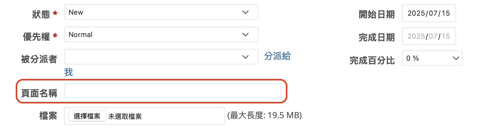
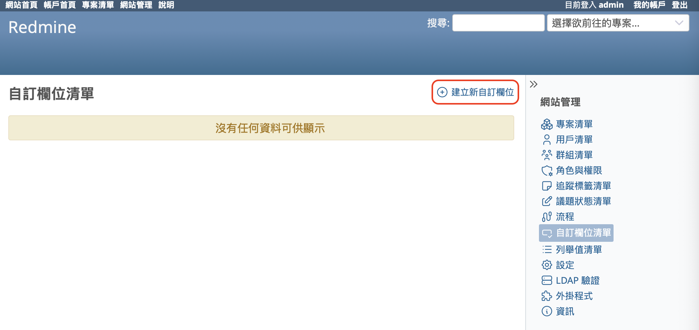
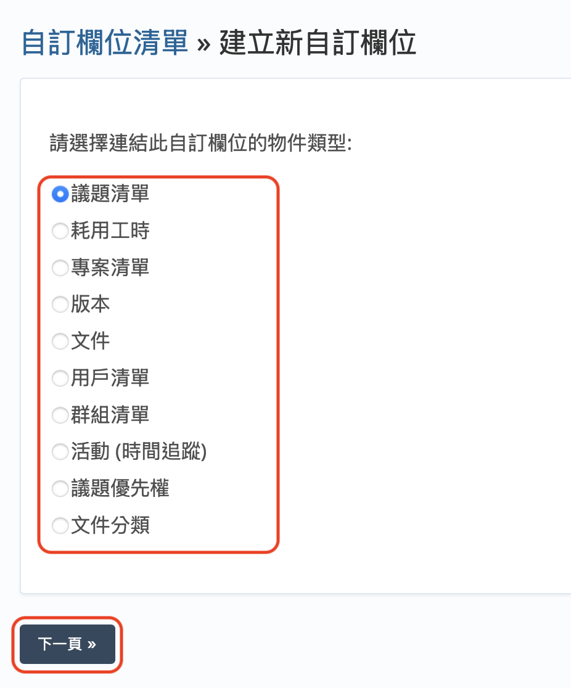
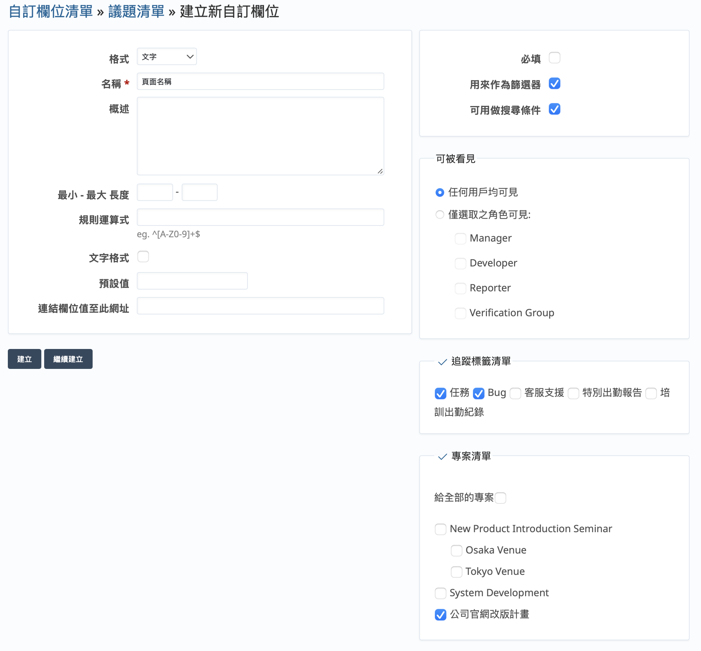
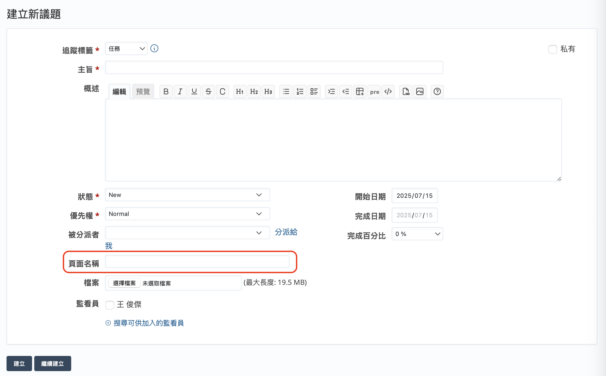
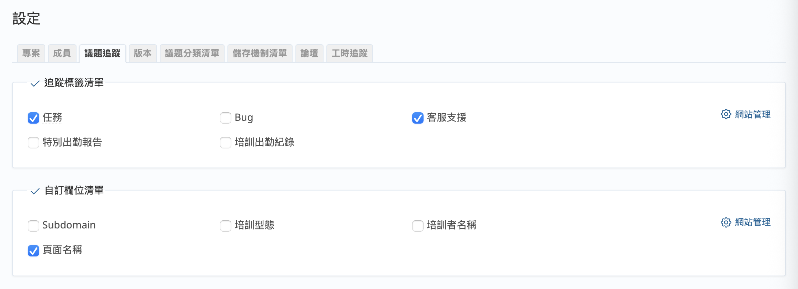

本文將介紹開源課題管理系統 Redmine 的「自訂欄位」。

## 目錄

- 概要
- 建立新自訂欄位
- 在新專案中使用既有的自訂欄位

## 概要

Redmine 的自訂欄位是用戶可自行定義的項目。

Redmine 預設提供多種輸入欄位，例如議題中預設包含以下欄位：

- 被分派者
- 分類
- 版本
- 父議題
- 開始日期
- 完成日期
- 預估工時
- 完成百分比
- 概述
- 優先權

當您在管理專案或任務時，可能會遇到以上欄位無法滿足需求的情況，例如：

- 為了明確每個議題對應到網站上的哪個頁面，希望新增「頁面名稱」
- 為了依錯誤類型整理議題，希望新增「錯誤分類」
- 希望在使用者資訊中新增「員工編號」

這時，自訂欄位功能就能派上用場。

Redmine 的自訂欄位可用於議題、工時記錄、用戶等多種功能。其欄位型態包含：

- 鍵/值 清單（Key/value list）
- 文字
- 版本
- 檔案
- 用戶
- 清單
- 連結
- 浮點數
- 整數
- 日期
- 布林（Boolean）
- 長文字

新增的自訂欄位可用作篩選條件，有助於議題的篩選與統計。

## 建立新自訂欄位

只有擁有系統管理員權限的使用者才能建立自訂欄位。Redmine 安裝完成後，admin 帳號預設擁有系統管理員權限，因此建議以 admin 登入來進行相關作業。

依序點選「網站管理」→「自訂欄位清單」，會進入自訂欄位一覽畫面。若為第一次進入，畫面上會顯示「沒有任何資料可供顯示」。請點選「建立新自訂欄位」。

接下來會出現選擇要將自訂欄位新增至哪個功能的畫面，請選擇想要新增的對象後，點選「下一頁」。

接下來會顯示建立自訂欄位的畫面。

（以下以要新增到「議題清單」的自訂欄位畫面為例）

請根據用途選擇「格式」，並輸入名稱等必要資訊。

若勾選「必填」，此自訂欄位將成為必須填寫的欄位。

若勾選「用來作為篩選器」，則該欄位可在議題清單等畫面中作為篩選條件使用。

若格式為「文字」，可勾選「可用做搜尋條件」來讓該欄位內容成為搜尋對象。

請選擇該自訂欄位要套用至哪些追蹤標籤與專案。

填寫完成後，點選「建立」。

如下面所示，自訂欄位就會被新增成功。

## 在新專案中使用既有的自訂欄位

若您希望在新建立的專案中使用現有的自訂欄位，請從專案選單點選「設定」→「議題追蹤」，進入議題追蹤畫面，勾選想要使用的自訂欄位與對應的追蹤標籤，然後點選「儲存」。

透過自訂欄位，您可以根據專案需求新增必要的資訊項目，幫助集中管理資料、提升工作效率。然而，若欄位數量過多，可能會增加填寫議題的負擔，進而降低使用者建立議題的意願。因此，建議您根據實際需求，慎選真正必要的欄位進行設定。
