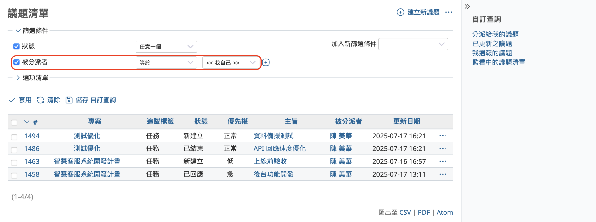

本文將為您簡單說明開源專案管理系統 Redmine 的「自訂查詢」功能。

## 目錄

- 自訂查詢功能概要 
- 儲存自訂查詢  
- 編輯自訂查詢  
- 刪除自訂查詢  
- 實用技巧：顯示在「帳戶首頁（My Page）」

## 自訂查詢功能概要

Redmine 會將各種課題與工作事項作為「議題」進行管理。透過議題列表畫面，您可以快速掌握自己目前的待辦事項。不過，隨著專案成員增加、議題數量變多，即使打開列表畫面，也會變得越來越難以找出屬於自己的議題或工作項目。

Redmine 提供多種用來搜尋議題的功能。舉例來說，在議題列表畫面中，您可以使用「篩選器」功能來縮小顯示的範圍。比方說，只篩選出「由您負責的議題」，就能更容易找到自己要處理的項目。

此外，Redmine 也提供變更議題列表中顯示欄位的功能。例如，若您想在列表中顯示議題的結束日期，可以開啟「選項清單」並新增「結束日期」欄位。

如果瀏覽器記住了您先前設定的篩選器與選項，那麼當您再次開啟議題列表時，這些設定會自動套用並顯示出相同的內容。不過，一旦切換到其他篩選條件後，若想再次使用原本的設定，就必須手動重新操作篩選器。

像是只要將「被分派者」設定為自己這樣的條件，手動設定並不費時；但若是像「被分派者為自己」、「完成日期為下週」、「追蹤標籤為任務」、並且「顯示完成日期欄位」這樣的複雜條件，每次都手動設定就會變得非常麻煩。

為了能夠在之後也重複使用這些設定，Redmine 提供了「自訂查詢」功能，讓您可以將設定好的篩選器與顯示項目儲存起來。只要儲存一次，日後就能隨時套用。

這項自訂查詢功能不僅適用於議題列表，也可以用在專案列表、工時記錄、甘特圖等畫面上。

## 儲存自訂查詢

以下以議題清單頁面為例，說明儲存自訂查詢的步驟（其他畫面亦同）。

在議題清單頁面中套用所需的篩選條件與顯示欄位後，點選「儲存 自訂查詢」。

接著會開啟「建立新查詢」畫面。

請在「名稱」欄輸入易懂、簡潔的名稱，該名稱將顯示於右側選單連結中。

「可被看見」可設定此查詢的使用對象。可依需求選擇是否要讓其他人也能使用這個查詢。

「給全部的專案」可設定此查詢是否適用於所有專案，或僅限目前專案。

設定完成後請點選「儲存」。系統會顯示「建立成功」的訊息，並將查詢名稱新增至右側選單的「我的自訂查詢」下方。點選該名稱，即可立即套用該查詢條件的議題清單。

## 編輯自訂查詢

若需變更查詢條件，請點選「編輯 自訂查詢」。這會開啟與建立查詢時相同的設定畫面，請在此進行所需的變更，然後點擊「儲存」。

## 刪除自訂查詢

若不再需要某個查詢，可先套用該查詢，然後點選「刪除 自訂查詢」即可將其移除。

## 實用技巧：顯示在「帳戶首頁（My Page）」

Redmine 提供「帳戶首頁」功能，可將常用資訊集中顯示。預設會顯示「分派給我的議題」與「我通報的議題」。

您可以在此頁面中顯示套用了自訂查詢的議題清單，作為快速入口使用。

操作步驟如下：

(1) 點選「新增」區塊下拉選單中的「議題清單」。

(2) 畫面上會出現一個新的「議題清單」區塊，並顯示「自訂查詢」選單。

(3) 從下拉選單中選擇要顯示的查詢，然後點選「儲存」。

這樣一來，您就可以在「帳戶首頁」中看到該查詢對應的議題清單。區塊標題同時也是一個連結，可快速前往該查詢結果畫面。

---

Redmine 的自訂查詢功能能幫助您快速找出所需議題，搭配帳戶首頁一起使用更能提高工作效率，建議積極加以運用。
