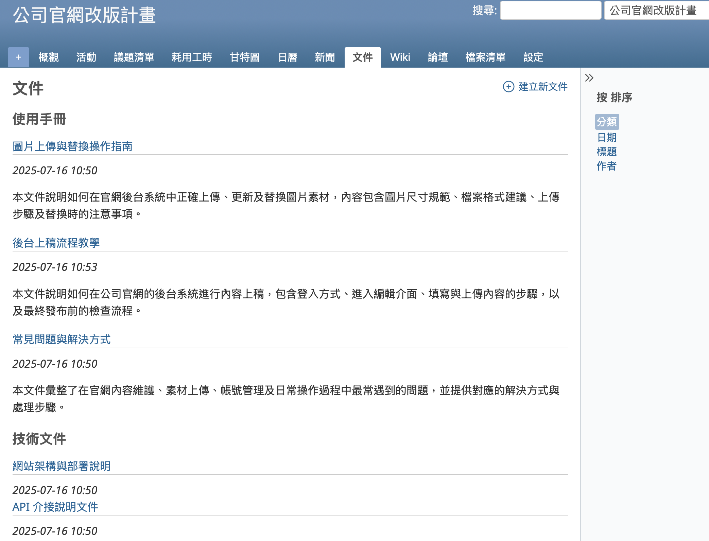
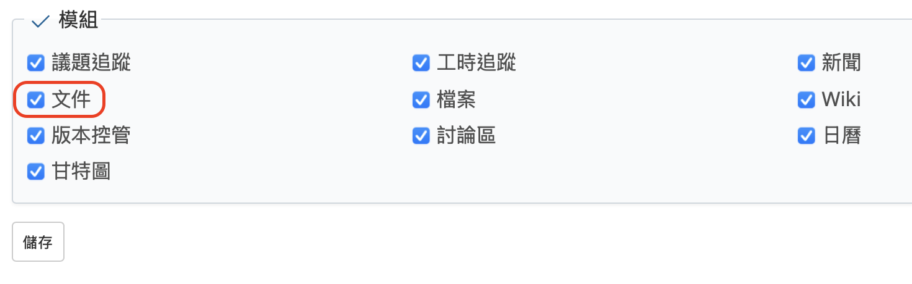
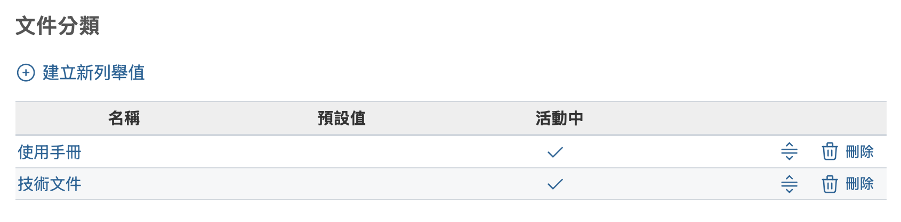
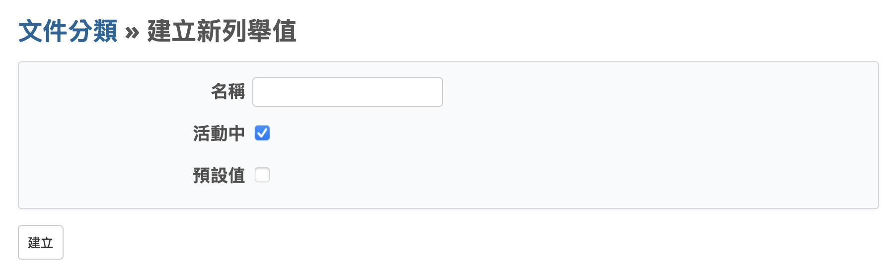
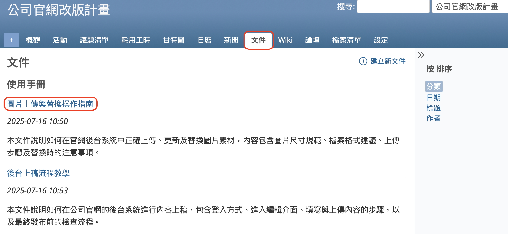
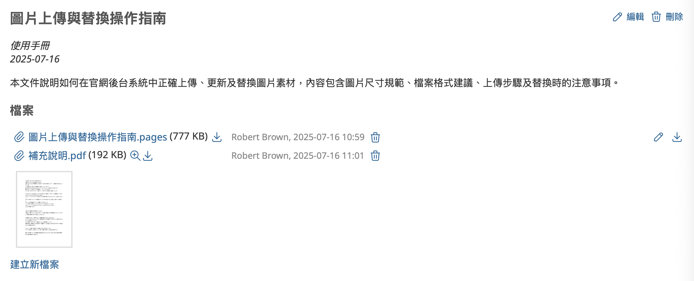
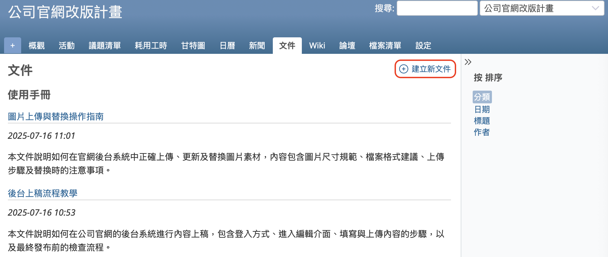
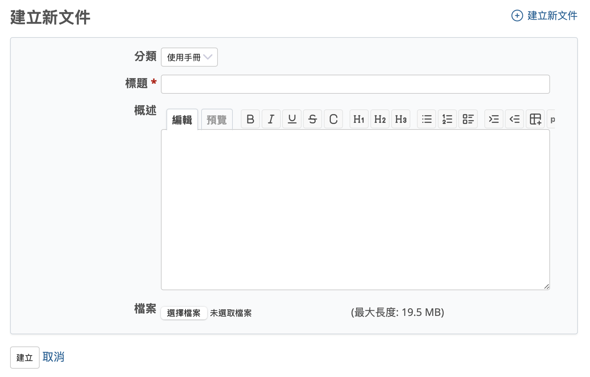
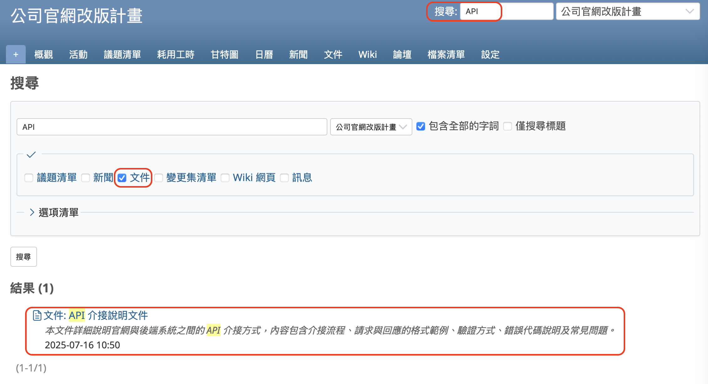

本文將介紹開源課題管理系統 Redmine 的「文件」功能。

## 目錄

- 概要
- 啟用「文件」功能的設定
- 顯示文件
- 建立新文件
- 搜尋文件

---

## 概要

Redmine 提供了名為「文件」的功能，可用來登錄其他應用程式中建立的檔案。

例如，在以下情況中，可能希望向相關人員分發檔案：

- 想將會議記錄分享給團隊成員
- 想將系統開發的規格說明書分享給成員
- 想將操作手冊分發給團隊成員
- 想限制存取權限，僅讓特定成員檢視重要資料
- 想安全地將報告檔案傳送給外部組織

若使用電子郵件或共享資料夾進行檔案分享，常常會發生以下問題：

- 產生許多檔名相似的檔案，導致無法分辨哪個是最新版本
- 若以附件方式寄送，收件人可能會漏看
- 忘記將檔案存在哪個共享資料夾中

針對這些問題，使用 Redmine 的「文件」功能可以有效避免。

- 可以建立文件、命名、附加檔案後儲存，無需依賴檔名進行管理
- 可為文件填寫說明，無需開啟檔案也能了解其內容
- 文件可以分類儲存，方便管理
- 文件以專案為單位建立，並可透過權限設定進行檢視、新增、編輯與刪除的控制
- 可使用 Redmine 的搜尋功能來查找文件

本文將說明如何使用 Redmine 的「文件」功能。

---

## 啟用「文件」功能的設定

### 啟用「文件」模組

首先需要啟用「文件」模組。「文件」模組可以針對每個專案分別設定啟用或停用。

只有下列條件的用戶才可以變更設定：該用戶已作為成員加入想要使用「文件」功能的專案，並且擁有被指派具有「編輯專案」與「選擇專案模組」權限的角色。如果 Redmine 採用初始設定並執行過「載入預設組態」，則「管理人員」角色預設已具備這些權限，因此建議將角色設為「管理人員」。

請打開專案選單中的「設定」→「專案」分頁，在模組清單中勾選「文件」，然後點擊「儲存」。

另外，也可以在建立新專案時就啟用此模組。如果您預計會使用「文件」功能，建議在專案建立畫面中一併啟用。

### 新增「文件分類」

在建立文件時，必須選擇一個類別。請根據專案的需求事先註冊合適的文件類別名稱。

如果您在 Redmine 的初始設定中執行過「載入預設組態」，系統會自動建立「使用手冊」與「技術文件」這兩個類別。這兩個類別可以直接使用，也可以變更名稱後使用，皆無妨。

只有具備系統管理員權限的用戶才能新增或變更文件類別名稱。剛安裝完 Redmine 時，admin 用戶預設具有系統管理員權限，因此建議以 admin 身分登入並進行操作。

請從上方選單點選「網站管理」→「列舉值清單」，即可進入選項值設定畫面。此畫面中的「文件分類」欄位即顯示目前已註冊的文件類別名稱。

若要新增新的類別名稱，請點選「建立新列舉值」。

接著輸入名稱，勾選「活動中」，並點擊「建立」。若勾選「預設值」，則在註冊文件時，該名稱將會自動作為預設選項。

---

## 顯示文件

點選專案選單中的「文件」，即可顯示文件清單畫面。

當您在文件清單畫面中點選文件名稱時，將會開啟該文件的詳細畫面。

您可以在此畫面中確認內容，然後下載檔案。

若您想要修改標題或概述，或替換已上傳的檔案，請點選右上角的「編輯」來開啟編輯畫面並進行修改。

若您想新增檔案，請點選左下角的「建立新檔案」，即可上傳檔案。

若該文件已不需要，請點選右上角的「刪除」進行刪除。

---

## 建立新文件

若要建立新文件，請在文件清單畫面中點選「建立新文件」。

系統將顯示「建立新文件」的畫面。

請選擇分類、輸入標題與概述，然後上傳檔案，接著點選「建立」。

概述欄位可以使用文字格式標記。

您可以一次上傳多個檔案。

標題與概述將會被納入 Redmine 的搜尋範圍。為了讓日後更容易搜尋找到，建議輸入清楚且適當的標題與概述。

---

## 搜尋文件

Redmine 具備搜尋功能，文件同樣屬於搜尋對象。

請在畫面右上方的搜尋框中輸入關鍵字後按下 Enter 鍵，即可顯示搜尋結果。

文件的標題與概述會被納入搜尋範圍，因此符合條件的文件將會列在搜尋結果中。

若未勾選「文件」選項，則搜尋結果中不會顯示文件。請務必勾選該選項後重新執行搜尋。

當您需要分享或傳送檔案時，Redmine 的「文件」功能非常實用。歡迎您多加活用！

