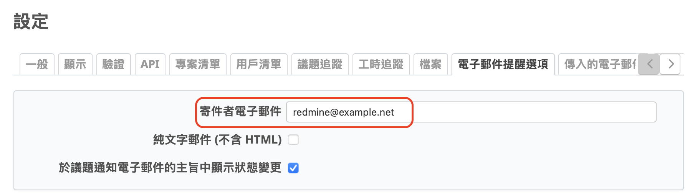
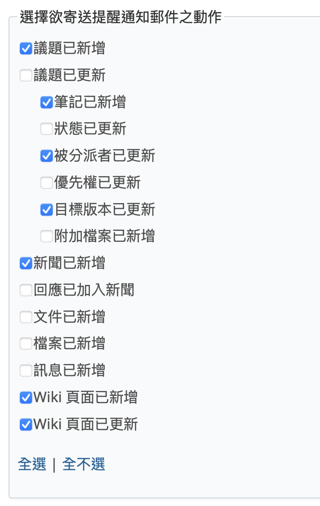

在這篇文章中，我們將介紹 Redmine 的郵件通知功能，包括系統會發送哪些類型的郵件、觸發時機、設定方式，以及能幫助團隊掌握期限的提醒功能。

## 目錄

- 郵件通知概要
- 郵件通知包含哪些訊息
- 郵件通知的觸發時機
- 郵件通知的使用設定
- 截止日期提醒功能

## 郵件通知概要

Redmine 會將工作事項與任務以「議題」的形式進行管理。透過議題清單、甘特圖或是版本與路線圖等功能，您可以直觀地掌握整體專案的進度。

然而，當專案中的資訊有變動時，例如其他成員將某張議題的負責人改為您，若沒有即時查看畫面，您可能會錯過這個變更。因此，光靠時時盯著 Redmine 畫面來掌握更新並不實際。
Redmine 本身雖不具備即時畫面通知的功能，但它提供了郵件通知的機制。若您使用的是能在畫面上即時顯示新郵件的郵件應用程式，就可以透過這些通知快速察覺 Redmine 專案中的變動。

此外，Redmine 還具備提醒功能，能將即將到期或已逾期的議題清單透過電子郵件發送給您。善用這項功能，能有效預防遺漏處理的工作。

## 郵件通知包含哪些訊息

當議題被更新時，您會收到一封通知郵件。信件的主旨會包含專案名稱、追蹤標籤名稱、議題編號與議題標題，因此即使不開啟郵件，也能一目瞭然是哪個專案的哪一個議題發生了更新。

在郵件的內容中，會顯示議題編號、執行更新的用戶名稱、變更的項目、新增的筆記、議題標題，以及其他相關資訊。透過閱讀郵件內容，您可以清楚掌握是誰、進行了哪些變更。此外，議題編號與標題均設有超連結，點擊即可直接開啟對應的議題詳細頁面，查看更多內容。

當 Wiki 頁面被更新時，您也會收到一封通知郵件。信件主旨中會包含專案名稱與被更新的 Wiki 頁面名稱，因此只需查看主旨，即可知道是哪個專案的哪個 Wiki 頁面有更新。

郵件內容中會顯示更新的 Wiki 頁面名稱、執行更新的用戶名稱，並提供可檢視更新差異的頁面連結。Wiki 頁面名稱設有連結，點擊即可開啟該頁面。若點擊差異檢視連結，則可以確認該頁面更新前後的變更內容。

## 郵件通知的觸發時機

Redmine 可以針對以下操作發送通知：

- 新增議題
- 更新議題
  - 對議題新增筆記
  - 變更議題狀態
  - 變更指派對象
  - 變更優先權
  - 變更版本
  - 附加檔案至議題
- 新增新聞
- 回覆新聞
- 新增文件
- 上傳檔案
- 新增訊息
- 新增 Wiki 頁面
- 更新 Wiki 頁面

只有在系統管理員啟用郵件功能、且用戶有勾選對應通知設定時，才會實際寄送通知。

### Redmine 6.0.0 新增功能：附件通知

在 Redmine 6.0.0 之前，若只新增附件而沒有備註或狀態變更，是不會觸發通知的。

Redmine 6.0.0 新增「新增附件」這個專用的通知條件，只要開啟這個選項，即使只是單純加上檔案也會通知相關人員，不需再仰賴其他更新條件。

## 郵件通知的使用設定

### 系統管理員的設定

1.您需要在設定檔 config/configuration.yml 中設定 SMTP 伺服器。
詳細設定方式請參考官方網站提供的說明文件：
https://www.redmine.org/projects/redmine/wiki/EmailConfiguration

2.為了讓郵件正文中包含的 Redmine 連結正確產生，請至【網站管理】→【設定】→【一般】頁面，正確設定「主機名稱（含路徑）」以及「協定」。

3.您也需要設定寄件人電子郵件地址。請至【網站管理】→【設定】→【電子郵件提醒選項】頁面，將「寄件者電子郵件」設定為適當的地址。

4.在【網站管理】→【設定】→【電子郵件提醒選項】頁面中，請選擇要作為郵件通知觸發對象的操作。

5.您也可以在郵件的標頭與頁尾中插入自訂文字。這並非必要設定，即使不插入也不會影響功能。
系統預設會插入一段文字，但您也可以自由刪除而不會造成問題。此設定可在【網站管理】→【設定】→【電子郵件提醒選項】頁面中進行修改。

### 用戶個人設定

每位用戶也能在「我的帳號」→「電子郵件提醒選項」中設定偏好：

- 是否收到分派給自己的議題通知
- 是否訂閱自己「監看中」的議題
- 避免收到不必要的變更通知

## 截止日提醒功能

Redmine 提供提醒功能，可以定期將「即將到期」或「已逾期」的議題列表透過郵件寄出：

- 該議題需設定「被分派者」與「完成日期」
- 系統管理員需定期執行指令來觸發提醒郵件

詳情可參考官方指南：<https://www.redmine.org/projects/redmine/wiki/RedmineReminderEmails>

Redmine 的郵件通知功能，是協助團隊掌握專案狀況的強力工具。只要妥善設定並善加使用，就能及時掌握各項更新，減少延誤與遺漏，讓你的團隊運作更順暢！
