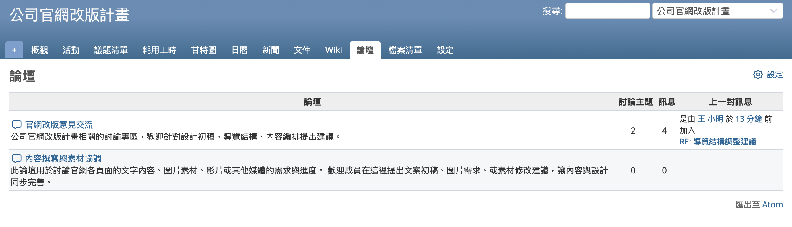
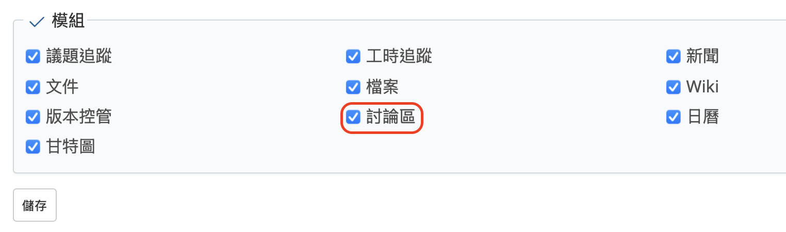
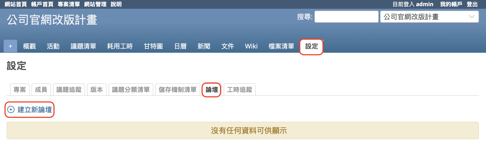
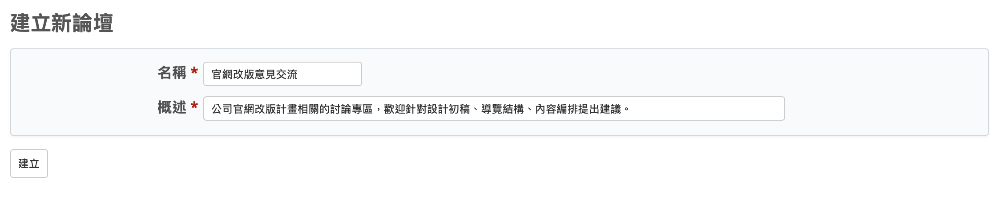
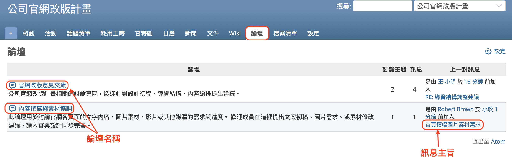
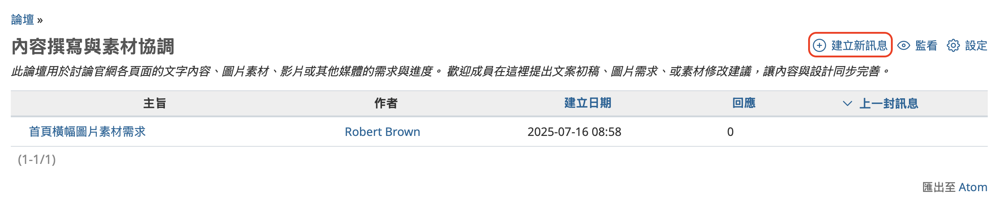
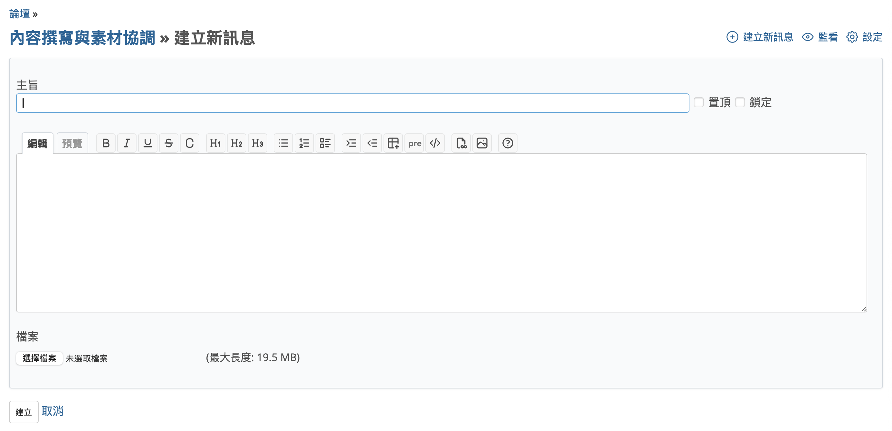
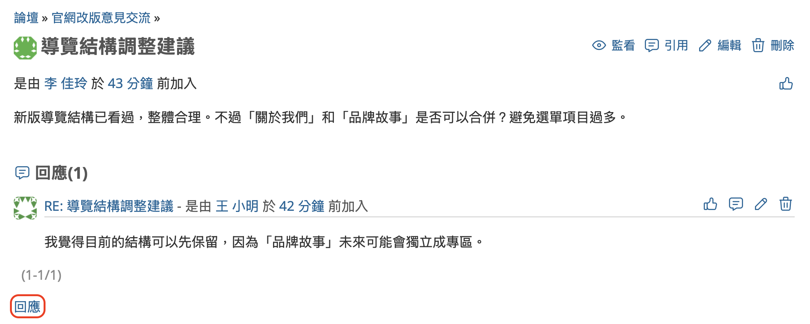
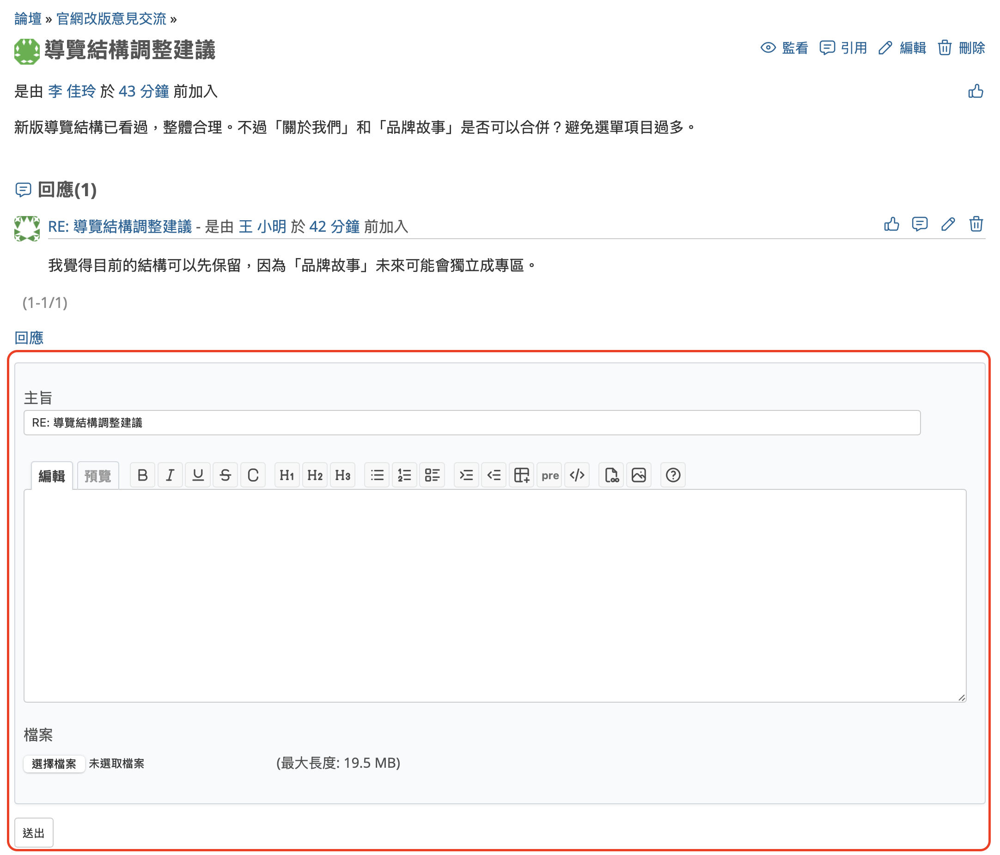
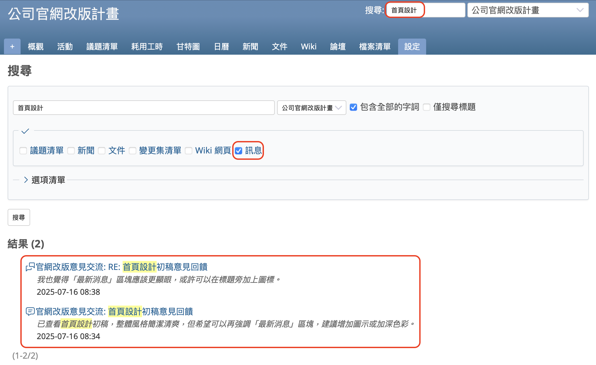

本文將介紹開源課題管理系統 Redmine 的「討論區（論壇）」功能。

## 目錄

- 概要
- 啟用「討論區」功能的設定
- 建立新論壇
- 顯示論壇清單
- 建立新討論主題
- 回應訊息
- 搜尋訊息

---

## 概要

Redmine 的「討論區」功能是一種留言板功能，適合用於團隊成員之間針對特定議題進行討論。

例如，當您想與團隊成員討論工作的進行方式，或是商討軟體新功能的規格時，就可以使用這項功能與多位成員進行交流。

若情況不至於需要召開會議，但又希望留下討論紀錄，可能會選擇群發電子郵件給所有成員。剛開始還好，但隨著郵件數量增多、話題分散，想追蹤誰在哪裡說了什麼就會變得非常困難。

當然，也可以使用聊天工具。許多聊天系統都具備類似討論串的功能，能維持訊息之間的連貫性進行討論。不過，也常會因為不小心發成新訊息而非回覆，導致對話斷裂或被忽略，甚至無法辨別某個主題中最新的訊息是哪一則。

在這樣的情境下，Redmine 的「討論區」功能就特別有用。

Redmine 的討論區會將討論起始訊息與所有回覆訊息作為一個整體保存，清楚記錄每則訊息的發送者與發送時間，因此不會出現「不知道誰說了什麼」或「發言順序混亂」的情況。

這樣的訊息集合在討論區被稱為「討論主題（topic）」。可以建立多個討論主題，主題列表中會顯示最新訊息的連結，因此不易錯過。

討論主題會依照「討論區」進行分類。就算畫面上出現大量訊息，也不會讓您難以尋找目標內容。即使找不到，訊息的標題與內容也會被包含在 Redmine 的搜尋功能中，因此仍然可以透過搜尋找到所需內容。

每個專案可以建立自己的討論區，而且一個專案中可以建立多個討論區。

本篇文章將說明「討論區」功能的使用方法，歡迎您親自體驗看看。

---

## 啟用「討論區」功能的設定

若要使用 Redmine 的「討論區」功能，請先在想要使用此功能的專案中啟用「討論區」模組。是否啟用此模組可以依專案個別設定。

只有具備以下條件的使用者才能變更設定：必須是該專案的成員，並且其所分配的角色需擁有「編輯專案」與「選擇專案模組」的權限。如果您在 Redmine 的初始設定中執行過「載入預設組態」，那麼「管理人員」角色會預設具備這些權限，因此建議將該角色指派給相關使用者。

請開啟專案選單中的「設定」→「專案」頁籤，勾選模組清單中的「討論區」選項，然後點擊「儲存」。

另外，也可以在建立新專案時就啟用此模組。如果您預計會使用「討論區」功能，建議在專案建立畫面中一併啟用。

---

## 建立新論壇

能夠建立討論區的使用者，必須符合以下條件：已被加入欲建立討論區的專案中，且其所分配的角色需擁有「管理討論版」的權限。
若您曾在 Redmine 的初始設定中執行過預設設定載入，系統會將此權限賦予「管理人員」角色，因此建議將該角色指派給有需要的使用者。

若要建立新的討論區，請從專案選單中開啟「設定」→「論壇」，然後點擊「建立新論壇」。

系統會顯示「建立新論壇」畫面。

在「建立新論壇」畫面中，輸入名稱與概述後，點擊「建立」即可完成。名稱與概述皆為必填欄位。

在此建立的論壇會作為大分類使用。您可以視需要建立多個論壇。

例如，在 Redmine 的官方網站中，就設有多個用於不同目的的論壇，如進行各類相關討論的「Open discussion」、用於提問的「Help」、以及關於 Redmine 核心開發的「Development」等。

Redmine官方網站論壇連結：<https://www.redmine.org/projects/redmine/boards>

---

## 顯示論壇清單

建立論壇後，專案選單中會顯示「論壇」項目。
如果尚未建立任何論壇，該項目將不會出現。請參考前一部分的「建立新論壇」的步驟來建立一個論壇。

點選「論壇」後，將會顯示論壇一覽畫面。

論壇一覽畫面中，點擊論壇名稱會進入該論壇的主題列表畫面。

在論壇一覽畫面中，可以看到每個論壇的回應數與訊息數。

如果已有訊息被張貼，則會顯示最新訊息的相關資訊。點選最新訊息的標題即可查看該訊息內容。

---

## 建立新討論主題

若您想開始新的討論並建立討論串，請在論壇中建立一則新的討論主題（topic）。

在論壇一覽畫面中點擊論壇名稱，即可進入該論壇的討論主題列表畫面。

點選「建立新訊息」後，將會顯示輸入表單。

輸入主旨與內容後點選「建立」，即可完成訊息建立。

主旨會顯示在討論主題列表中，建議輸入清楚明確的文字內容。此外，主旨也會被納入搜尋對象。

內容可使用文字格式語法撰寫，並同樣會被納入搜尋對象。

您也可以根據需要上傳附加檔案。

新訊息建立後，將會顯示於討論主題列表畫面中。

---

## 回應訊息

若您想參與討論並發送訊息，請使用回應功能對訊息進行回復。

在討論主題列表畫面中，點擊討論主題的標題，即可顯示該討論主題及其所有回覆訊息的列表。

點選「回應」連結後，將會顯示訊息輸入表單。請輸入內容後點選「送出」即可發送訊息。

---

## 搜尋訊息

Redmine 具備搜尋功能，論壇中的訊息也會被納入搜尋範圍。

在畫面右上角的搜尋框中輸入關鍵字並按下 Enter 鍵後，將會顯示搜尋結果。

系統會根據訊息的標題與內容進行搜尋，符合搜尋關鍵字的訊息將以列表方式顯示。點擊標題即可檢視該訊息內容。

如果未勾選「訊息」，則不會顯示相關結果。請確認有勾選後再次執行搜尋。

善用「討論區」功能，您就能不依賴電子郵件或其他通訊工具，也能有效率地進行討論並集中管理資訊。不妨先試用看看，親身體驗它的便利性。
