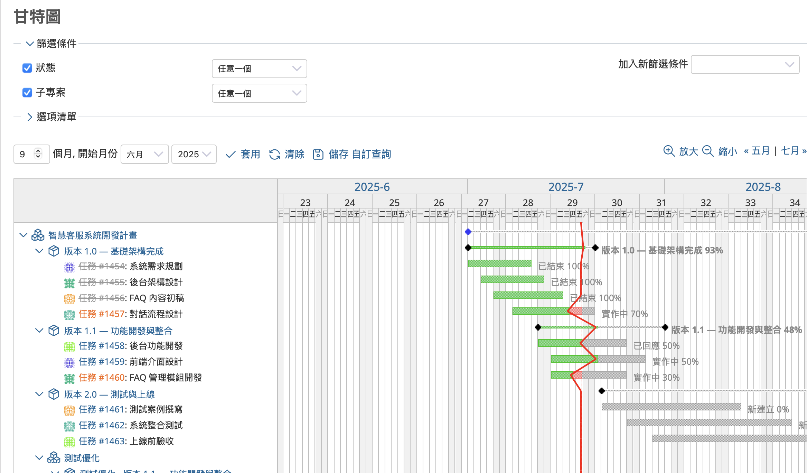
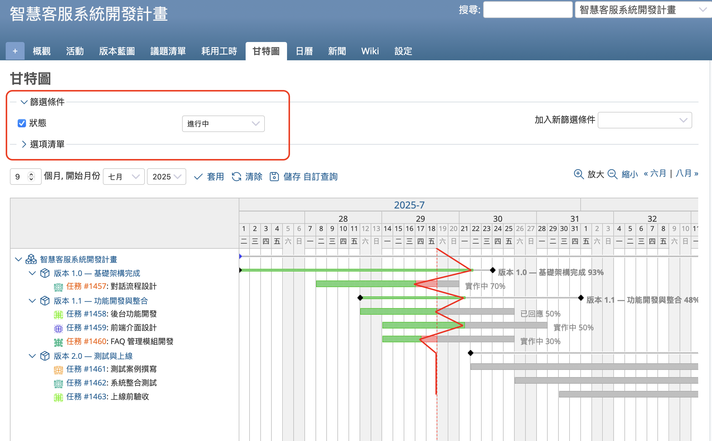
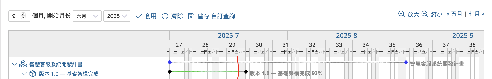
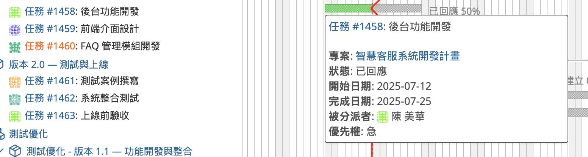
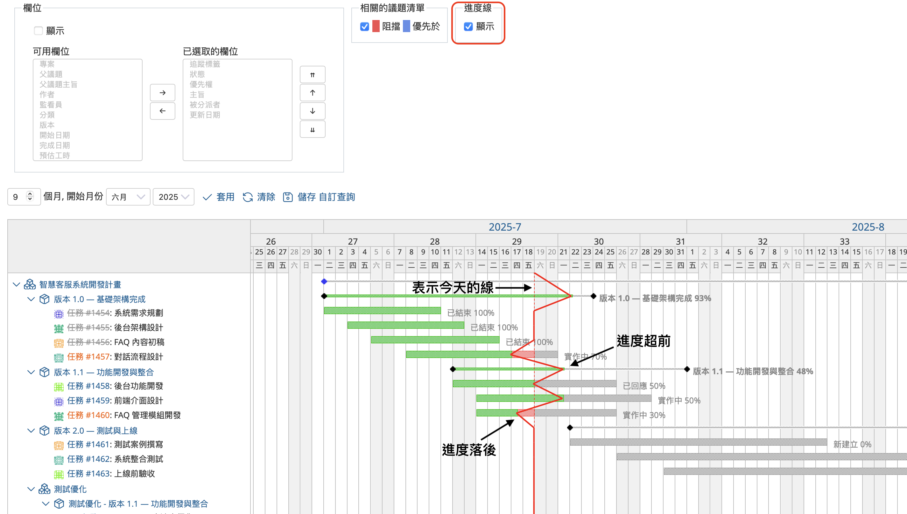

本文將介紹開源課題管理系統 Redmine 的「甘特圖」功能。

---

## 目錄

- 甘特圖功能概要  
- 甘特圖畫面介紹  
- 甘特圖的實用功能  

---

## 甘特圖功能概要

在專案管理中，經常會使用「甘特圖」來協助掌握整體的作業流程與進度。甘特圖是一種將任務細分為小單位，並以圖表方式依時間軸排列，使用戶能一目了然了解整體進行狀況的工具。透過甘特圖，可以輕鬆掌握各項任務的開始與結束時間，判斷哪些工作進行順利、哪些出現延遲，進而有效推動專案如期進行。

Redmine 提供甘特圖作為標準功能。當您建立議題時，只要輸入「開始日期」與「完成期日」，該議題就會自動顯示在甘特圖上。

---

## 甘特圖畫面介紹

在專案選單中點擊「甘特圖」，即可顯示甘特圖畫面。您可以選擇只顯示特定專案的議題，也可以將 Redmine 中所有專案的議題統一顯示在同一個畫面中。

甘特圖畫面中，垂直軸列出各個議題，水平軸則顯示日期。每個議題會以長條圖標示其開始日期與到期日，並顯示目前的狀態與進度百分比。

您可以透過「篩選條件」來縮小顯示的議題範圍。例如，將「狀態」篩選條件設為「進行中」，即可只顯示尚未完成的議題。

---

## 甘特圖的實用功能

### 時間軸

甘特圖的橫軸為時間軸，可顯示年、月、週次、日期與星期。

畫面左上方的「9 個月」等數字為顯示區間。您可以透過下拉選單調整顯示的開始年月，點選「套用」即會更新畫面，點選「清除」可重設條件。若點選「儲存　自訂查詢」，則可以儲存目前的顯示設定。

畫面右上方的「放大」「縮小」按鈕可改變時間軸的縮放比例。右側也提供切換月份的按鈕，可切換至前一個或下一個月份。

---

### 浮出視窗

當滑鼠游標移到甘特圖上顯示各議題時間軸的橫條時，會顯示一個浮出視窗（Popup），顯示該議題的標題等資訊。該視窗內也包含了連結，可直接開啟議題的詳細畫面，方便您立即查看或編輯議題。

---

### 進度線

進度線是將每個議題條列長度視為100%，再根據目前的進度百分比，連接各議題進度點所形成的折線圖。

在「選項清單」中，勾選進度線的「顯示」即可在甘特圖中顯示這條線。

如果進度線的折點出現在代表今天的虛線右側，代表進度超前；若出現在左側，則表示進度落後。

---

甘特圖是 Redmine 中非常實用的視覺化工具，建議在專案管理中善加利用，以提升團隊效率與整體掌控力。
