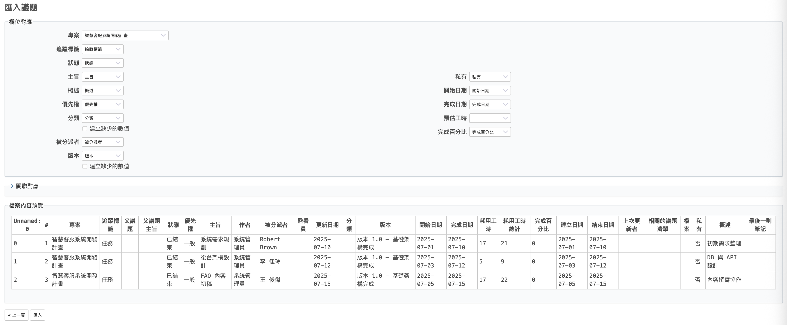
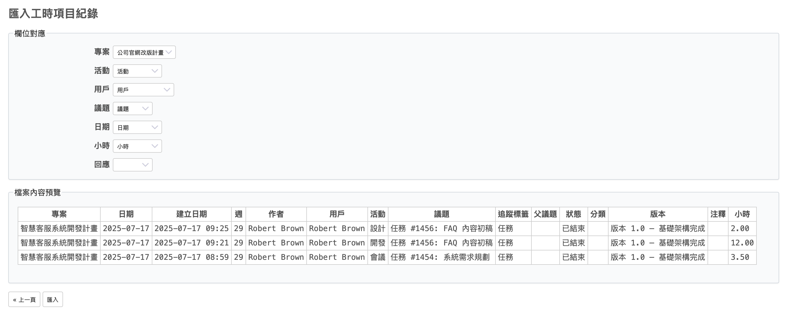
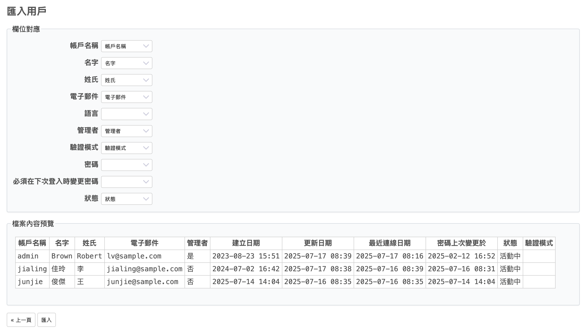
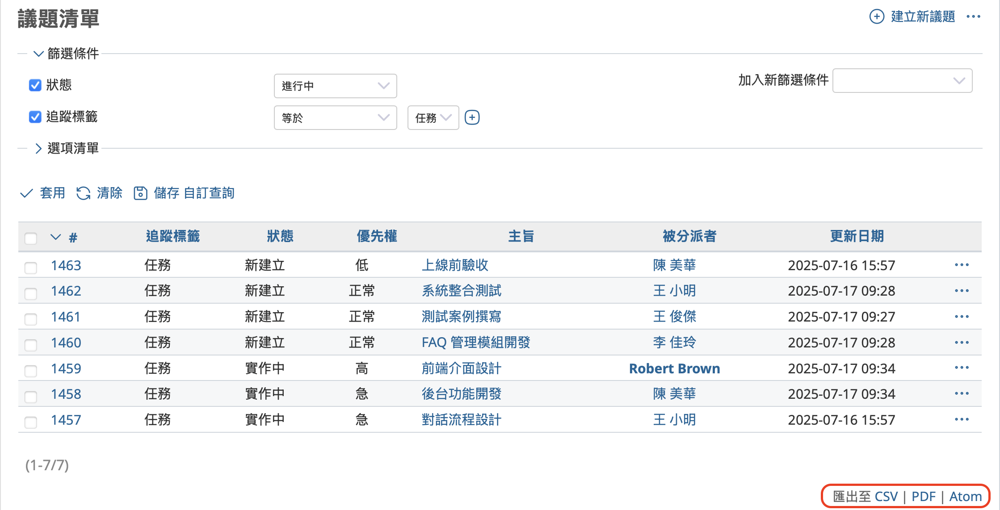
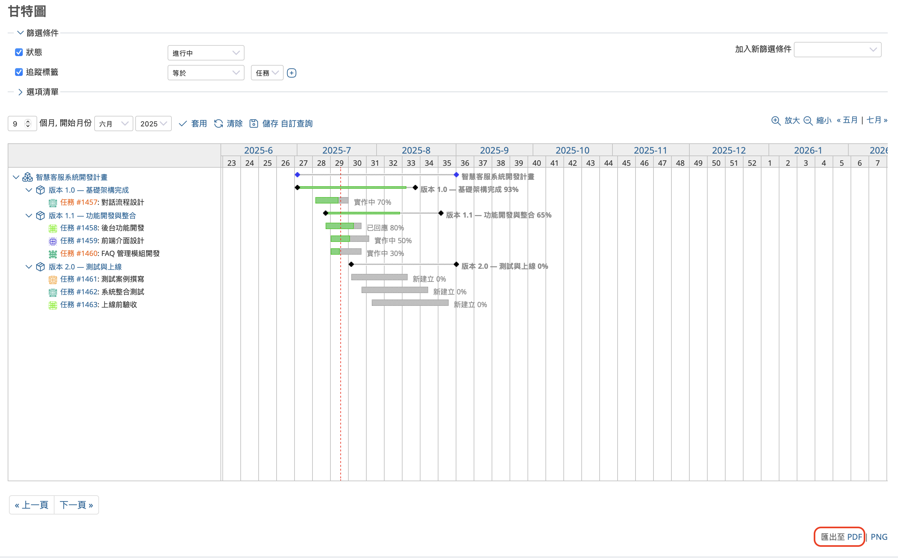
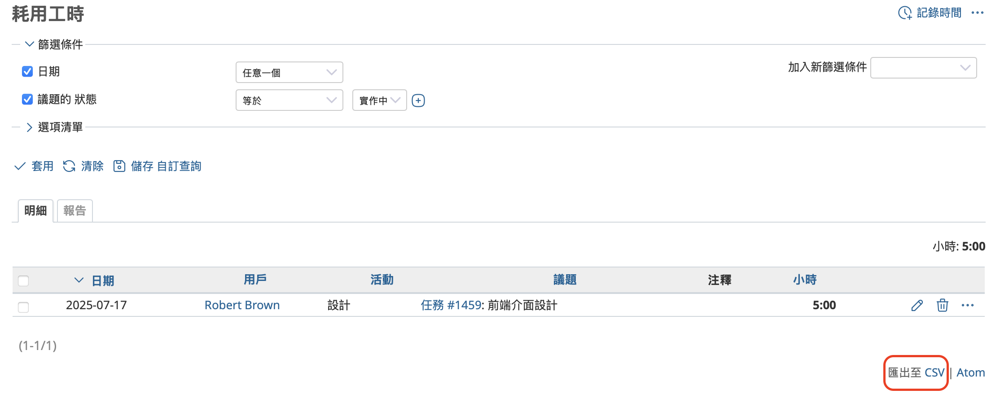
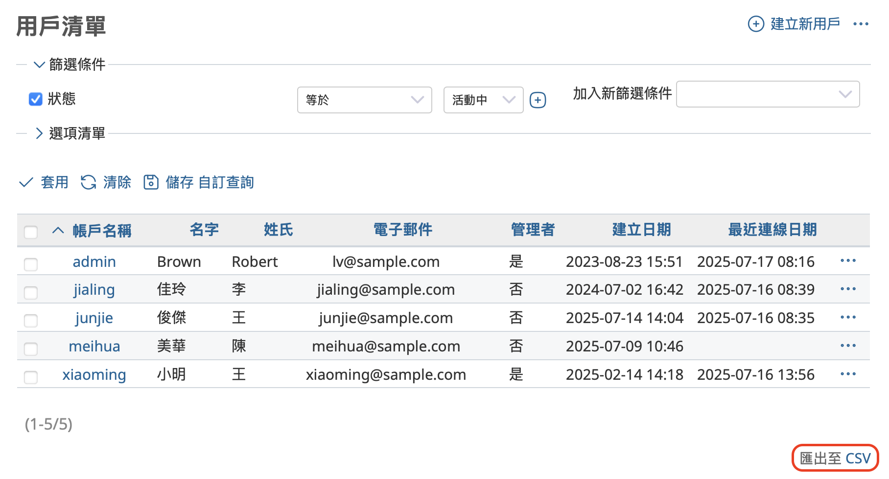
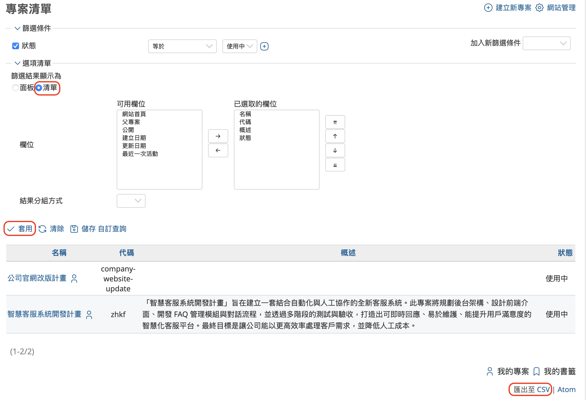
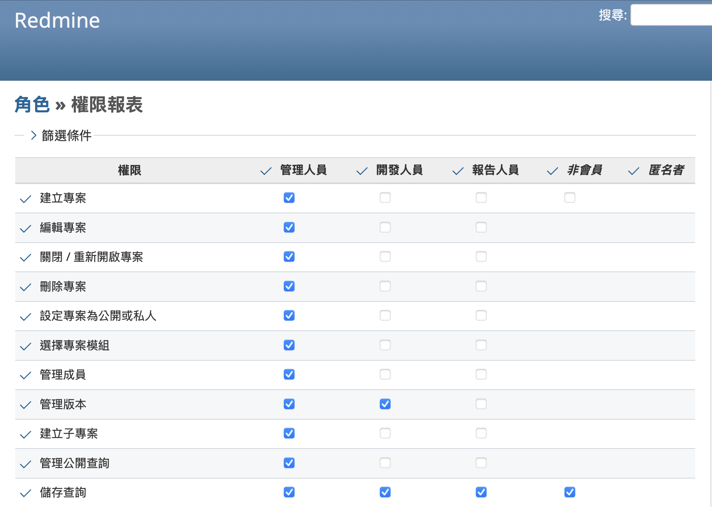
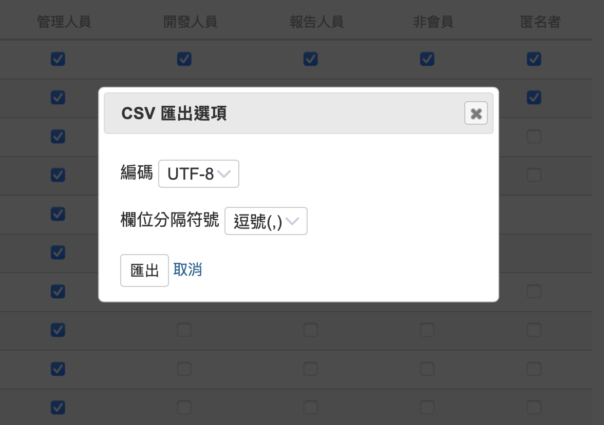

本文將介紹開源課題管理系統 Redmine 的匯入與匯出功能。

## 目錄

- 概要
- Redmine 可匯入的資料
- Redmine 可匯出的資料

## 概要

Redmine 作為一套課題管理系統，具備豐富的功能，其中一項重要功能就是「匯入」與「匯出」。這些功能可在各種情境下大幅提升作業效率。

舉例來說，作為 Redmine 管理者經常需要執行以下操作，而這些作業都可以透過匯入／匯出功能來實現：

- 將以試算表應用程式製作的課題清單，一次匯入為 Redmine 的議題
- 將 Redmine 的議題清單匯出至試算表應用程式中，以利分析狀況
- 將以試算表應用程式製作的用戶清單，一次匯入為 Redmine 的用戶
- 將目前已註冊於 Redmine 的用戶清單，儲存到試算表中作為管理台帳

本文將說明 Redmine 可匯入／匯出的資料種類，以及這些功能的使用情境。

## Redmine 可匯入的資料

Redmine 支援以下資料的匯入：

- 議題
- 耗用工時
- 用戶

### 匯入議題

您可以匯入以 CSV 格式建立的議題清單，將其註冊為 Redmine 議題。

當您想要一次註冊大量議題，或是有許多追蹤器、截止日期等資訊相同的議題時，若逐一透過議題建立畫面輸入，將會非常耗時且重複性高。而若先使用試算表應用程式製作議題清單並匯入，就能省下這些麻煩，非常方便。

### 匯入工時

在[《5 分鐘快速上手 Redmine：「工時追蹤」功能》](time-tracking.md)一文中，我們介紹了如何在議題中登錄耗用工時。該文章說明了逐一手動輸入的方式，但 Redmine 也具備批次匯入的功能。若您是透過試算表應用程式或其他工具記錄工時，這項功能將會非常實用。

### 匯入用戶

在[《5分鐘快速上手 Redmine：用戶管理》](users.md)一文中，我們介紹了如何建立用戶。該文章說明了逐一建立用戶的步驟，不過當您需要一次註冊大量用戶時，這種方式會變得相當麻煩，且容易發生輸入錯誤。

Redmine 提供了匯入 CSV 格式的用戶清單來批次建立用戶的功能，可大幅節省時間並降低錯誤發生的機會。

## Redmine 可匯出的資料

Redmine 支援以下資料的匯出：

- 議題
- 甘特圖
- 耗用工時
- 用戶
- 專案清單
- 權限報表

### 匯出議題

您可以將 Redmine 的議題清單畫面中所顯示的議題匯出為 CSV 檔案或 PDF 檔案。

若匯出為 CSV 檔案，可以將議題的說明內容與最新的留言一併匯出。

匯出的 CSV 檔案也可以作為日後匯入議題時的資料使用，因此也能作為備份資料加以活用。不過請注意，能夠匯出的僅限目前的最新狀態，議題的歷史紀錄無法被匯出。

### 匯出甘特圖

您可以將甘特圖匯出為 PDF 檔案，可用於報告製作等用途。
只需顯示甘特圖，然後點擊右下角的「PDF」按鈕，即可產生 PDF 檔案。

### 匯出工時

您可以將記錄在 Redmine 中的工時匯出為 CSV 檔案。
當您想使用試算表應用程式或其他工具分析工時資料時，這是一個非常方便的功能。

### 匯出用戶

您可以將登錄在 Redmine 中的用戶清單匯出為 CSV 檔案。

在某些情況下，必須以台帳方式管理系統使用者。例如，即使在 Redmine 中註冊初始用戶時建立了管理台帳，但隨著運用的持續，用戶的新增或停用會使台帳內容逐漸產生偏差，因此可能需要定期更新管理台帳。在這種情況下，只需匯出用戶清單並與現有台帳比對，即可輕鬆完成更新作業。

此外，匯出的 CSV 檔案也可作為匯入用戶的資料使用，因此也能作為備份資料加以活用。

### 匯出專案清單

您可以將登錄在 Redmine 中的專案清單匯出為 CSV 檔案。只需在專案一覽畫面中，將專案的顯示形式切換為「清單」，並選擇顯示所需欄位進行匯出，即可保存必要的資訊。

由於 Redmine 並未提供專案的匯入功能，因此無法將匯出的 CSV 檔案作為備份資料使用。不過，該檔案仍可用於報告製作或作為管理台帳等用途加以活用。

### 匯出權限報表

在[《5 分鐘快速上手 Redmine：工作流程設定》](workflow.md)一文中，我們介紹了 Redmine 的角色與權限設定。Redmine 具備多項功能，而是否能使用這些功能，則取決於權限設定。

權限是依據角色來設定的。請從頂部選單點選「網站管理」→「角色與權限」，即可開啟角色一覽畫面。在該畫面中點選「權限報表」即可查看各個角色的權限設定一覽。

在這個畫面中，您不僅可以變更權限設定，還可以將目前的設定內容匯出為 CSV 檔案。

請點選畫面最下方的「CSV」，系統會顯示選擇匯出設定的畫面。請在此選擇編碼格式與欄位分隔符號，然後點選「匯出」即可。

由於 Redmine 沒有匯入權限設定資料的功能，因此匯出的 CSV 檔案無法作為備份資料來使用。不過，這些資料仍可用於製作報告、管理台帳，或用來檢查權限設定是否正確等用途。
