本文將為您簡單說明在安裝好開源課題管理系統 Redmine 之後，應進行的初始設定。

## 目錄

- 初次登入
- 載入預設設定
- 設定「預設語言」
- 設定「用戶（名稱）顯示格式」
- 設定郵件中包含的 URL

## 初次登入

Redmine 安裝並啟動後，使用瀏覽器造訪 Redmine 的首頁，畫面右上角會顯示「登入」連結，點選即可進入登入畫面。

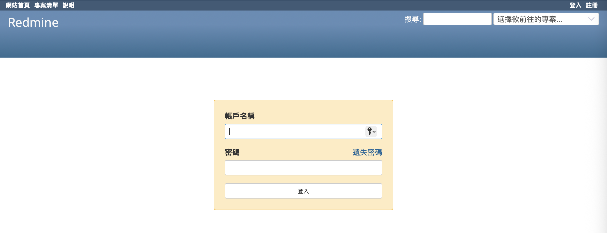

安裝完成初期，系統中只存在一個管理員帳戶 admin。請使用帳號 admin 和密碼 admin 進行登入。

首次登入後，系統會要求您變更密碼。請根據畫面指示完成變更。

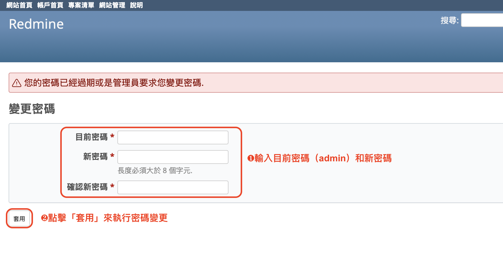

## 載入預設設定

Redmine 具備多項設定選項，例如角色、追蹤標籤、狀態、工作流程等，讓您能有效地進行議題與任務的管理。然而，剛安裝完成的 Redmine 並未預先登錄這些項目的名稱與內容。

雖然您可以從零開始手動設定這些值，但若對 Redmine 還不熟悉，這可能會有些困難。

為了簡化設定流程，Redmine 提供了一組預設資料。載入預設資料後，系統會自動建立角色、狀態等基本項目，讓您能立即開始進行議題與任務管理。

第一次以 admin 帳號登入後，點選上方選單的「網站管理」即可進入管理畫面。此時畫面中央會顯示一則提示訊息，詢問您是否要載入預設設定。點選「載入預設組態」，即可完成預設資料的匯入。語言選擇請依實際運用情況決定，若主要使用繁體中文，建議選擇「Chinese/Traditional（繁體中文）」。

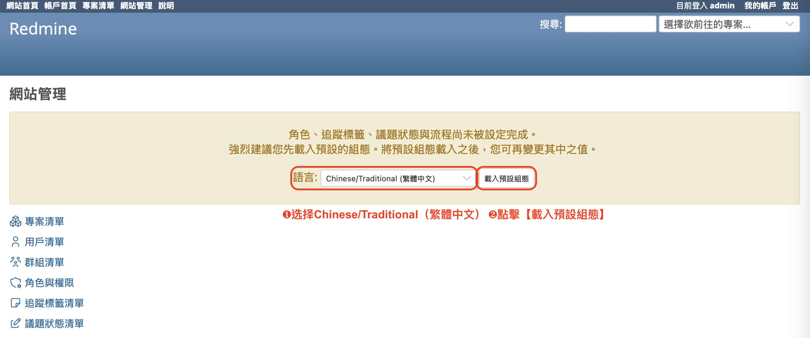

另外，如果伺服器管理員在安裝 Redmine 完成後，已經在伺服器上執行了下列指令，那麼預設設定就會自動載入，此時您不需要再手動操作載入（系統也不會顯示提示載入預設設定的訊息）：
```
rake redmine:load_default_data RAILS_ENV="production"
```

## 設定「預設語言」

Redmine 支援多種語言。同一套 Redmine 系統中，每位使用者都可以設定自己的介面語言。

建立新用戶時，您可以為該用戶指定其使用語言。預設情況下，語言會設定為 English（英文）。

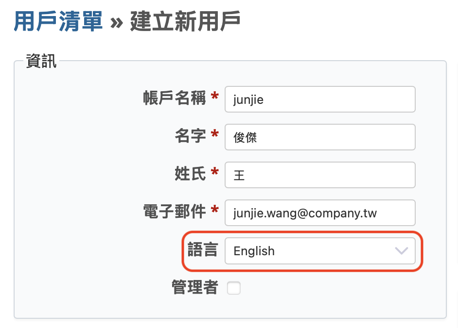

用戶可以在登入系統後，可以自行變更所使用的語言。此項設定可在「我的帳戶」畫面中進行調整。
在「我的帳戶」畫面的「語言」欄位中，您可以變更所使用的語言。

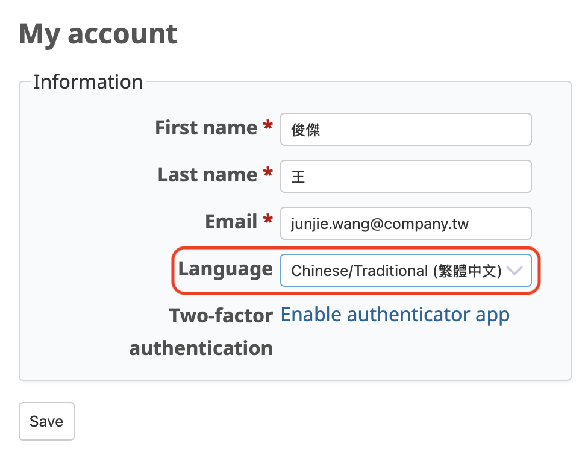

如果您已經確定所有使用者都會使用繁體中文，您可能會希望將預設語言從 English（英文）改為 Chinese/Traditional（繁體中文）。Redmine 提供了「預設語言」的系統設定。請前往上方功能表的「網站管理」→「設定」→「顯示」分頁，在「預設語言」欄位中選擇「Chinese/Traditional（繁體中文）」，然後儲存設定。

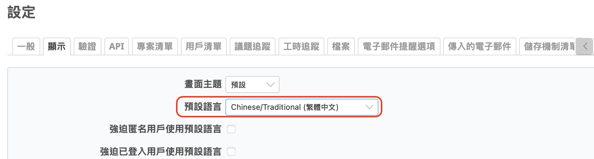

## 設定「用戶（名稱）顯示格式」

由於 Redmine 最初是由法國開發者建立的軟體，用戶名稱的登錄順序預設為「名字 → 姓氏」。

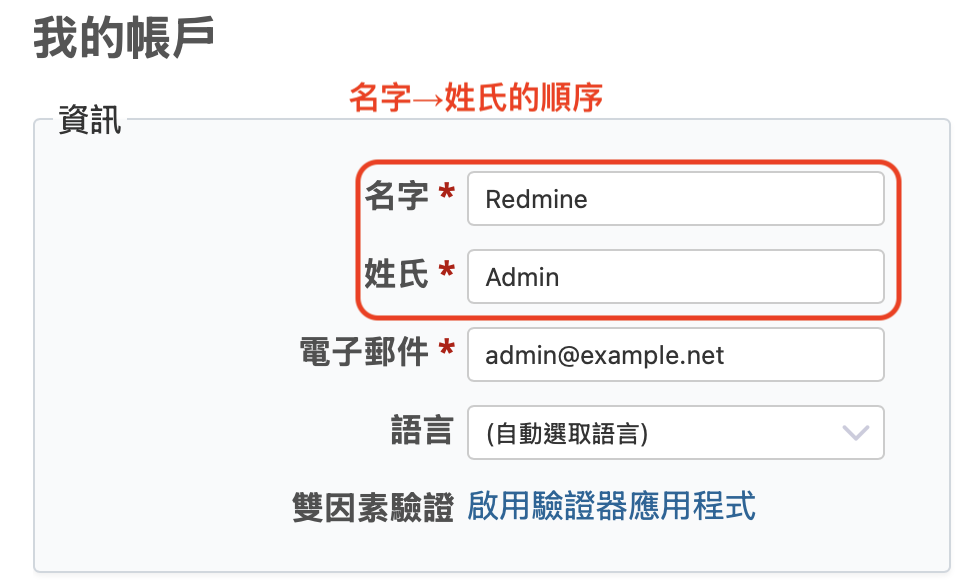

因此，在 Redmine 的整體介面中，用戶名稱的顯示順序預設為「名字 姓氏」。但若是在中文的使用環境中，這樣的顯示順序可能會讓人感到不自然。例如，當您打開下拉選單以選擇議題的負責人時，顯示的名稱為「名字 姓氏」，這樣一來在眾多用戶中搜尋姓名就會比較困難。

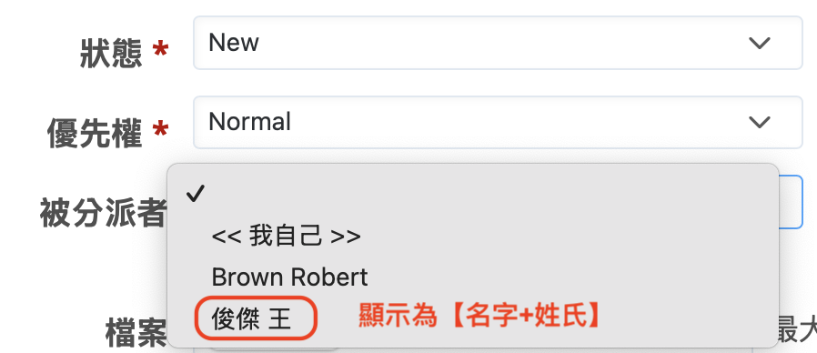

Redmine 考慮到多語系的使用情境，因此提供了「用戶（名稱）顯示格式」的設定項目。您可以前往上方選單中的「網站管理」→「設定」→ 點選「顯示」標籤頁，在那裡即可找到「用戶顯示格式」設定選項。

點開「用戶顯示格式」下拉選單後，您會看到多種選項。預設為「Redmine Admin」，也就是以「名字 姓氏」的形式顯示用戶名稱。若您將此選項變更為「Admin Redmine」，則顯示格式會變為「姓氏 名字」。

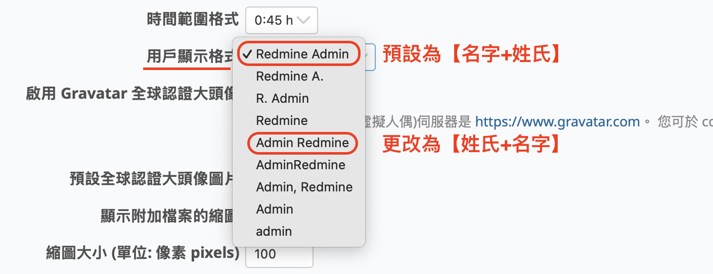

透過這個設定變更，在議題負責人選擇的下拉選單中，也會以「姓氏 名字」的形式顯示用戶姓名，讓您能更容易地尋找特定的使用者。

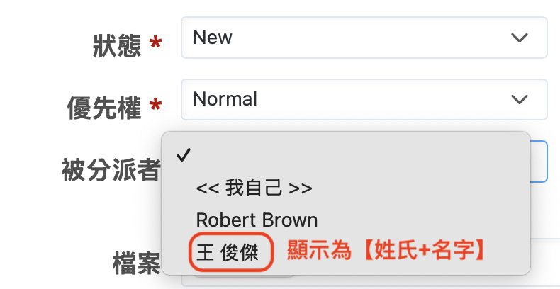

## 設定郵件中包含的 URL

在〈5 分鐘快速上手 Redmine：郵件通知設定〉中我們介紹過，Redmine 具備在專案資訊有更新時發送郵件通知的功能。這些郵件中會包含 Redmine 上議題詳細頁面、Wiki 頁面等的連結，讓您可以直接點擊前往查看相關資訊。

若要正常使用此功能，需事先進行一些設定，主要是設定主機名稱與通訊協定。

請依序點選上方選單的「網站管理」→「設定」→「一般」頁籤，在該頁中可以找到「主機名稱」以及「協定」等設定項目。請根據實際運作環境進行設定。

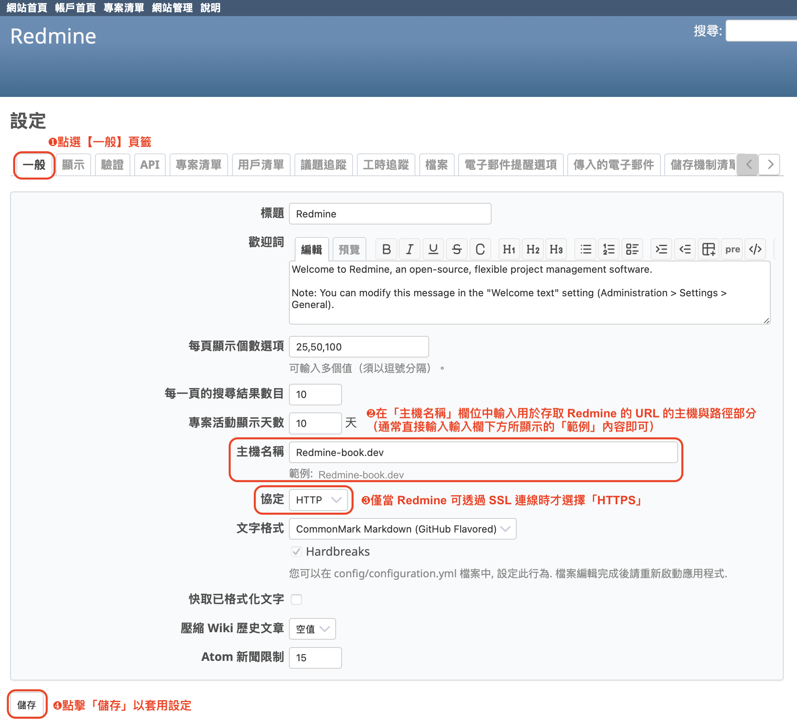

**主機名稱（含路徑）**

「主機名稱」是指 Redmine 執行所在伺服器所設定的主機名稱。請向伺服器管理員確認此資訊。

「路徑」則是 Redmine 所安裝的目錄名稱。如果同一台伺服器上還有其他系統一併運作，可能會為每個系統分配不同的目錄進行管理。此資訊也請向伺服器管理員確認。

**協定**

此項目用於設定存取 Redmine 時所使用的通訊協定，可選擇 HTTP 或 HTTPS。請依實際運用環境與伺服器設定，向伺服器管理員確認後選擇適當的選項。

Redmine 的郵件通知功能會將「主機名稱（含路徑）」、「協定」以及指向議題等特定頁面的 URL 組合起來，嵌入在郵件內容中。如果這些設定正確，用戶點擊郵件中的連結即可正確地開啟對應頁面。

若您無法透過郵件中的連結開啟 Redmine 頁面，請檢查這些設定是否有誤，或聯絡伺服器管理員協助確認。

---

以上說明的是 Redmine 安裝完成後建議立即進行的初始設定項目。特別是針對以繁體中文為主要使用語言的環境，上述設定能讓 Redmine 更加好用。如果您還有尚未設定的項目，請務必試著調整看看。
