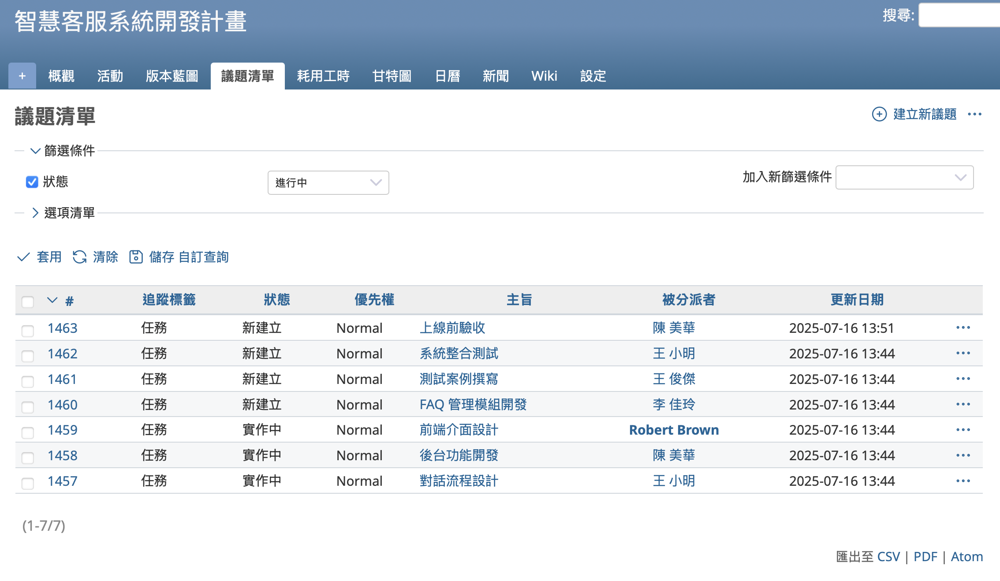
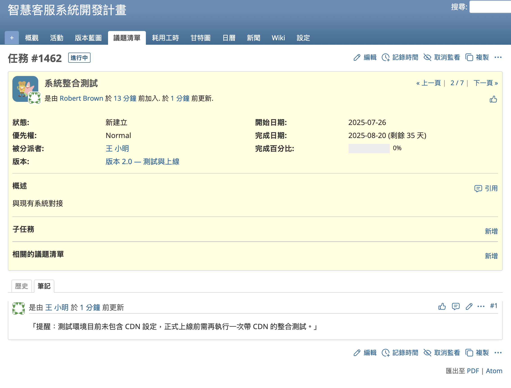
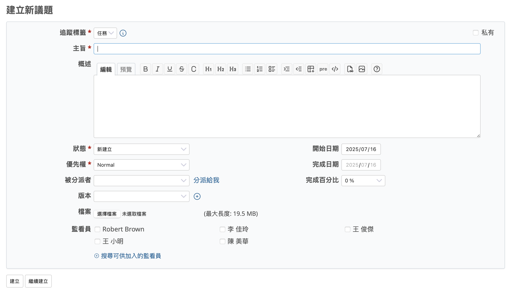
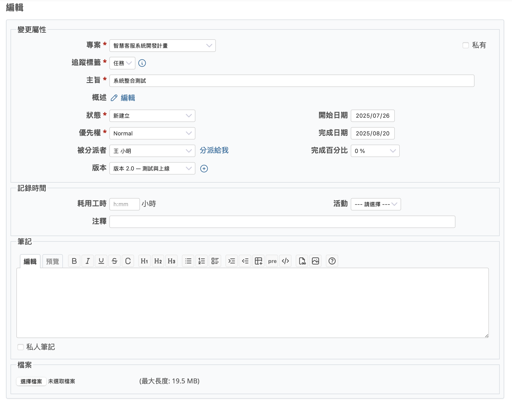
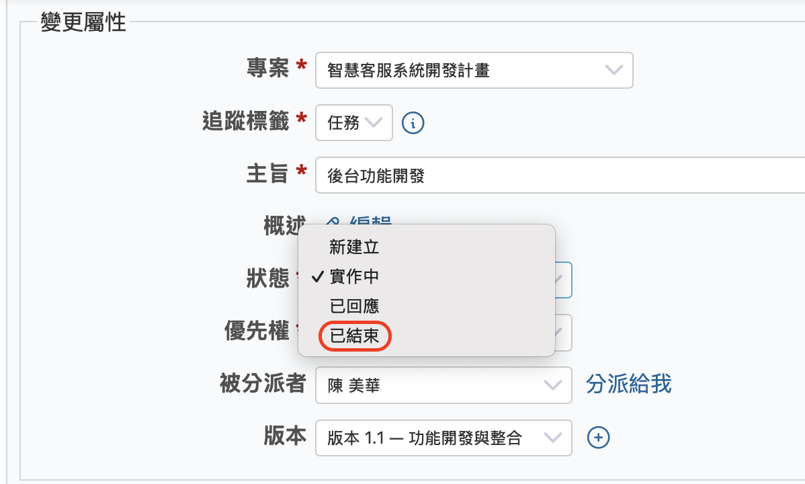
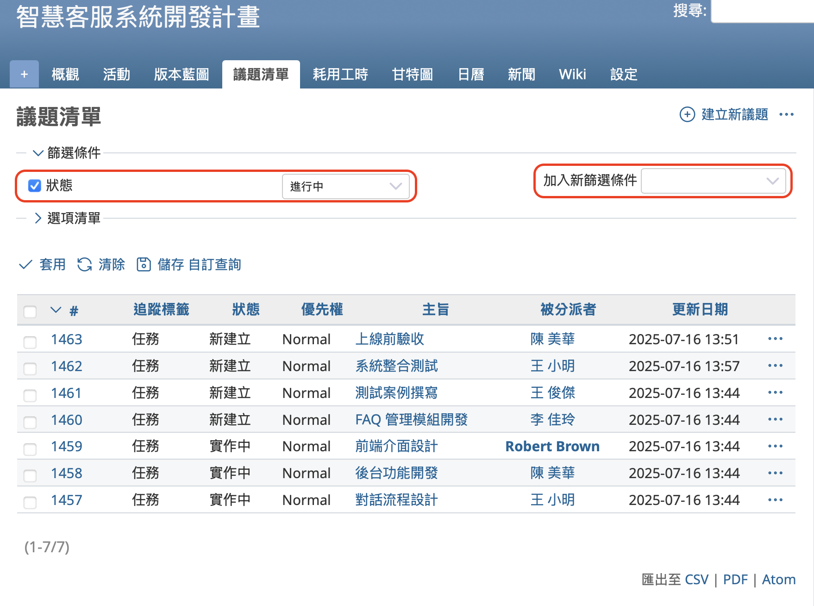
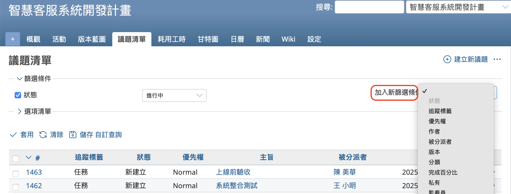
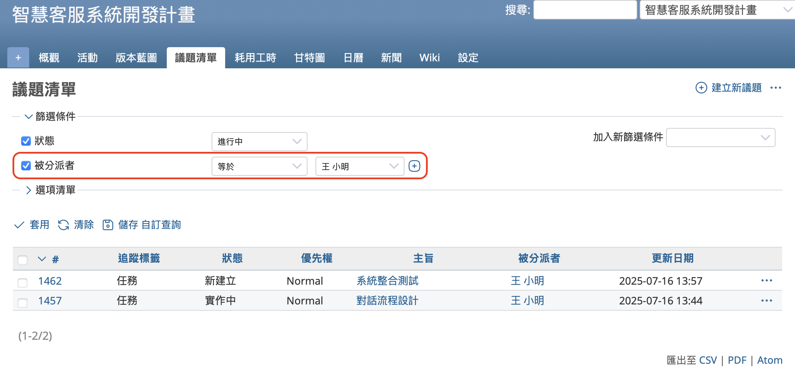
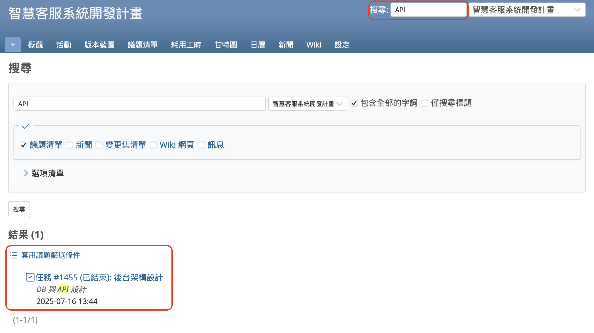

本文將介紹開源課題管理系統 Redmine 的核心功能：「議題」。

---

## 目錄

- 議題功能概要  
- 議題清單畫面  
- 議題詳細畫面  
- 建立新議題  
- 更新議題  
- 結束議題  
- 查詢議題  

---

## 議題功能概要

議題是 Redmine 的核心功能。
需要執行的作業、需要修正的錯誤等，必須完成的工作都可以登錄為一個議題。

在議題中，可以記錄多種資訊，例如負責人、開始日期、截止日期、概述等等。

透過正確地填寫這些資訊，就能快速掌握 「誰」要在「什麼時候」處理「什麼事項」。

議題可以由多名成員共同分享與處理。
其設計理念並不是讓一個人單獨處理一個議題，而是可以將議題轉交給能處理的成員，透過大家的合作一起完成目標。

---

## 議題清單畫面

點選專案選單中的「議題」，會顯示該專案中所有已註冊的議題清單。  
每筆議題會顯示編號、主旨、狀態等資訊。點選編號或主旨即可開啟議題的詳細頁面。

---

## 議題詳細畫面

議題的詳細畫面會顯示其所有資訊。  

以下是幾個主要欄位的說明：

### 狀態

表示議題目前的進度狀態。議題通常從「新建立」開始，當狀態變更為「已結束」時，即表示該項工作已完成。
您可以自由新增或修改狀態項目。
例如，只使用「新建立」、「實作中」、「已結束」這三種狀態，也足以應付一般的工作流程。
此外，您也可以將狀態與進度百分比連動。這樣即使不手動輸入進度，只要變更狀態，系統就會自動更新完成度。

### 優先權

您可以為議題設定優先權。在議題清單中，也可以透過樣式設定，根據不同的優先權改變顯示方式，例如將高優先權的議題以紅色呈現，以便快速辨識重要事項。

### 被分派者

一提到任務的分派對象，我們往往會直覺認為，這個人就是要對整個任務負責到底。但是Redmine 中的「被分派者」不一定代表唯一負責人，而是表示「目前要處理此議題的人」。如同傳球般地讓每位成員在適當時機接手任務，完成議題。

### 開始日與到期日

開始日期為預計開始作業的日期，完成日為預期完成的時間。設定這兩項可讓議題在甘特圖中呈現，有助於掌握處理任務的順序與時程規劃。

---

## 建立新議題

在議題清單畫面中點擊「建立新議題」按鈕後，會顯示建立新議題的畫面。

雖然不需要填寫所有欄位，但我們建議您在輸入「主旨」與「概述」時，注意以下幾點：

* 主旨請清楚表達議題內容
在議題清單中，用來辨識每筆議題的就是主旨。請盡量使用一眼就能了解內容的標題。

好範例：「在建立畫面中點選送出時出現錯誤訊息」
壞範例：「Bug 回報」

* 概述請儘可能具體詳細
建議您清楚說明在什麼條件下可以將此議題視為完成。
如果沒有明確條件，系統中將充斥許多「無法結束」的議題，造成後續混亂。

---

## 更新議題

當您完成了議題中所記載的工作或處理事項後，請記得回到議題中輸入執行內容或結果，將議題更新至最新狀態。

請開啟議題的詳細畫面，點選「編輯」按鈕進入編輯模式。
您可以在評論欄輸入執行過的作業內容或成果，也可以更新狀態、填寫工時等欄位。輸入完成後，請點選「送出」以儲存這次的更新。

即使無法一次完成議題，也沒有關係。
每次輸入的筆記都會依照日期自動記錄為歷史紀錄，您可以一邊逐步執行任務、一邊留下處理過程，循序漸進地推進至議題完成為止。

---

## 結束議題

當議題所描述的工作已完成，請開啟編輯畫面，將狀態設為「已結束」，並儲存。

預設情況下，結束的議題將不會出現在議題清單中。請以「讓清單中的議題逐一完成並消失」為目標，持續推進您的工作。

---

## 查詢議題

當系統裡登錄了大量議題時，您可能會不清楚目前每一筆議題應該由誰負責處理。
這時，就可以善用搜尋與篩選功能來快速找出各個用戶所負責的議題。

在議題清單上方有一個「篩選器」區塊。
預設情況下，會顯示「狀態」欄位，且篩選條件為「進行中」，代表系統目前顯示的是尚未結束的議題。

您也可以使用其他條件進行篩選。在「篩選器」區塊右側，有一個「加入新篩選條件」的下拉選單，您可以從中選擇不同欄位作為條件，例如「被分派者」、「優先權」、「開始日期」等等。

舉例來說，如果想篩選出某位用戶負責的議題：
點選「加入新篩選條件」，選擇「被分派者」，再設定條件為「等於」並選取該用戶的姓名，最後點選「套用」。
如此一來，畫面上就只會顯示分派給該用戶的所有議題。

如果使用篩選器仍無法順利找到議題，也可以試試右上角的「搜尋」功能。
只要在輸入框中輸入關鍵字並按下 Enter 鍵，系統就會在該專案內搜尋相關資訊並顯示結果。

---

