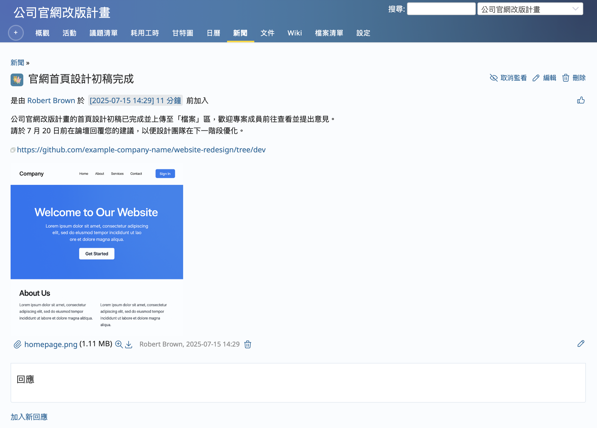
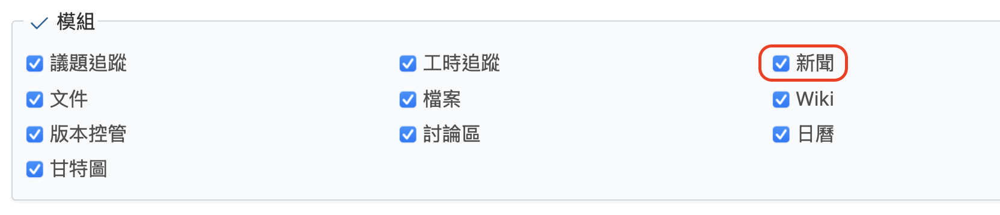
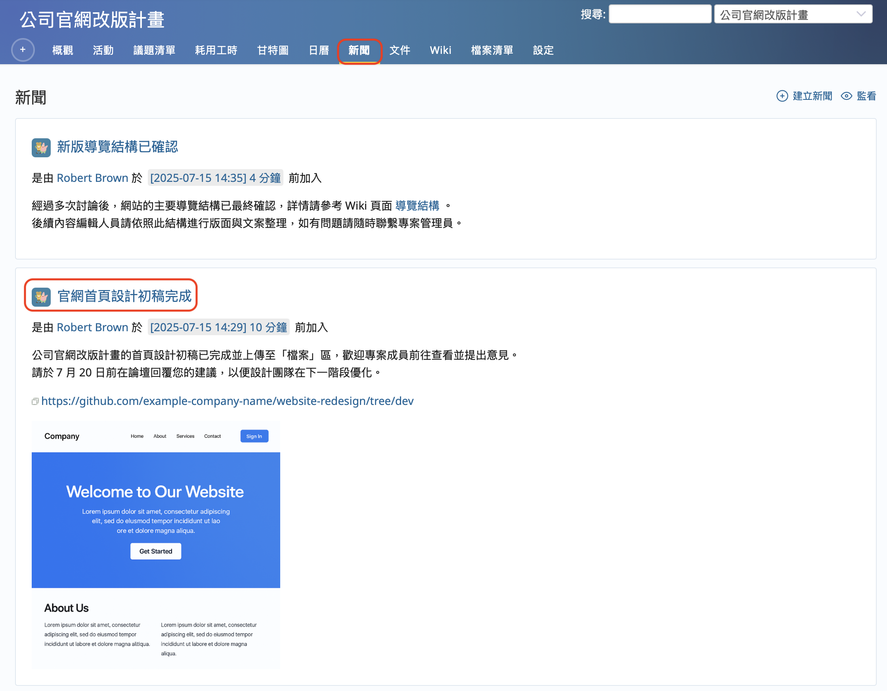
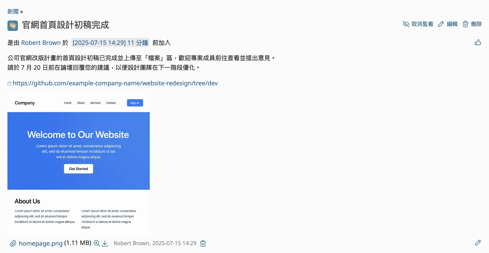
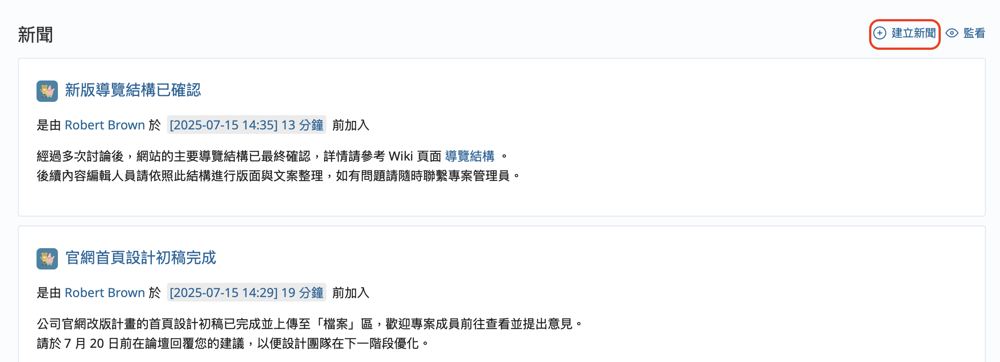
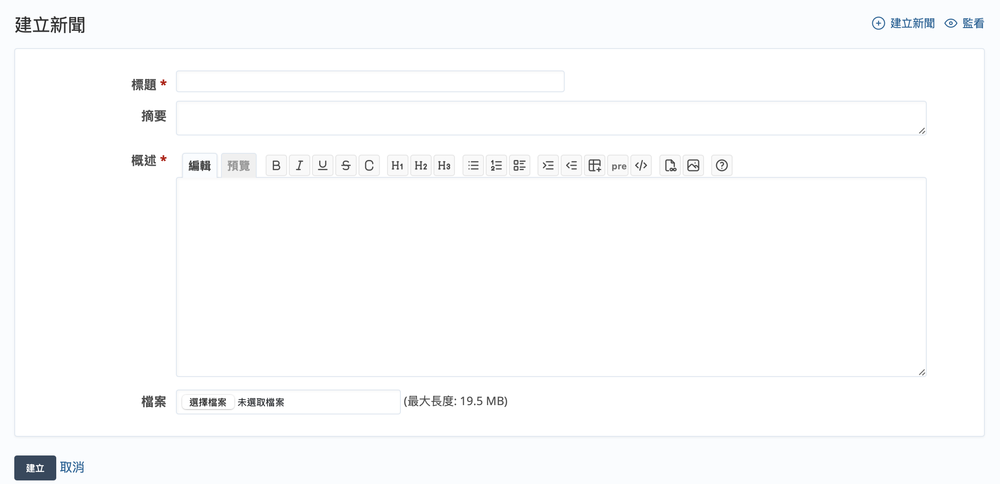
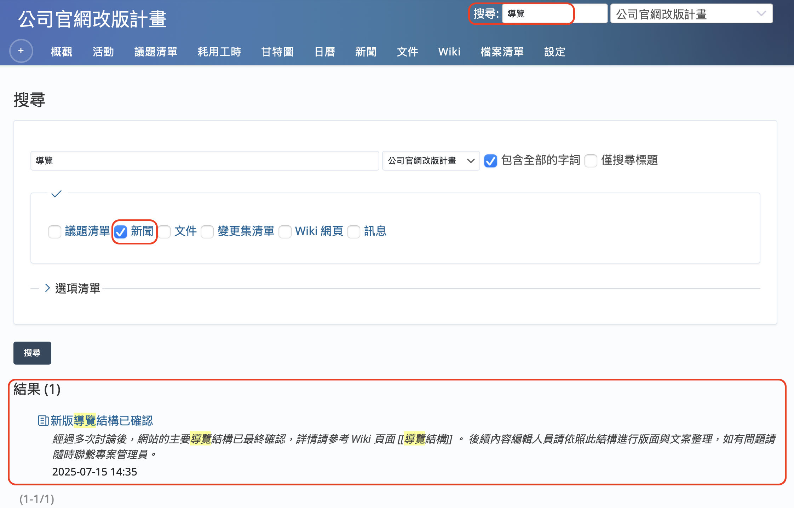

本文將介紹開源課題管理系統 Redmine 的「新聞」功能。

## 目錄

- 概要
- 啟用「新聞」功能的設定
- 顯示新聞
- 建立新新聞
- 搜尋新聞

## 概要

Redmine 的「新聞」功能是用來發佈與專案相關通知的功能。

例如，當您希望將專案的最新進展或重要公告一次性傳達給所有專案成員時，「新聞」功能就非常實用。若以電子郵件發送這些通知，雖然當下能傳達給收件人，但過了一段時間後，很容易被其他郵件淹沒而被忽略。即使當下沒空閱讀，想等有空時再看，也經常會找不到那封郵件。

透過「新聞」功能發佈的內容，會顯示在專案的新聞畫面、首頁畫面、專案概覽畫面以及我的頁面畫面上。這些畫面都是 Redmine 使用者經常會開啟的畫面，因此能有效避免資訊被錯過或忽略。

此外，Redmine 提供在新增新聞時自動發送通知郵件的功能，可將通知寄送給專案內所有成員。即使有些成員不常登入 Redmine，也能透過郵件得知最新消息。

以往發佈過的新聞也會被保留，方便日後查看。對於中途加入專案的成員來說，透過查看過去的新聞紀錄，也能幫助他們快速理解專案進展。

「新聞」的內容也包含在 Redmine 的搜尋對象中，因此即使在新聞畫面找不到，也可以透過搜尋功能找到所需資訊。

如果您想發佈下列資訊，不妨試試使用「新聞」功能：

- 專案整體進度與里程碑相關公告
- 專案營運上的重要通知
- 專案相關活動等公告
- 對支援業務產生影響的系統故障與對應措施通知
- 業務系統的更新資訊

Redmine 的「新聞」功能兼具「隨時可查看最新資訊」、「保留過往資訊」、「可透過搜尋功能查詢」三大優點，請多加利用。

## 啟用「新聞」功能的設定

若要在某個專案中使用「新聞」功能，必須先啟用該專案的「新聞」模組。「新聞」模組可以針對每個專案個別設定啟用或停用。

只有具備以下條件的使用者才能變更設定：必須是該專案的成員，並且其所分配的角色需擁有「編輯專案」與「選擇專案模組」的權限。如果您在 Redmine 的初始設定中執行過「載入預設設定」，那麼「管理人員」角色會預設具備這些權限，因此建議將該角色指派給相關使用者。

請開啟專案選單中的「設定」→「專案」頁籤，勾選模組清單中的「新聞」選項，然後點擊「儲存」。

另外，也可以在建立新專案時就啟用此模組。如果您預計會使用「新聞」功能，建議在專案建立畫面中一併啟用。

## 顯示新聞

點選專案選單的「新聞」，將會顯示新聞列表畫面。

在新聞列表中點選標題，即可開啟新聞的詳細畫面。

## 建立新新聞

若要新增新聞，在新聞列表畫面中點擊「建立新聞」。

畫面會切換至「建立新聞」畫面。

請輸入標題、摘要與概述。其中，標題與概述為必填項目。

在摘要中填寫的內容，將會顯示於首頁畫面以及專案的概覽畫面中。建議撰寫簡潔易懂的文字。

概述欄位可以使用文字格式標記。

您可以上傳檔案，且支援一次上傳多個檔案。

標題、摘要與概述皆會被納入 Redmine 的搜尋功能範圍。為了讓其他人更容易透過搜尋找到相關內容，建議填寫恰當且具體的內容。

## 搜尋新聞

Redmine 具備搜尋功能，而「新聞」也是搜尋的對象之一。

在畫面右上角的搜尋框中輸入關鍵字後按下 Enter 鍵，即可顯示搜尋結果。

系統會根據新聞的標題、摘要與概述進行比對，並將符合搜尋關鍵字的新聞列表顯示出來。點擊新聞標題即可進入新聞詳細頁面查看內容。

請注意，如果搜尋類別中未勾選「新聞」，則新聞不會顯示在搜尋結果中。請勾選「新聞」後再次執行搜尋。

善用新聞功能，您就能不透過電子郵件或其他通訊工具，也能有效集中管理資訊，讓相關成員隨時掌握最新消息。如此一來能提升整體溝通效率，加強專案的透明度與團隊凝聚力。歡迎您多加活用這項功能。

