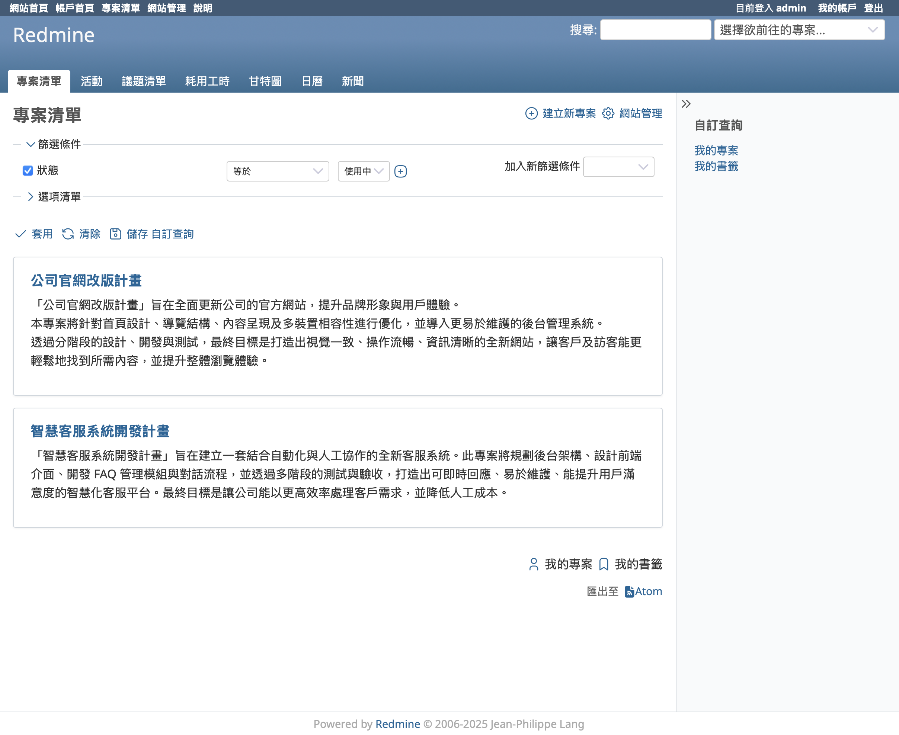
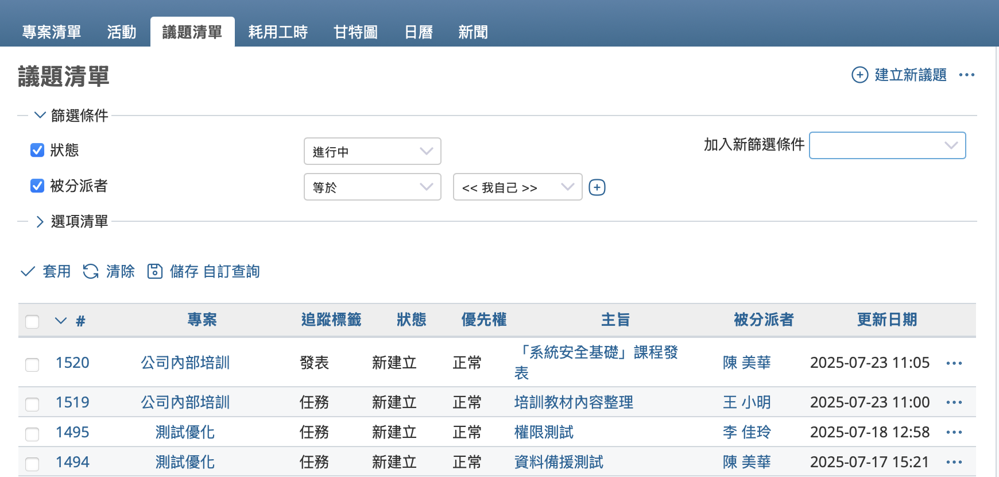
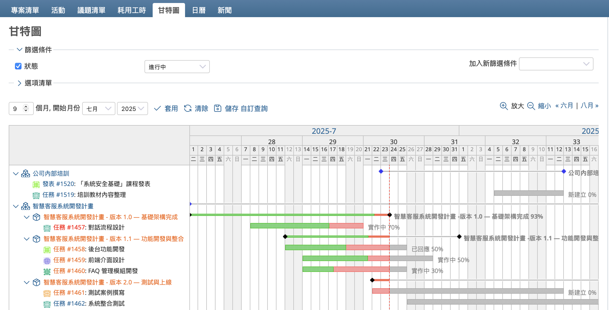
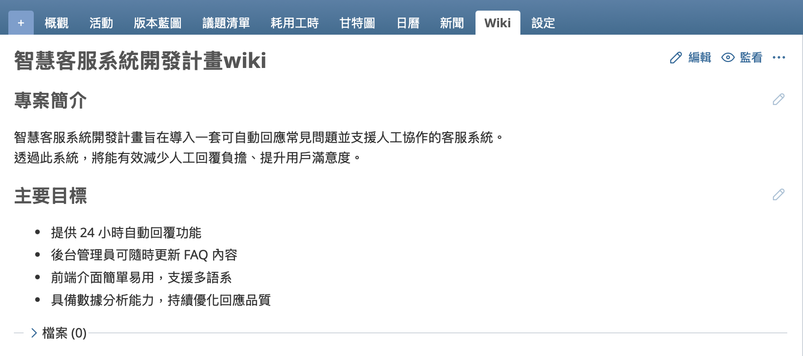
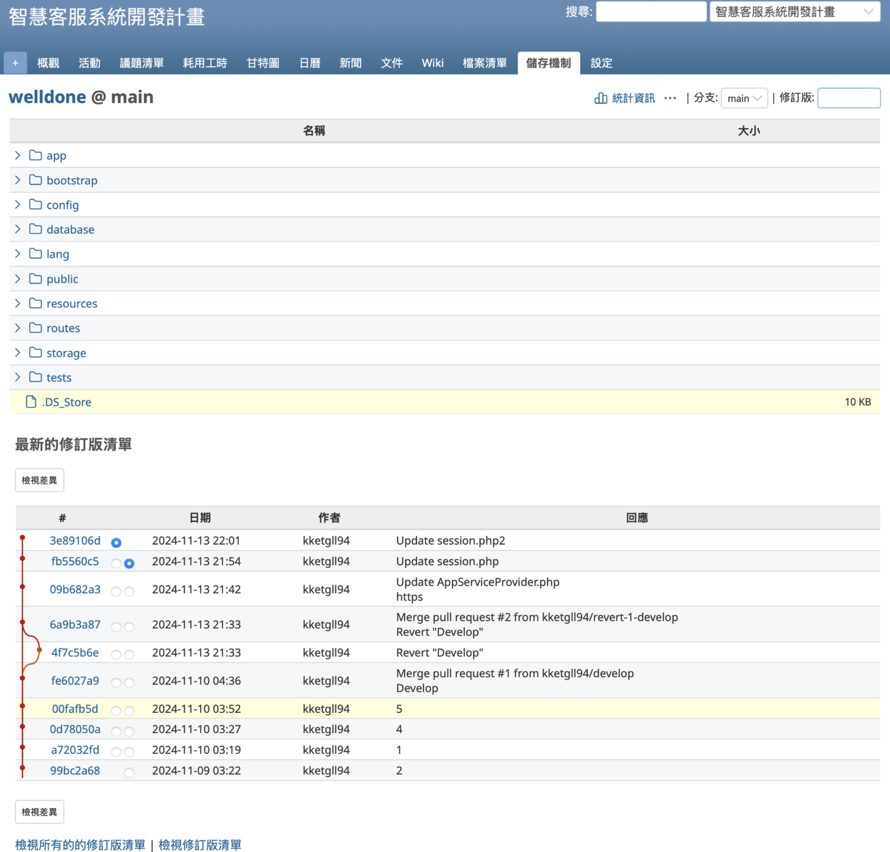
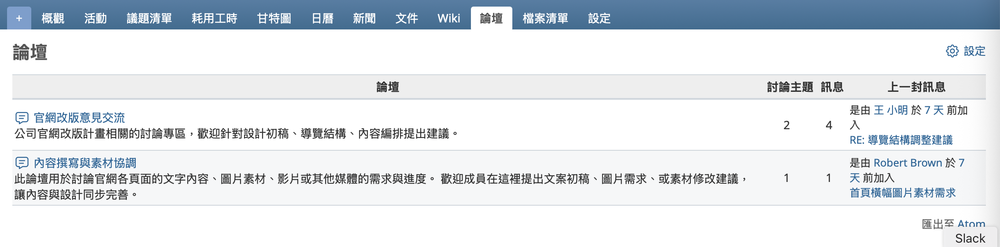

本篇文章將為您解說開放原始碼的課題管理系統 Redmine 的基本概要。

## 目錄

- [什麼是 Redmine](#about)
- [Redmine 的主要功能](#feature)
- [使用 Redmine 的優勢](#merit)
- [Redmine 的應用場景](#resources)

## 什麼是 Redmine {#about}

Redmine 是一套具備課題管理與資訊共享功能的開源軟體，旨在支援專案的順利推進。任何人都可以自由下載、安裝並使用 Redmine。

由於 Redmine 是作為 Web 應用程式運作的系統，只要具備可執行 Redmine 的伺服器環境以及網頁瀏覽器，無需另外安裝其他應用程式，即可開始使用。此外，Redmine 能集中管理資訊，無論身在何處都能存取，也適合多人協作使用。

Redmine 與軟體開發專案的相容性極高，能與 Subversion、Git 等版本控制系統整合。實際上，Redmine 自身的開發專案也是透過 Redmine 來管理，此外也廣泛應用於其他軟體開發流程中。

Redmine 的用途不僅限於軟體開發。它同樣適用於各種業務專案管理、活動籌劃、組織內部日常工作的任務追蹤、客服案件管理、內部流程運作等各式場景，具備高度的靈活性。

在現代的工作環境中，有效管理任務與提升團隊溝通效率變得越來越重要。尤其是在遠距工作日益普及、跨部門或多團隊協作成為常態的情況下，導入合適的工具將對業務品質帶來重大改善。Redmine 正是為此類需求量身打造的最佳工具。若您正在尋找合適的管理工具，或是在使用試算表管理任務時遇到瓶頸，不妨參考本書的介紹，考慮導入 Redmine。

## Redmine 的主要功能 {#feature}

### 議題（Issue）

Redmine 的核心功能是透過「議題（Issue）」進行課題與問題的追蹤與管理。需要處理的工作會以議題的形式註冊，包括待解決的問題、待辦任務、程式錯誤等內容，皆可轉換為議題加以管理。隨著作業的推進，您可以隨時更新議題的內容。

每個議題都可以設定負責人與期限，因此「誰需要負責哪項任務、什麼時候之前必須完成」等資訊能一目了然。

### 甘特圖（Gantt Chart）

為了管理專案，通常會將課題細分為較小的作業單位，並以圖表形式排列，讓整體的作業流程與進度能夠一目瞭然。這種圖表稱為甘特圖（Gantt Chart）。Redmine 提供了甘特圖功能。

當您註冊議題時，只要輸入開始日期與截止日期，該議題就會自動反映在甘特圖上。透過此圖表，您可以清楚掌握作業的順序、預定時程與進度狀況。

### Wiki

Wiki 是一項用於建立與編輯文件的功能。您可以自由撰寫與專案或組織相關的文件、備忘錄等各種用途的內容。不僅能建立多個頁面，也能輕鬆地讓各頁面彼此互相連結。

此外，Wiki 會保留所有的編輯記錄，因此不僅方便比對不同版本，也能輕鬆地還原至先前的內容。

### 版本控制系統整合

Redmine 可與 Subversion、Git 等版本控制系統進行整合。您可以在 Redmine 的介面上查看提交（Commit）記錄以及版本庫中的檔案內容。

這項功能在管理軟體開發或系統開發等專案時非常實用，能有效促進原始碼的追蹤與團隊協作。

### 討論區（論壇）

論壇是提供留言討論的功能。當用戶之間想針對特定主題進行討論時，這個功能就非常實用。

## 使用 Redmine 的優勢 {#merit}

### 作為開放原始碼軟體，可自由使用

Redmine 是開放原始碼軟體，任何人都可以自由下載、安裝並使用。
您可以根據需求選擇在自有伺服器（On-premises）或雲端平台（Cloud）上運行。如果資源允許，Redmine 沒有限制可登錄的專案或成員數量。

### 作為網頁應用程式，只需瀏覽器即可使用

因為 Redmine 是一套網頁應用程式，只要有瀏覽器，就可以隨時存取，無需安裝額外軟體。
所有資訊會集中管理，團隊成員只需透過瀏覽器即可從任何地點存取與更新資料。

### 以議題記錄下來的資訊會成為寶貴資產

將待辦事項或任務登錄為議題，並持續記錄實際的處理情況，這些資料會作為寶貴的工作紀錄保留下來。
當面對類似於一年前執行過的任務時，即使無法完全回憶細節，只要有過去的議題作為參考，就能迅速掌握當時的進行方式，有助於提高作業效率。
即使負責人更換，新成員也能查閱前任留下的議題記錄，進而順利完成工作交接。

## Redmine 的應用場景 {#resources}

Redmine 擁有豐富的功能，透過靈活的組合，可廣泛應用於各種業務場景。

### 專案管理

Redmine 具備多項專案管理所需功能。

在大型專案中，往往需要劃分子專案來推進各項作業。Redmine 支援依任意階層建立子專案，您可以依照專案的規模與架構進行靈活管理。

此外，在 Redmine 中登錄的成員人數沒有限制，您可以根據專案需求自由新增參與成員。

當參與人數增加時，可能需要限制各成員的資訊瀏覽權限。Redmine 可透過詳細的權限設定來精細控制資訊的可視範圍。

### 任務管理

Redmine 也適用於日常業務的任務管理。您可以為每個工作項目指定期限與優先順序，透過議題列表即可一目了然掌握當前應該優先處理的事項。

### 客戶支援管理

Redmine 同樣適用於管理客戶詢問紀錄。將每一筆詢問內容作為議題登錄後，系統會幫助您清楚掌握尚未回覆或延遲回覆的案件，避免遺漏與延誤。

### 活動企劃與執行

在舉辦活動的專案中，經常需要依照「企劃 / 準備 / 活動當日」等不同階段來分工推進。Redmine 可建立各個階段，並將議題與階段關聯後進行管理，即使工作項目繁多，也能清晰呈現每個階段應辦事項，幫助您在每個時點快速掌握當下的優先任務。

