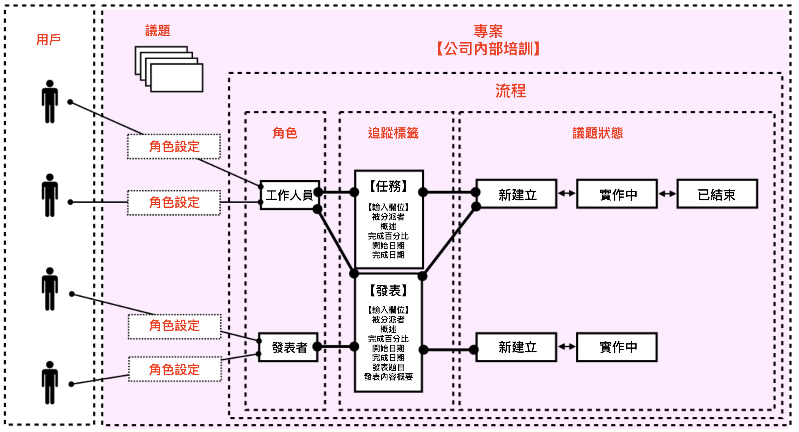
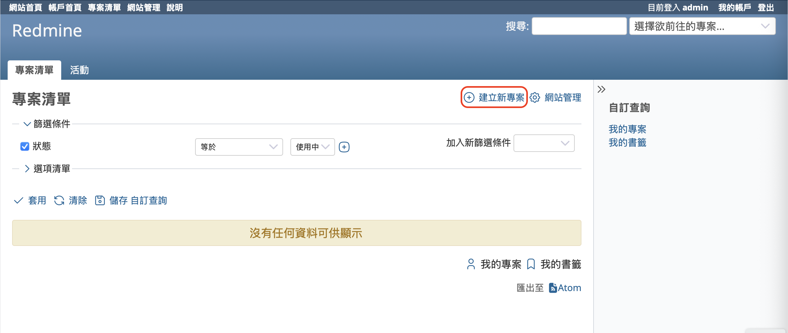
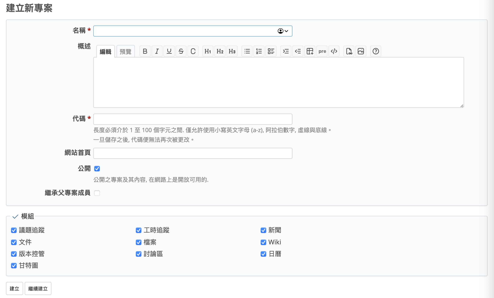
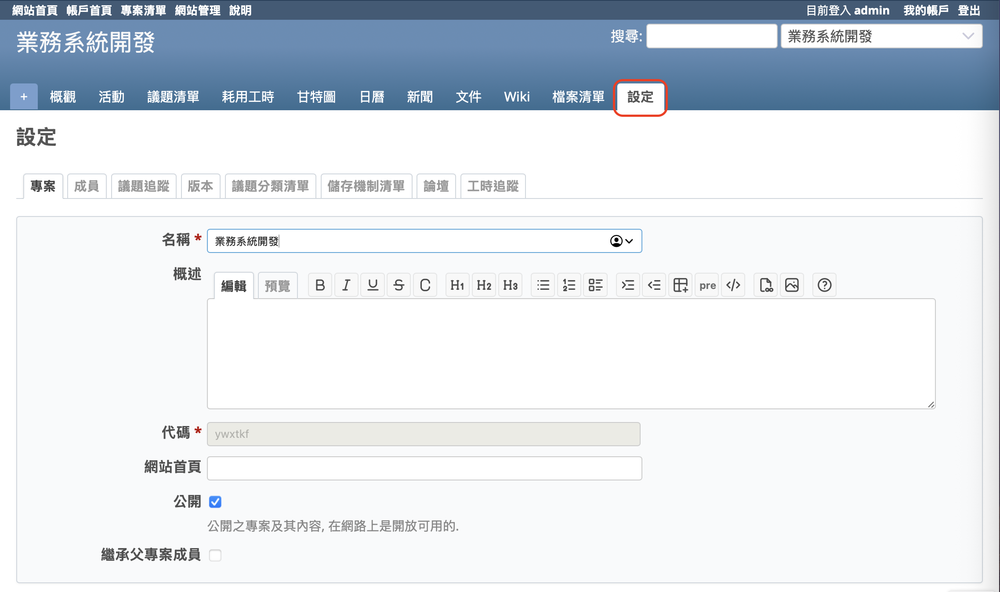

本文將介紹開源課題管理系統 Redmine 的「專案設定」。

## 目錄

- Redmine 的「專案」是什麼
- 建立新專案
- 專案的設定項目
- 後續變更設定

## Redmine 的「專案」是什麼

Redmine 可用於專案管理、工作任務管理、客戶服務管理、活動舉辦等各種用途。可管理的資訊類型也非常多樣，包括議題、Wiki、文件等。

在 Redmine 中，這些資訊是以「專案」為單位進行整合管理。您可以將 Redmine 中的「專案」想像成一個用來集中整理相關資訊的容器。

舉例來說，若使用 Redmine 的核心功能——議題功能，在使用議題的同時會使用到指派給誰、目前狀態為何等資訊，而「可被指派的人員有哪些」、「可以使用哪些狀態」這些條件，都是根據每個「專案」單獨設定的。
將 Redmine 的專案以示意圖來呈現的話，會如下所示。

Redmine 中可建立的專案數量沒有上限。只要伺服器資源允許，您可以建立任意數量的專案。

在同一個 Redmine 系統中，也可以建立不同類型的專案。舉例來說，若同時有專案管理業務與客戶服務業務，且由不同的員工負責，所需使用的狀態也不同，則可以在 Redmine 中分別建立為獨立的專案，使它們並存。即便有員工同時負責兩者，也可以在同一個 Redmine 畫面中切換專案進行操作，無需為每個專案分別重新登入，省去繁瑣的流程。

此外，專案中還可以建立子專案。子專案的層級數沒有限制，也可以建立孫專案、曾孫專案。若專案規模龐大、業務細分明確且參與成員眾多，建議依照實際使用情境將專案拆分為易於管理的子專案。

## 建立新專案

在剛安裝完 Redmine 時，系統中尚未建立任何專案，因此需要從建立新專案開始操作。

只有擁有系統管理員權限的使用者才能建立專案。剛安裝完 Redmine 時，admin 用戶預設具有系統管理員權限，因此建議以 admin 身分登入並進行操作。

點擊上方選單的「專案清單」，即可進入專案清單畫面。

此時會顯示「沒有任何資料可供顯示」，點擊「建立新專案」即可開啟建立新專案的畫面。

在畫面中輸入專案相關資訊後，點擊「建立」即可完成建立。

## 專案的設定項目

### 名稱

「名稱」欄位用於輸入專案的名稱。您在此輸入的文字將會顯示在專案的標題、專案清單的下拉列表等位置。此欄位為必填，且日後可以變更。

### 概述

「概述」欄位的內容會顯示在專案的總覽畫面中。這不是必填欄位，可以選擇省略，日後也可修改。

### 代碼

「代碼」會作為專案網址（URL）的一部分。可使用的字元包括半形英文字母小寫（a–z）、數字、連字號（-）與底線（_）。長度需介於 1 到 100 個字元之間。此欄位為必填，且建立後無法變更，建議您謹慎填寫。

### 網站首頁

「網站首頁」欄位可輸入要顯示於專案總覽頁面的超連結網址。這不是必填欄位，可以省略，且日後可以修改。

### 公開

「公開」用於設定是否將此專案設為公開。若勾選此選項，即使不是專案成員也能檢視此專案的內容。建議在實際業務中將其關閉。預設為勾選狀態，請取消勾選以避免外部人員瀏覽。此設定可日後變更。

### 繼承父專案成員

「繼承父專案成員」用於建立子專案時，是否要繼承父專案的成員設定。若您希望子專案自動繼承父專案的成員，請勾選此選項。

### 模組

「模組」是用來啟用此專案中可使用的功能。請勾選您希望啟用的模組，例如若要進行議題管理，請勾選「議題追蹤」，若要使用 Wiki，請勾選「Wiki」。這些設定日後可變更，您也可以先全部啟用，日後再逐一停用不需要的模組。

### 後續變更設定

若您想在專案建立後變更相關設定，請點選頂部選單的「專案清單」，開啟專案清單，接著點選欲變更的專案名稱以進入該專案頁面，然後點選專案選單中的「設定」。

這時會顯示與新建專案時相同的設定畫面。修改您希望變更的項目後，點選「儲存」即可套用新的設定內容。