本文將介紹開源課題管理系統 Redmine 的基本操作方法，讓您能在短時間內了解介面構成與核心功能。

## 目錄

- 網站首頁  
- 登入  
- 畫面結構  
  - 主選單  
  - 專案選單  
  - 帳號選單  
- 專案操作  
  - 專案清單  
  - 建立新專案  
- 議題操作  
  - 議題清單  
  - 建立新議題  
  - 更新議題  
  - 結束議題  
  - 查詢議題  
  - 自訂查詢  
- 甘特圖   
- 帳戶首頁
- 電子郵件通知 

## 網站首頁

Redmine 的首頁稱為「網站首頁」。使用瀏覽器開啟網址後，畫面將顯示如下。

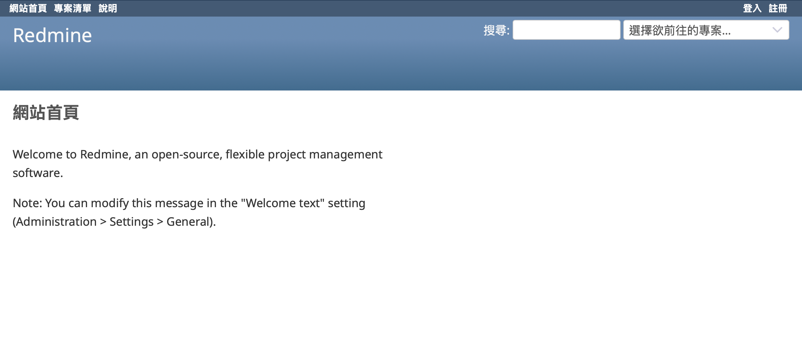

Redmine首頁預設為公開，任何人皆可瀏覽。如需限制訪客必須登入後才能檢視，可透過「網站管理」中的設定進行調整。

## 登入

請點選右上角的「登入」進入登入畫面。  

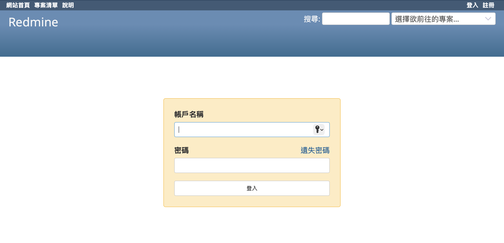

若您剛安裝完 Redmine，系統預設會建立一組帳號為 `admin` 的管理者帳戶。初始密碼亦為 `admin`。請於首次登入後盡快變更密碼以確保安全。

## 畫面結構

Redmine 主要畫面分為以下幾個區塊：

- **主選單**：可快速進入網站首頁、帳戶首頁、專案清單、網站管理與說明頁面  
- **專案選單**：顯示目前專案中可使用的功能（如議題、甘特圖等）  
- **帳號選單**：顯示目前登入者資訊、帳號設定與登出連結  
- **內容區域**：顯示目前所選功能的詳細內容  

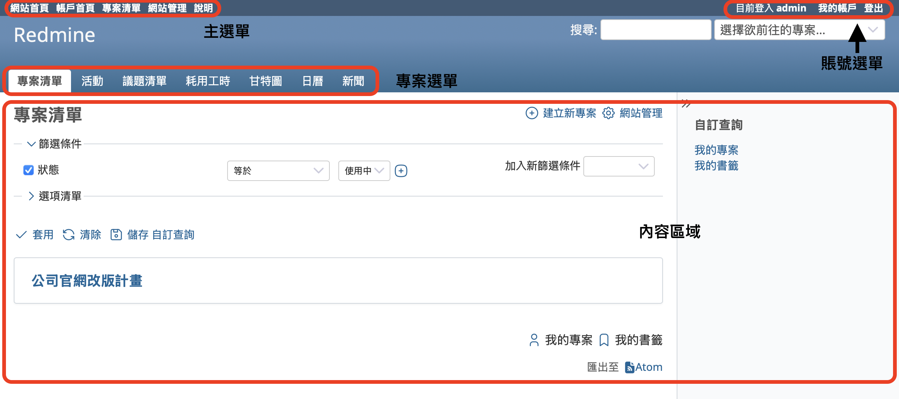

### 主選單

- **網站首頁**：點選後會回到 Redmine 的網站首頁。 
- **帳戶首頁**：顯示與您相關的議題清單與小工具。
- **專案清單**：顯示您有權限存取的專案清單。  
- **網站管理**：僅管理員可見。點選後可進入系統管理介面。
- **說明**：連結至 Redmine 的官方操作指南。 

### 專案選單

當您進入某個專案時，畫面上會顯示該專案可用的功能項目（如議題、甘特圖、日曆等）。本篇文章將會介紹「專案」、「議題」以及「甘特圖」這三個功能。

### 帳號選單

帳號選單位於畫面右上角，提供以下操作：

- 顯示目前登入的用戶名稱  
- **我的帳戶**：可修改個人資訊、登入名稱、密碼與偏好設定  
- **登出**：登出 Redmine  

## 專案操作

Redmine 以「專案」為單位管理各種資訊與功能模組。以下為專案相關的基本操作方式：

### 專案清單

點選主選單的「專案清單」，即可查看您有權限參與的所有專案。點選專案名稱可進入該專案首頁。

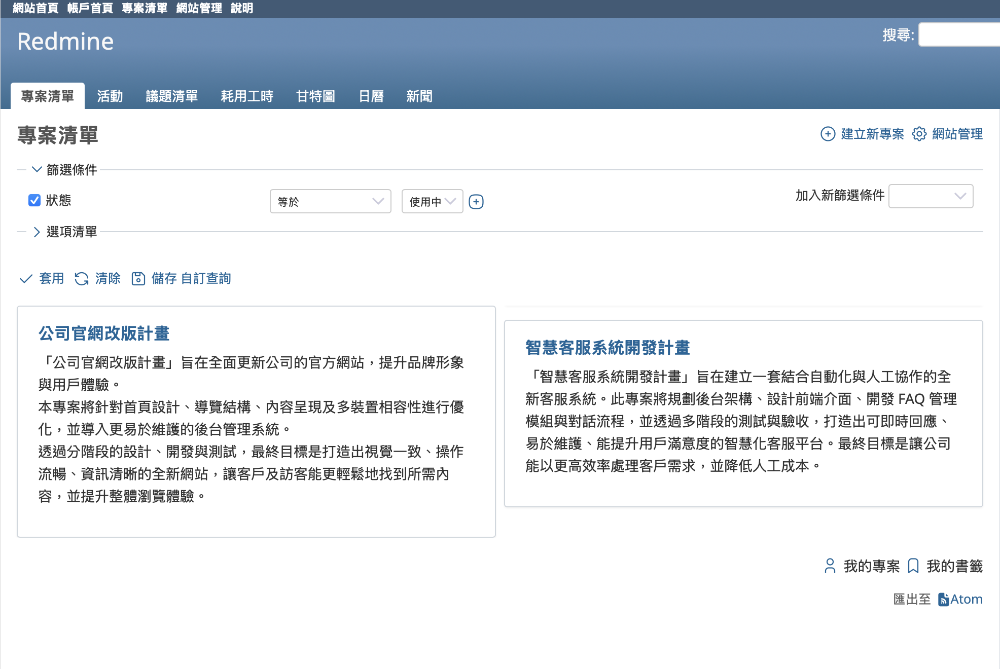

### 建立新專案

若您擁有管理員權限，專案清單中會顯示「建立新專案」按鈕。點選後可填寫專案名稱、代碼、啟用模組等資訊，建立新的專案。

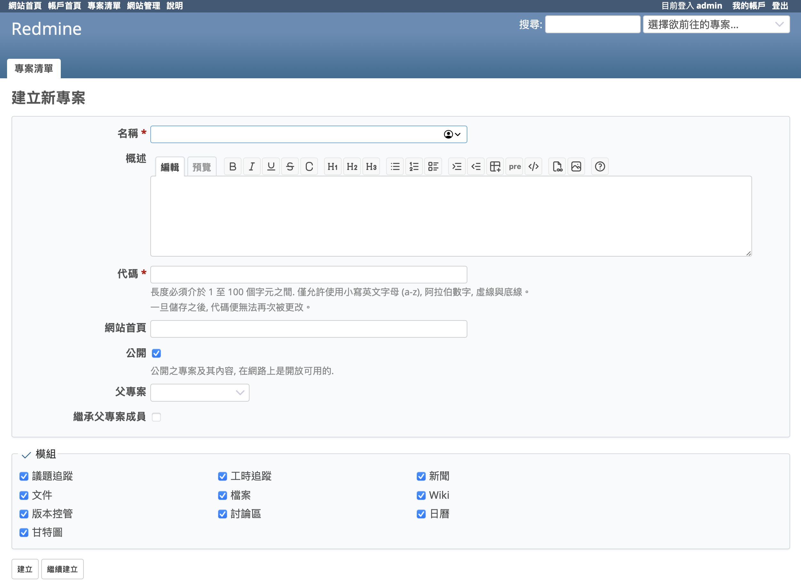

## 議題操作

議題是 Redmine 中用來追蹤任務、錯誤、需求等工作的主要單位。以下為基本操作流程：

### 議題清單

進入某專案後，點選「議題清單」頁籤即可檢視所有該專案中的議題。

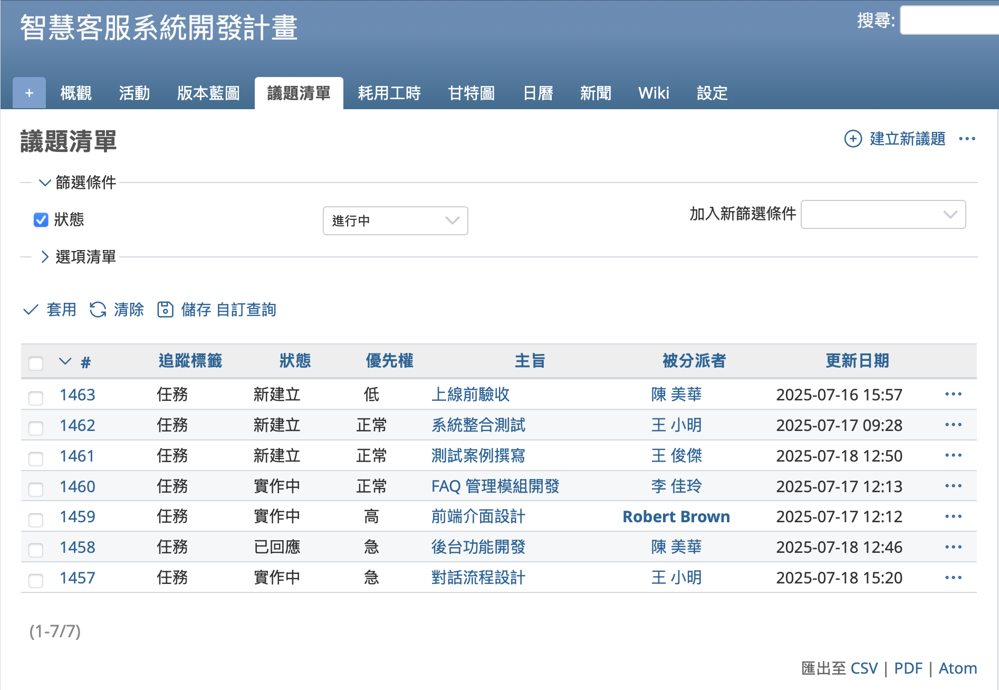

### 建立新議題

在議題清單畫面中，點選「建立新議題」按鈕，輸入追蹤標籤、主旨、概述、狀態、分派對象等資訊後，即可建立新議題。

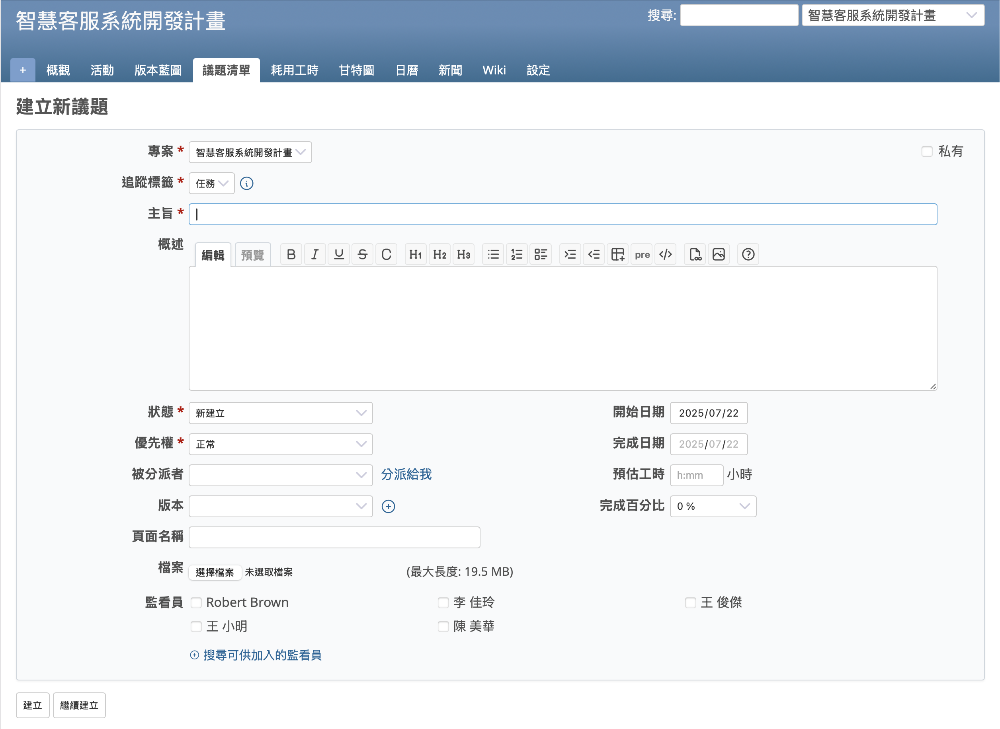

### 更新議題

點選議題主旨可進入詳細畫面，點選「編輯」可變更狀態、填寫筆記、更新處理進度或變更欄位。儲存後的變更將記錄於歷史紀錄中。

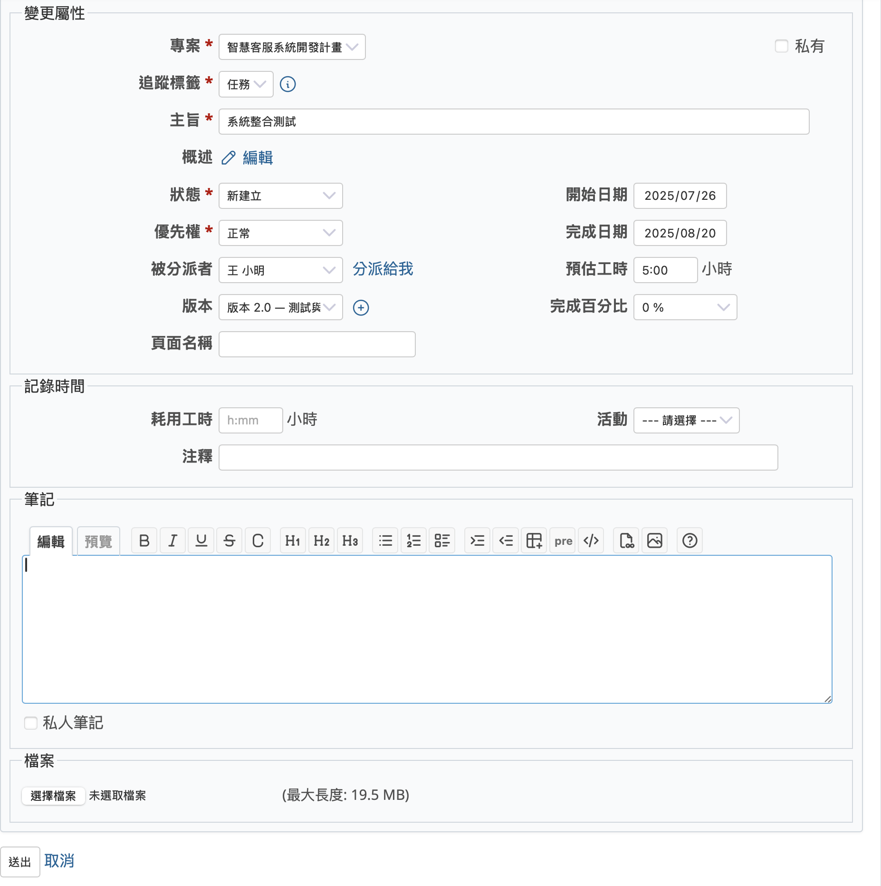

### 結束議題

當議題完成後，可將其狀態變更為「已解決」或「已結束」。  
預設情況下，已結束的議題不會顯示於清單中，可透過篩選條件查閱。

### 查詢議題

在議題清單中，您可以透過篩選功能，從顯示的所有議題中找到需要處理的議題。例如，新增「被分派者」這個篩選條件，就可以只顯示由自己負責的議題。
此外，也可以在畫面右上方的「搜尋」欄位輸入文字來搜尋議題。

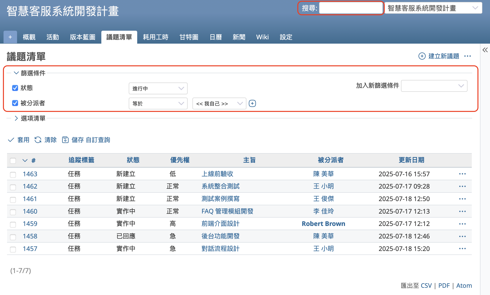

### 自訂查詢

透過篩選功能來縮小議題清單的範圍雖然很方便，但如果每次都要重新設定篩選條件就會有點麻煩。
在這種情況下，可以將當前的篩選條件儲存為「自訂查詢」。
儲存後的自訂查詢會以連結的形式顯示在畫面右側，只要點擊該連結，就能立即顯示套用相同篩選條件後的結果畫面。

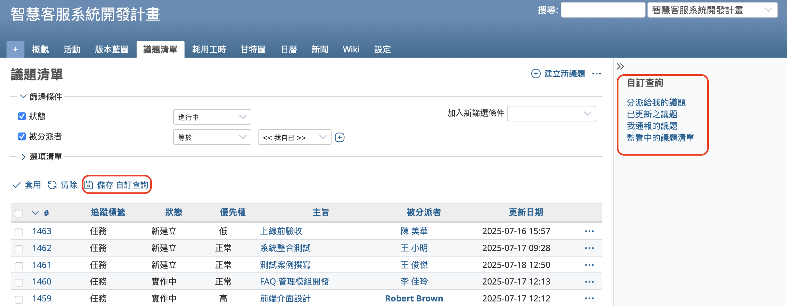

## 甘特圖

點選「甘特圖」頁籤，即可將已登錄的議題以甘特圖形式一覽顯示。
只要在議題中輸入開始日期與完成日期，就能直觀地確認各項任務的執行順序與作業進度。
此外，還可以顯示閃電線（進度線），讓您一眼就能掌握目前的進度狀況。

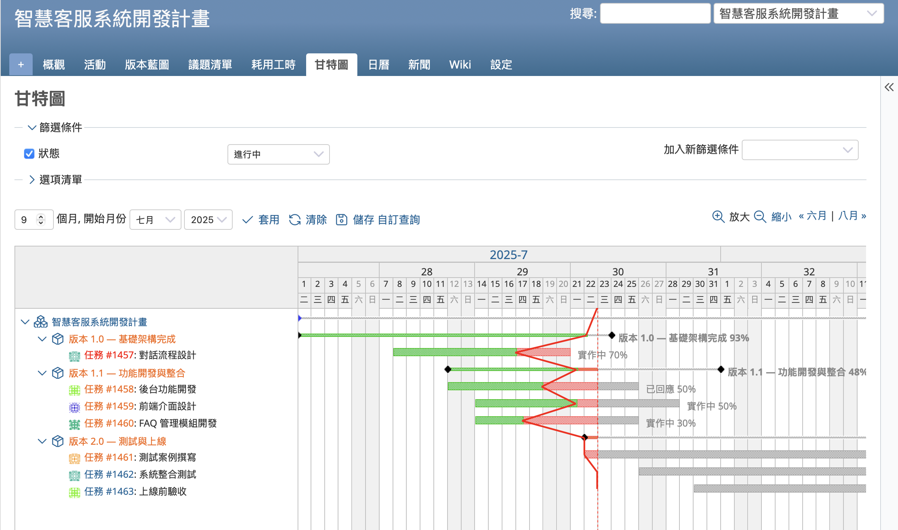

## 帳戶首頁

「帳戶首頁」是用戶專屬的儀表板，可同時顯示多個經篩選的議題清單，例如「分派給我的議題」或「監看中的議題清單」等，這些篩選條件皆為系統預先設定。
此外，您也可以加入自己建立的自訂查詢，讓符合特定條件的議題清單顯示在頁面上，便於集中檢視與管理。

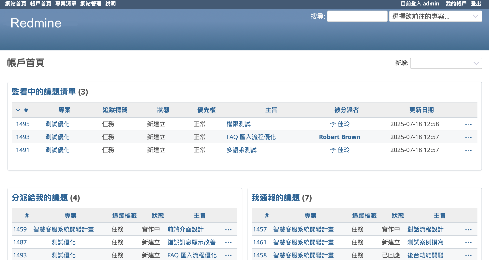

## 電子郵件通知

當議題被建立、更新、留言時，系統會根據用戶設定的偏好，自動發送通知郵件。  
郵件中會包含新增的筆記內容，因此即使不開啟 Redmine，也能直接確認內容。
郵件裡也會附上該議題的連結，您可以點擊後直接開啟該議題。

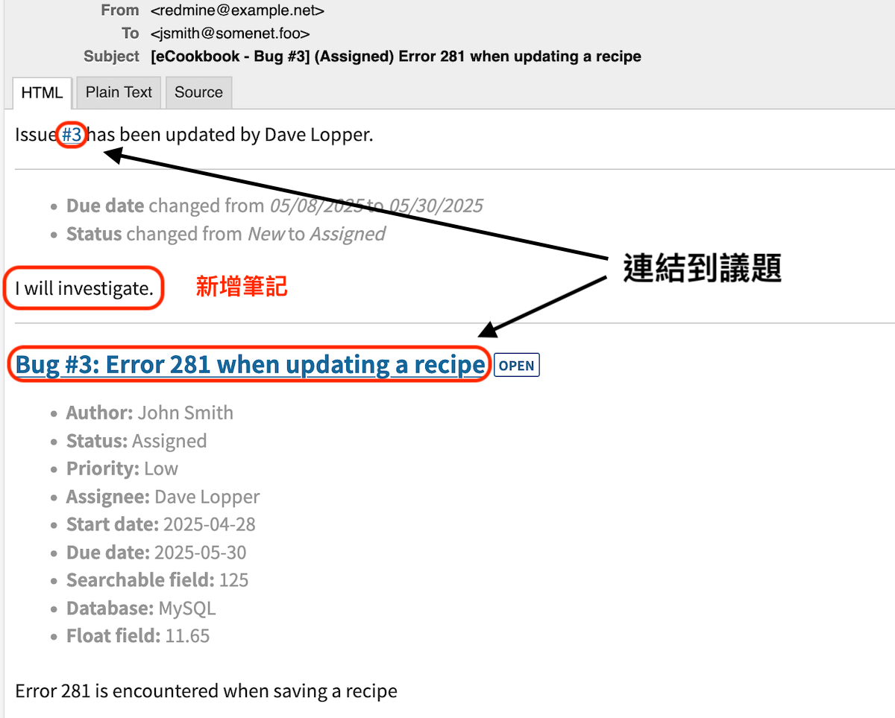

