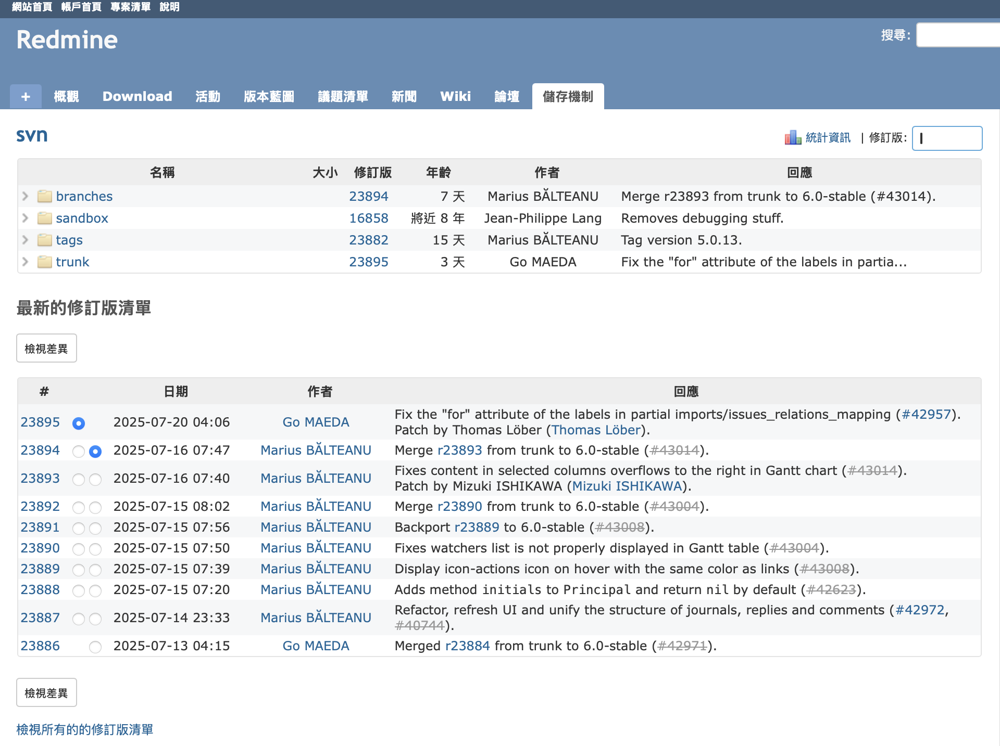
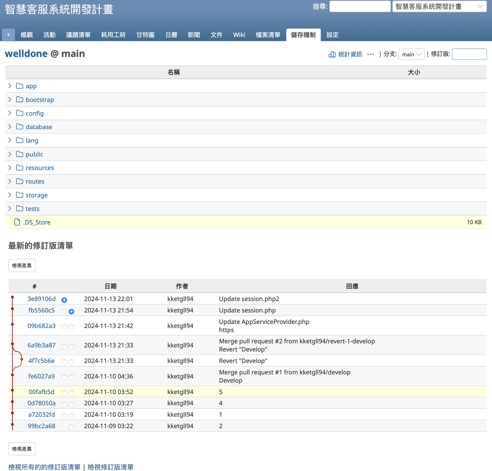
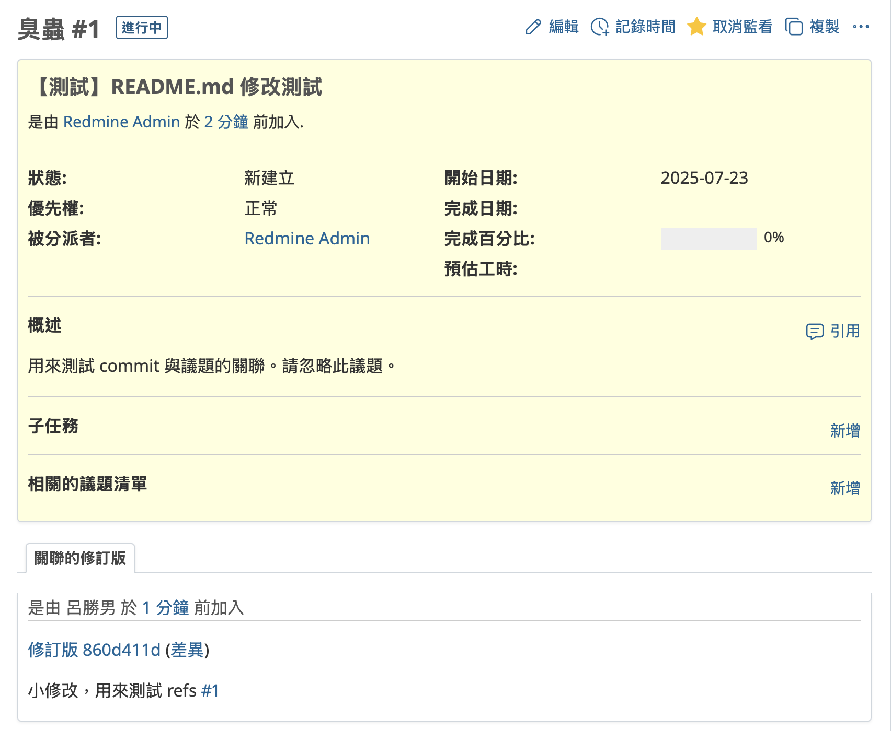
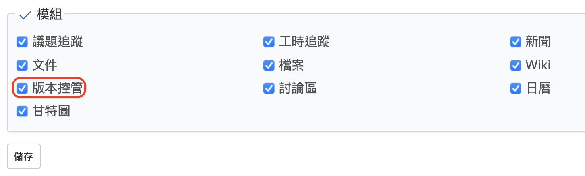
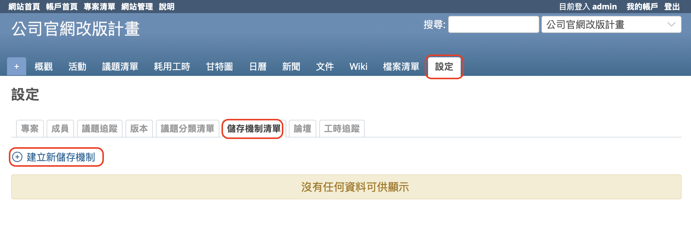
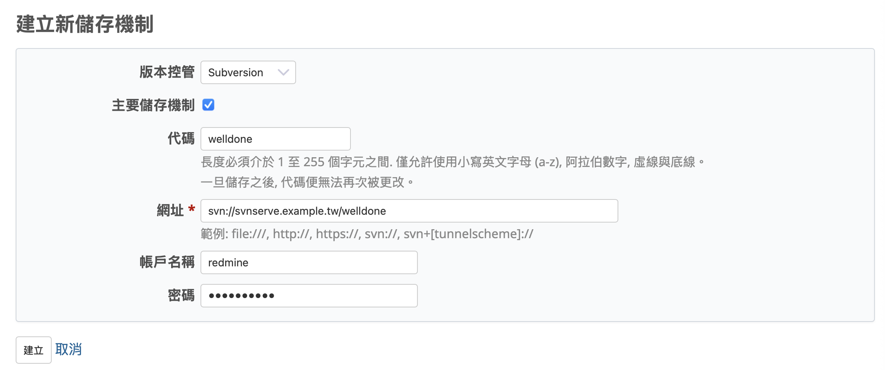
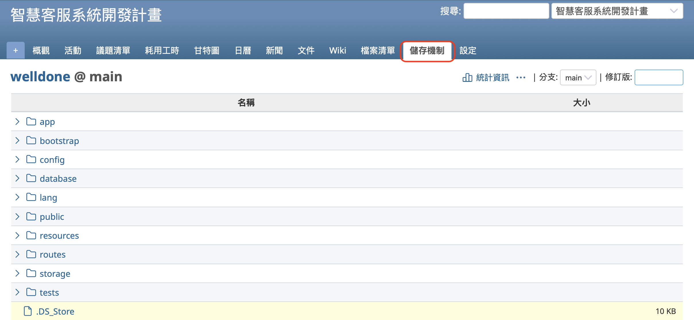
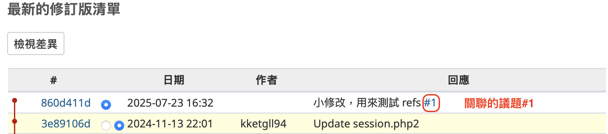
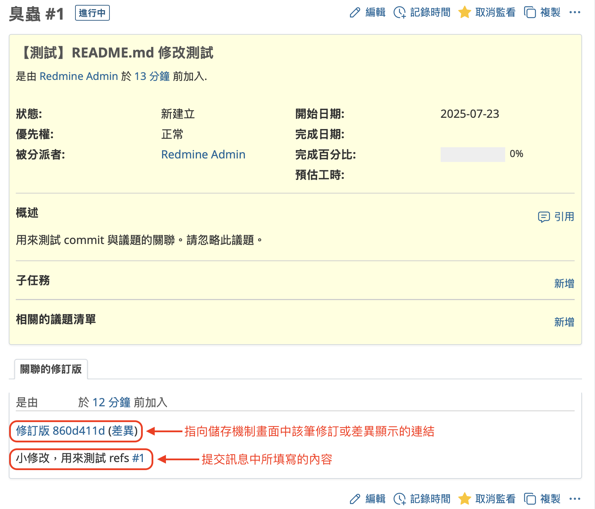

本文將介紹開源課題管理系統 Redmine 的「版本控管」與版本庫連結功能。

## 目錄

- 概要
- 功能
- 設定版本控管功能
- 建立新版本庫（原始碼儲存機制）
- 顯示版本庫畫面（原始碼儲存機制）
- 如何將議題與修訂版建立關聯

## 概要

Redmine 可應用於專案管理、工作管理與客戶諮詢回應等各種業務場景，其中尤其適合用於軟體開發專案。其高度適配性的關鍵功能之一，就是「版本控管」功能。

Redmine 能與 Subversion、Git 等版本控管系統（VCS）整合，讓您能直接在 Redmine 畫面中瀏覽原始碼、追蹤原始碼的變更紀錄，並在提交程式碼的同時，自動更新相關議題的資訊。

舉個實際的例子：Redmine 本身的開發專案就是以 Redmine 管理。Redmine 官方網站即是以 Redmine 架設，其上的開發專案也透過 Redmine 進行管理。Redmine 的原始碼是以 Subversion 進行版本控管（http://svn.redmine.org/redmine/） ，並與官方網站上的 Redmine 版本控管畫面（https://www.redmine.org/projects/redmine/repository） 連結，使得原始碼與變更紀錄都能公開瀏覽。

## 功能

當您啟用 Redmine 的版本控管功能並與版本控制系統整合後，將可使用以下功能。

### 瀏覽原始碼

您可以在 Redmine 的介面上瀏覽原始碼及其變更紀錄。

若要透過版本控制系統查看變更紀錄，通常需要使用指令列或專用應用程式；但若與 Redmine 整合，則可以直接在 Redmine 的版本庫畫面（儲存機制）上檢視相關內容。

### 將議題與修訂版相互關聯

Redmine 可讓您將議題與版本控制系統中的修訂版（revision）建立雙向關聯。

例如，若您為了解決編號為 #1 的議題而修改了原始碼，在將該變更提交（commit）到版本控制系統時，只需在提交訊息中加入對 #1 的參照描述。如此一來，該訊息會自動出現在議題的筆記中，並附上可導向該修訂版或差異內容畫面的連結。

透過將議題與修訂版關聯，您可以獲得以下好處：

- 可從議題快速追蹤到對應的原始碼內容，立即確認是否已依議題內容完成對應作業。
- 在版本控管畫面中查看變更紀錄時，也能反向查詢關聯的議題，快速掌握修改作業的原因依據。

## 設定版本控管功能

若要使用版本控管功能，請先在欲啟用的專案中啟用「版本控管」模組。此模組可依各個專案個別啟用或停用。

要變更這項設定的用戶，必須是該專案的成員，並被指派擁有「編輯專案」與「選擇專案模組」權限的角色。如果 Redmine 採用初始設定並執行過「載入預設組態」，則「管理人員」角色預設已具備這些權限，因此建議將角色設為「管理人員」。

請打開專案選單中的「設定」→「專案」分頁，在模組清單中勾選「版本控管」，然後點擊「儲存」。

另外，也可以在建立新專案時就啟用此模組。如果您預計會使用「版本控管」功能，建議在專案建立畫面中一併啟用。

## 建立新版本庫（原始碼儲存機制）

只有在欲註冊版本庫的專案中被登錄為成員，且擁有「管理儲存機制」權限的角色所分配的用戶，才可以註冊版本庫。
若您是在 Redmine 的初始設定中執行了預設設定的載入，系統會自動將此權限授予「管理人員」角色，因此建議您將該用戶分配為「管理人員」。

若要註冊版本庫，請從專案選單中點選「設定」→「儲存機制清單」，然後點擊「建立新儲存機制」。

「建立新儲存機制」的畫面將會顯示。

請選擇您要使用的版本控制系統，輸入用於存取版本庫的 URL，然後點選「建立」。
以下的畫面範例是以 Subversion 為例。

## 顯示版本庫畫面（原始碼儲存機制）

新建完成後，專案選單中會出現「儲存機制」選項。若未註冊則不會顯示，請參考前一部分的「建立新版本庫」步驟。

點選「儲存機制」後，將會顯示版本庫畫面。

畫面上方會顯示原始碼的目錄樹。
點選目錄名稱可瀏覽該目錄的內容；點選檔案名稱則會顯示該檔案的內容。

畫面下方會顯示最近的變更紀錄。
點選「檢視差異」按鈕，便可檢視最新的變更內容。

## 如何將議題與修訂版建立關聯

若要將議題與修訂版建立關聯，可透過版本控制系統的提交（commit）訊息來實現。

請在提交訊息中加入以下其中一種參照關鍵字與議題編號（nnn 為議題編號）：

- `refs #nnn`
- `references #nnn`
- `IssueID #nnn`

例如，若您希望參照編號為 1 的議題，可在提交訊息中寫入下列內容：

`小修改，用來測試 refs #1`

如此一來，在儲存機制畫面中，該修訂版的提交說明中會自動加入連結，指向編號 #1 的議題。

此外，從該議題的畫面中，也會出現一個名為「關聯的修訂版」的頁籤，顯示您提交時所寫的訊息內容，並附上前往該修訂版畫面或查看差異的連結。

Redmine 的版本庫整合功能可大幅提升軟體開發專案的效率，並有助於提高交付成果的品質。誠摯建議您善加運用。
