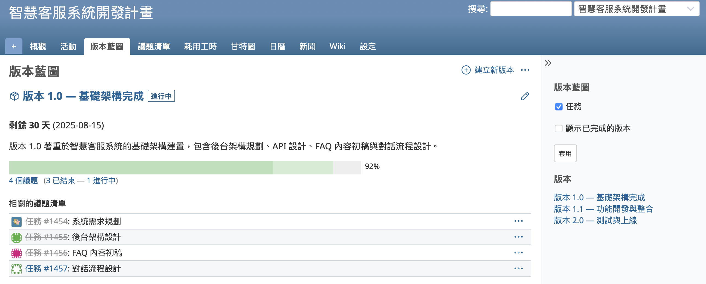
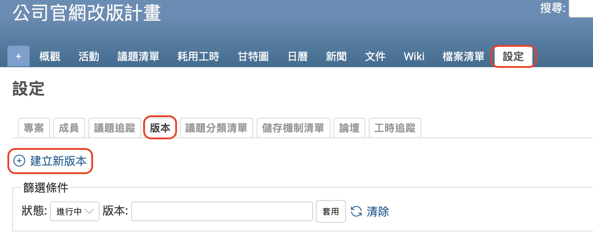
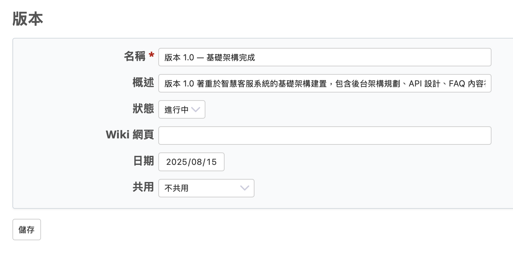
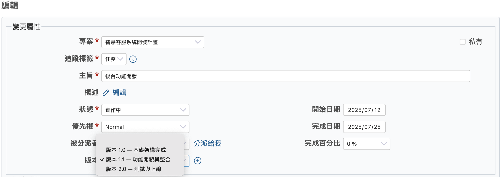
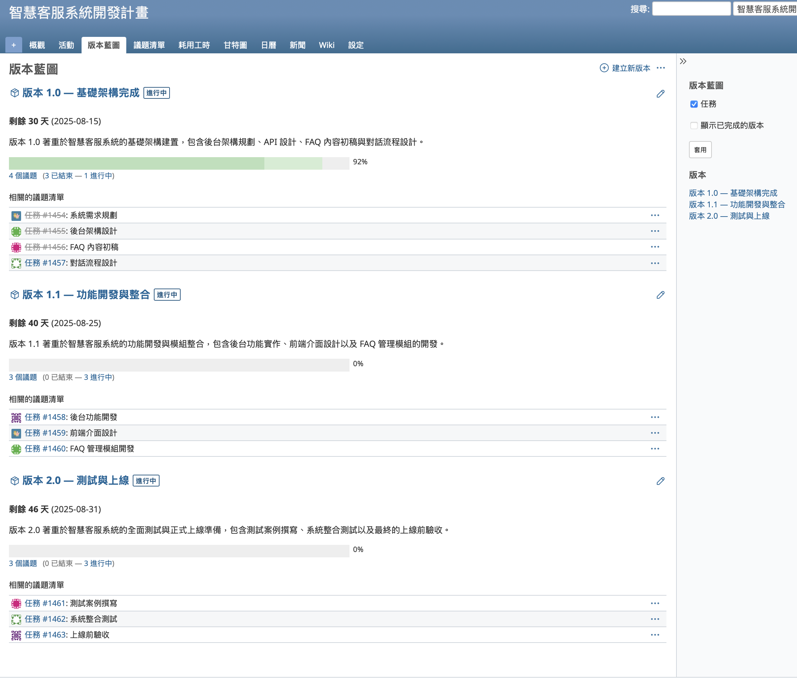

本文將介紹開源課題管理系統 Redmine 的「版本藍圖」功能。

## 目錄

- 版本藍圖功能概要
- 將里程碑新增為版本
- 版本藍圖一覽

## 版本藍圖功能概要

Redmine 的核心功能是使用「議題」來進行任務與問題的追蹤與管理。「議題」是指在 Redmine 中被用來追蹤與管理的各種任務或問題，例如需要執行的工作、需要修復的錯誤等，這些都會個別登錄為議題。當顯示議題清單時，可以看到每個任務的狀態（尚未開始、進行中、已完成等），從而一目了然地掌握整個專案的進度情況。

然而，隨著專案推進，議題的數量可能會不斷增加，導致議題清單變得非常冗長。這樣一來，重要任務或緊急事項可能會被忽略，進而造成掌握整體專案進度變得更加困難。

這時，Redmine 所提供的「版本」與「版本藍圖」功能就能派上用場。在一般的專案規劃中，常常會設定一些階段性成果或目標，這些被稱為「里程碑（Milestone）」。在專案管理中，經常會透過每個里程碑來檢視進度。透過 Redmine 的版本功能，可以將議題關聯到特定的里程碑；而版本藍圖功能則會將與版本關聯的議題視覺化地呈現出來，幫助用戶以圖像方式掌握各個里程碑的進度狀況，使管理工作更加容易。

## 將里程碑新增為版本

透過設定里程碑，可以協助團隊衡量並調整整體的進度。所謂的里程碑，通常包含下列資訊：

* 具體的成果或目標，以及專案中的關鍵階段（例如：「原型完成」、「啟動使用者測試」）
* 完成的截止日期

根據這些資訊，可以在 Redmine 中新增一個「版本」，將這些里程碑具體化呈現在 Redmine 上。

### 顯示「版本藍圖」標籤

要讓專案畫面中出現「版本藍圖」這個標籤，必須先新增至少一個版本。

新增版本的方法是：進入專案「設定」→「版本」→ 點選「建立新版本」。

※ 新增版本需要擁有「管理版本」的權限。這項權限預設會授予給「管理人員」、「開發人員」、「報告人員」這仨個角色。

### 將里程碑作為版本新增

每個新增的版本都可以作為一個專案的里程碑來使用。可以設定名稱、概述和截止日期，用來明確定義這個里程碑的內容與目標。

### 將議題連結到版本

在建立或編輯議題的時候，可以選擇要指派到哪個版本。這樣一來，就能把工作項目歸類到對應的里程碑之下，更清楚掌握每一項工作與整體進度的關聯，從而提升整體的工作管理效率。

完成這個設定後，在顯示議題列表時，就能依照版本分類，或是只篩選特定版本的議題來查看。

這麼做有以下幾個好處：

* 不容易遺漏各個里程碑下該完成的工作
* 可以更有效率地安排優先順序
* 清楚知道現在該處理哪些事情

## 版本藍圖一覽

當您新增版本後，專案選單中就會顯示出「版本藍圖」的連結。點擊這個連結後，系統會依照不同版本，顯示各個議題的狀態。

畫面中會依版本顯示以下資訊：

- 版本名稱
- 版本概述
- 截止日期與剩餘天數
- 所有關聯議題的整體進度百分比
- 該版本底下所有議題的清單

透過這個畫面，就能一目了然地掌握每個里程碑的進度狀況。

如果想查看某筆議題的詳細內容，只要點選議題列表中的編號，就可以進入該議題的詳細畫面。

Redmine 的版本藍圖功能能有效提升專案的進度管理效率，進而幫助專案順利達成目標。活用這項功能，不僅能讓專案依計劃推進，也有助於風險控管與成果品質的提升。請善用這項功能，讓您的團隊朝目標穩健前進！
