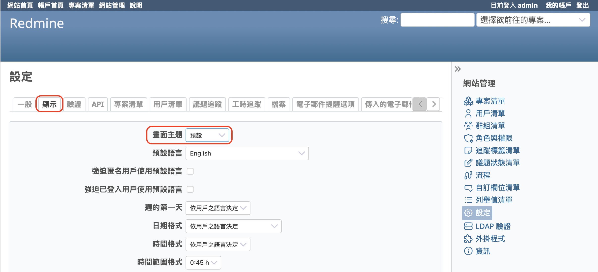
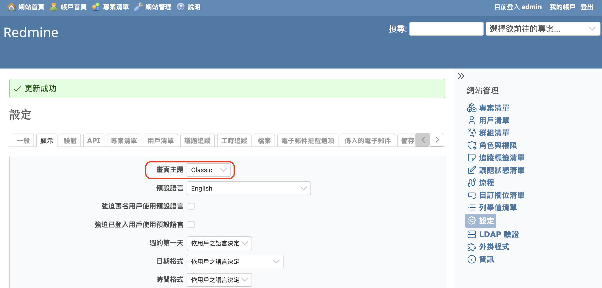
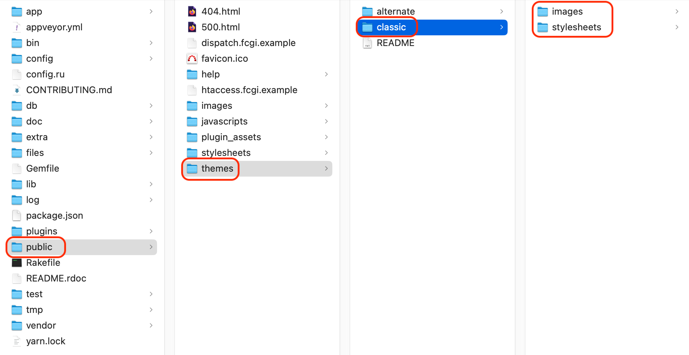
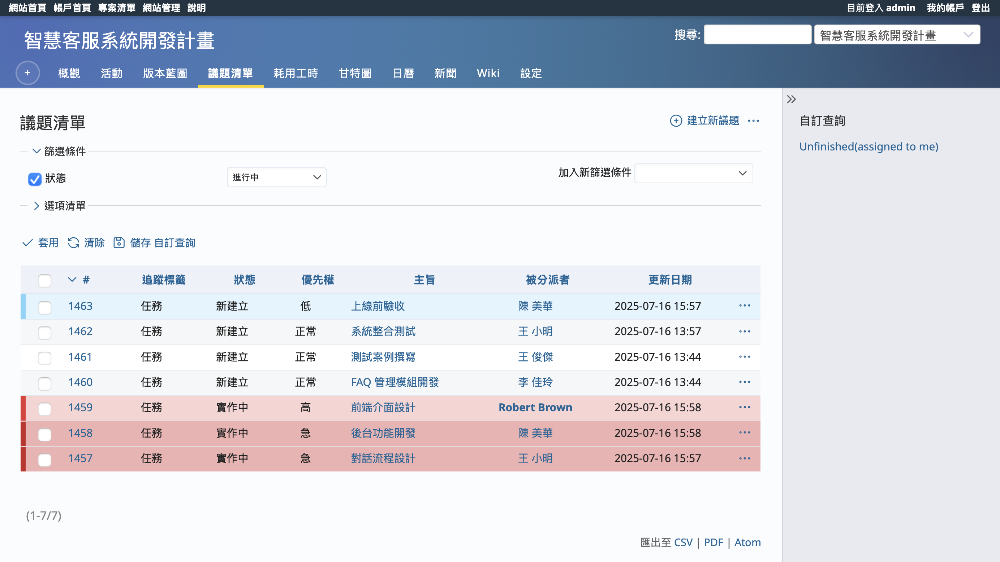
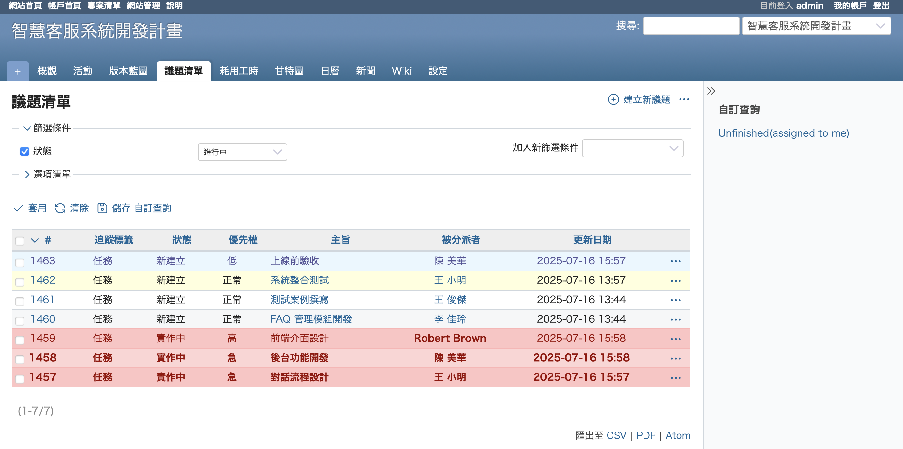
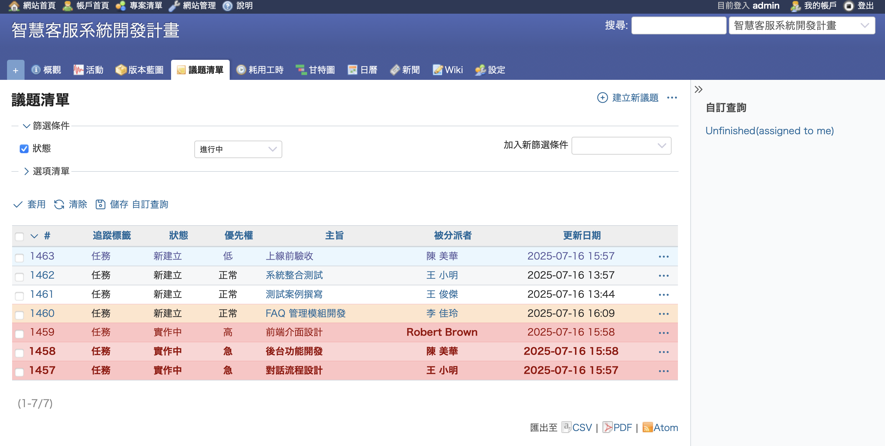

本文將為您簡單介紹如何在開源議題管理系統 Redmine 中進行書面主題設定。

## 目錄

- 概要
- 變更主題
- 新增主題
- 推薦主題

## 概要

Redmine 的書面主題是由樣式表與圖像所組成的套件，用來變更 Redmine 使用者介面的外觀。透過主題，您可以改變以下項目：

- 顯示文字所使用的字體種類、字體大小、字體樣式
- 頁面中各個元素的排列方式
- 圖示圖像、背景圖像等視覺元素
- 頁面的背景顏色與文字顏色等配色

Redmine 的書面主題不僅可以自行製作，也可以使用社群所開發的多樣主題。

## 變更主題

Redmine 預設內建三種主題：「Default」、「Alternate」、「Classic」。系統安裝完成後，會自動套用「Default」主題。

只有具有系統管理員權限的帳號才能變更主題。Redmine 剛安裝完成時，admin 用戶預設已擁有系統管理員權限，因此建議以 admin 身分登入進行操作。

點選主選單中的「網站管理」→「設定」，然後切換到「顯示」分頁，即可看到「書面主題」設定項目。

從下拉選單中選擇主題，點選「儲存」即可完成主題切換。

## 新增主題

Redmine 的主題可以使用自己製作的主題，或是由社群開發的主題。

若要新增主題，您需要登入伺服器進行操作。

在伺服器上 Redmine 的安裝目錄底下，有一個名為 public 的目錄。該目錄中有一個名為 themes 的子目錄。在這個 themes 目錄中，為每一個主題建立一個資料夾，並將樣式表與圖片等完整檔案放入，即可使用該主題。

若要使用由社群開發的主題，請依照各主題所提供的文件說明進行安裝。

當主題安裝完成後，請依照「變更主題」的操作步驟切換您想使用的主題。

## 推薦主題

以下為幾個推薦使用的主題：

### farend bleuclair

farend bleuclair 是基於 Redmine 原始主題進行改善的樣式，著重於提升整體閱讀體驗。雖然最初是以日文環境為基準進行調整，但在繁體中文介面下也能有良好表現。此主題加大了字體尺寸、擴大了元件間距，並保持與預設主題相近的配色與結構，能減少使用者在語言切換或主題變更時的不適應感。

推薦原因：

- 頁面排版清晰，適合顯示繁體中文字段內容（如 Wiki 或議題說明）。
- 標籤、表格與選單區塊分明，有助於提升資訊辨識度。

GitHub 專案頁面：  
<https://github.com/farend/redmine_theme_farend_bleuclair>

### farend basic

farend basic 保留了預設主題的風格，僅針對細部進行調整，特別是字體與表格的可讀性。雖然不是專為繁體中文設計，但其簡潔設計與穩定排版，在繁體中文介面中同樣具備良好表現。對於不希望大幅改變畫面風格但又希望提升閱讀體驗的使用者，這是一個穩健的選擇。

推薦原因：

- 不改變既有操作習慣，適合團隊直接導入。
- 樣式設計保守，與各種 Redmine 外掛兼容性佳。
- 在繁體字顯示上表現穩定，不會出現字體破碎問題。

GitHub 專案頁面：  
<https://github.com/farend/redmine_theme_farend_basic>

### farend fancy

farend fancy 是在 farend basic 的基礎上加入更多視覺元素，如圖示與配色強化，讓整體介面更具親和力。對於覺得 Redmine 畫面過於單調的使用者來說，是一種兼顧實用與美觀的選擇。

推薦原因：

- 介面友善，適合新手使用者快速上手。
- 配色豐富但不過於雜亂，適合在內部支援系統中使用。

GitHub 專案頁面：  
<https://github.com/farend/redmine_theme_farend_fancy>

## 其他主題

由社群開發的各種書面主題已收錄於 Redmine 官方網站的主題一覽頁面中。歡迎瀏覽並尋找您喜愛的主題。

Redmine 官方網站的主題清單連結：<https://www.redmine.org/projects/redmine/wiki/Theme_List>

透過變更 Redmine 的主題，您或許可以改善系統的外觀，提升使用體驗。當然，最適合的主題會依據專案或團隊的需求而有所不同，但您可以從眾多選項中找出最符合需求的一款。善用 Redmine 的彈性與可自訂性，打造更舒適的工作環境吧。