本文將介紹開源課題管理系統 Redmine 的「工時追蹤」功能。

## 目錄

- 概要
- 啟用「工時追蹤」功能
- 在議題中記錄工時
- 在議題中填寫預估工時
- 查看時間統計結果

---

## 概要

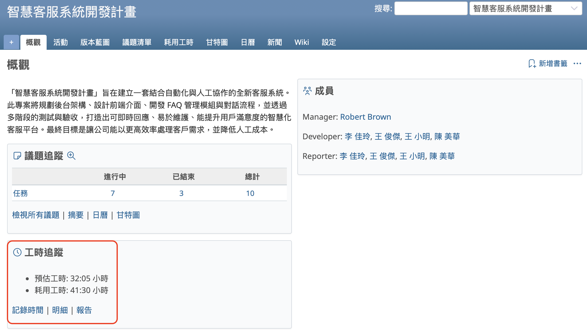

Redmine 具備「工時追蹤」功能，可用來記錄和統計議題或專案中所花費的工時與預估工時。

舉例來說，當您將工作註冊為議題後，在完成作業後記錄所花費的時間，系統便會自動顯示該議題累積的總作業時間。您也可以統計每位成員在每張議題上投入了多少時間。

將實際花費的時間作為紀錄保留下來，不僅對當前的專案有幫助，對未來的專案同樣具有參考價值。當下次出現類似作業時，您可以依據過去的作業時間紀錄，準確地預估所需工時。

在將工作註冊為議題時，可以同時輸入預估工時。若為所有作業都輸入了預估工時，就能計算出整個專案的總預估工時。

若依照工作階段將議題分類並進行統計，便能判斷該階段是否能依照計畫順利推進。

若依照成員進行議題統計，則可以計算出每位成員的預估工時，幫助您檢查作業分配是否合理。

像這樣的工時追蹤功能，是專案管理中不可或缺的重要工具。

---

## 啟用「工時追蹤」功能

### 啟用「工時追蹤」模組

首先，您需要啟用「工時追蹤」模組。此模組可以根據每個專案分別啟用或停用。

只有在專案中被指派為成員，並擁有「編輯專案」與「選擇專案模組」權限的使用者，才可以變更這項設定。如果在 Redmine 的初始設定中載入了預設設定，這些權限將會指派給「管理人員」角色，因此建議使用具備「管理人員」角色的帳號來進行操作。

請開啟專案選單的「設定」，切換到「專案」分頁，勾選模組清單中的「工時追蹤」，然後點選「儲存」。

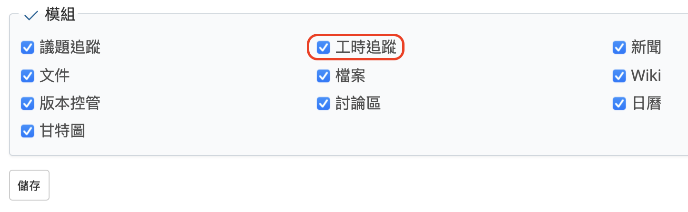

此外，您也可以在建立新專案時預先啟用此模組。如果預期會使用工時追蹤功能，建議在新建專案畫面中一併啟用。

---

### 新增「活動 (時間追蹤)」

輸入工時時，必須選擇「活動」種類。這有助於後續的統計與分析，因此建議您根據專案需求，事先設定好合適的分類名稱。

如果在 Redmine 的初始設定中已執行過載入預設設定，系統將會自動建立「設計」與「開發」這兩個分類。您可以直接使用這些分類，也可以修改其名稱後再使用，兩種方式皆可。

只有擁有系統管理員權限的使用者才可以新增或修改作業分類的名稱。Redmine 安裝完成後，預設會將系統管理員權限指派給 admin 帳號，因此建議使用 admin 登入以進行設定。

請從頂部選單進入「網站管理」→ 點選「列舉值清單」，即可開啟選項值的管理畫面。在這個畫面中，您會看到「活動 (時間追蹤)」的欄位，這裡就是設定作業分類的地方。

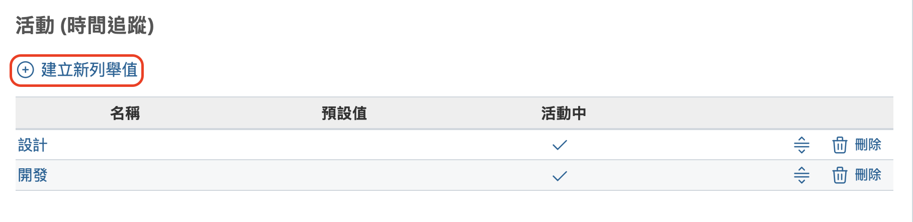

若您想新增分類名稱，請點選「建立新列舉值」。

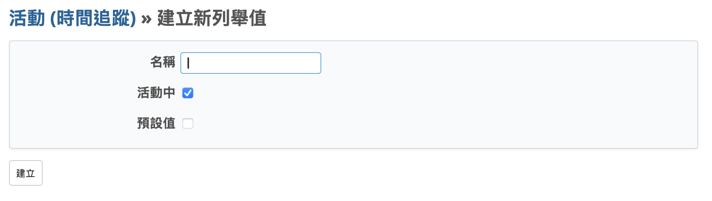

輸入要新增的分類名稱，勾選「活動中」，然後點擊「建立」。
若您勾選「預設值」，此分類名稱將在登錄工時時自動被選為預設選項。

---

## 在議題中記錄工時

接下來說明如何在議題中記錄工時。

記錄方式有兩種：

- 在議題的編輯畫面中輸入
- 在議題的「記錄時間」畫面中輸入

### 方法 1：從議題的編輯畫面輸入

開啟議題編輯畫面，您會看到「記錄時間」欄位。

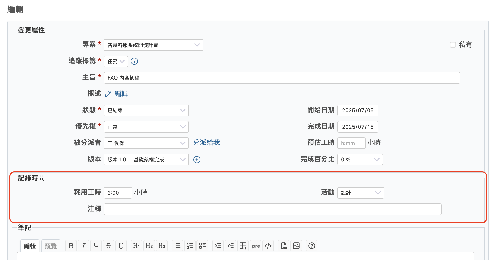

請輸入「耗用工時」的數值，單位可為時間與分鐘的格式，或十進位格式。

舉例來說，輸入 1 小時 30 分鐘的方式如下：

- `1:30`
- `1h30m`
- `1.5`

請使用半形英文輸入。然後，選擇「活動」（必填），若需要也可填寫「註解」（選填），最後點擊「送出」。

### 方法 2：從「記錄時間」畫面輸入

在議題畫面上方點擊「記錄時間」連結，進入輸入畫面。

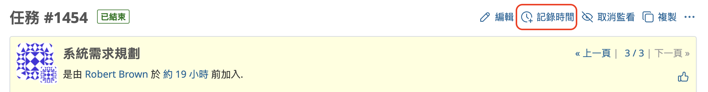

輸入工時、選擇活動分類，然後點擊「建立」。

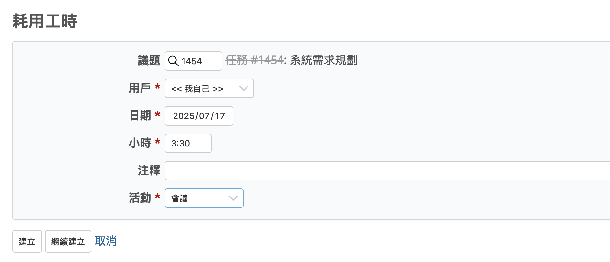

輸入完成後，議題畫面中的「耗用工時」欄位會顯示總時數。若輸入多筆工時，系統將自動加總顯示。

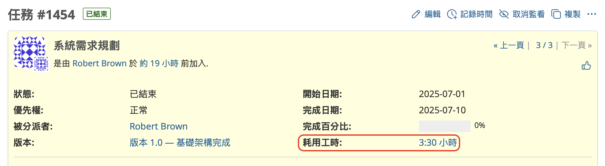

預設顯示格式為小時與分鐘，若您想改為十進位格式，可至「網站管理」→「設定」→「顯示」頁籤，將「時間範圍格式」設定為 `0.75`。

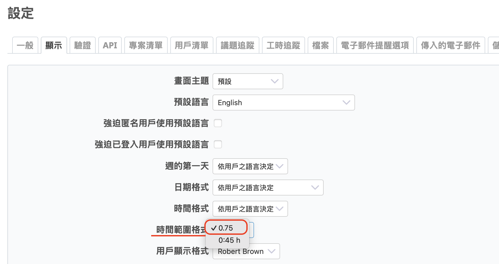

---

## 在議題中填寫預估工時

於議題編輯畫面中，您可在「預估工時」欄位輸入預估的作業時間。輸入方式與實際工時相同。

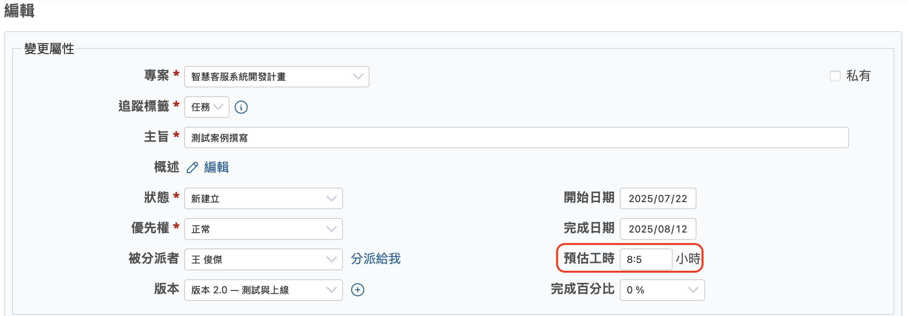

---

## 查看時間統計結果

若要將記錄下來的預估工時與實際耗用工時進行彙總與顯示，請開啟「耗用工時」畫面。

請點選專案選單中的「耗用工時」，或在專案概覽頁面「工時追蹤」區塊中的「明細」連結。

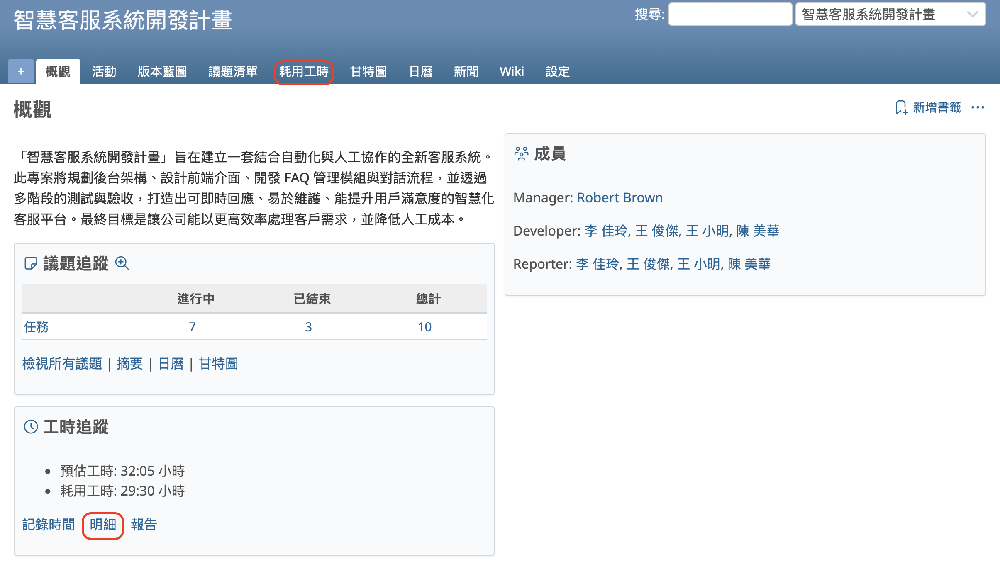

系統會顯示「耗用工時」的「明細」分頁。在這裡，您可以查看所有有登錄工時的議題清單與工時總計。
您也可以透過篩選器來縮小議題範圍，或透過選項來變更顯示的欄位項目。

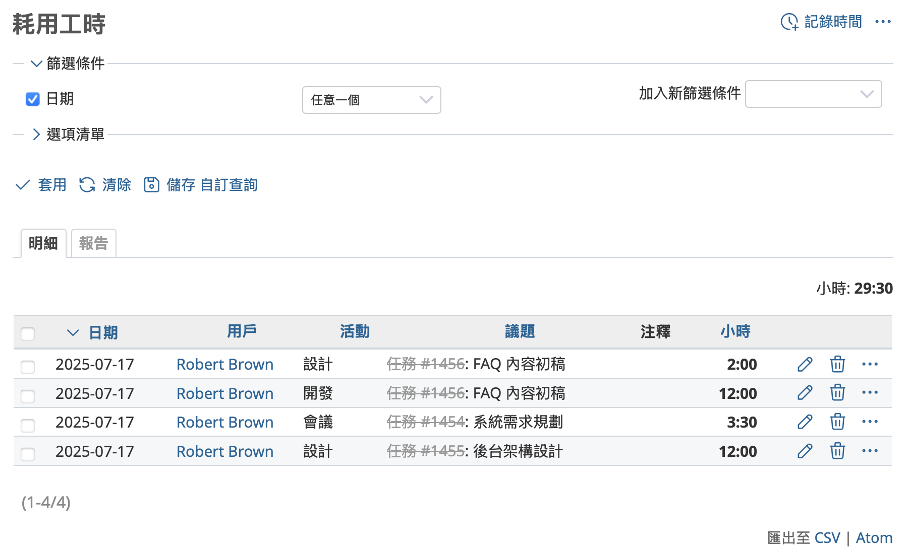

點選「報告」分頁會切換成不同的顯示格式。

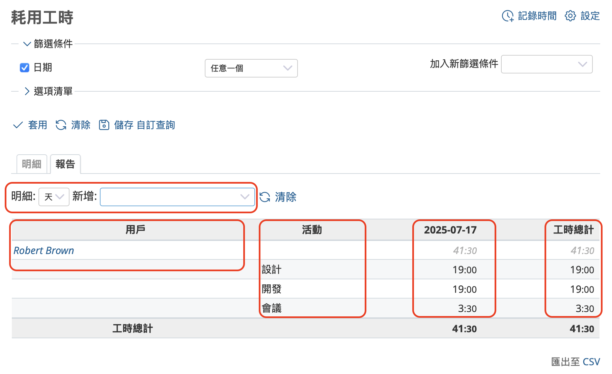

當您透過下拉選單選取期間與新增項目後，畫面會更新並顯示對應的彙總結果。上述範例顯示的是依「用戶」、「活動」以及「日期」彙總的結果。

需要注意的是，在「耗用工時」畫面中無法同時顯示預估工時與實際耗用工時。
若您希望同時檢視兩者，請在議題清單畫面中，透過調整選項清單設定，將「可用欄位」中的「預估工時」和「耗用工時」移至「已選取的欄位」，即可同時顯示預估工時與耗用工時。

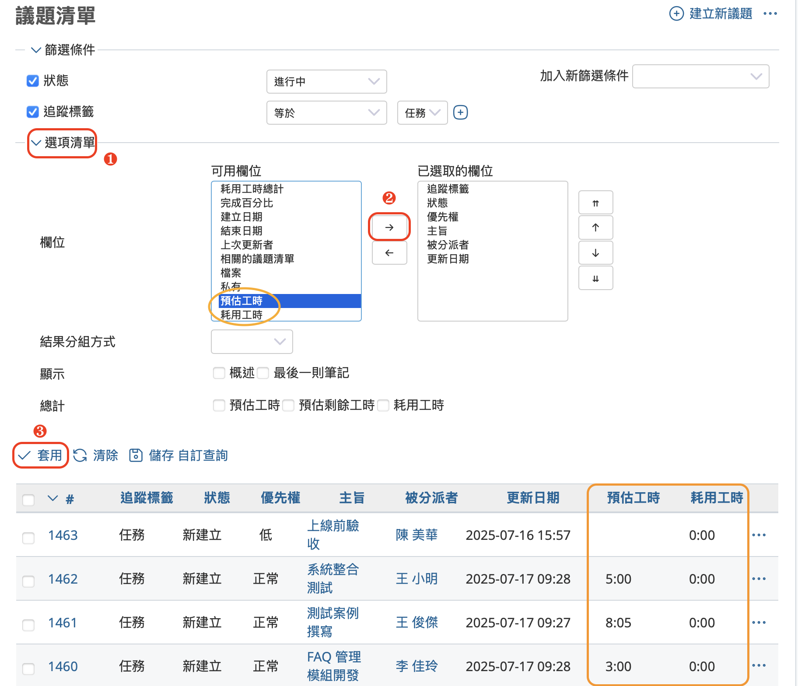

---

記錄預估工時與耗用工時，不僅有助於當前專案的進度管理，未來也可作為其他專案的寶貴參考資料。
敬請善用 Redmine 的時間管理功能，協助您提升專案管理的效率。
