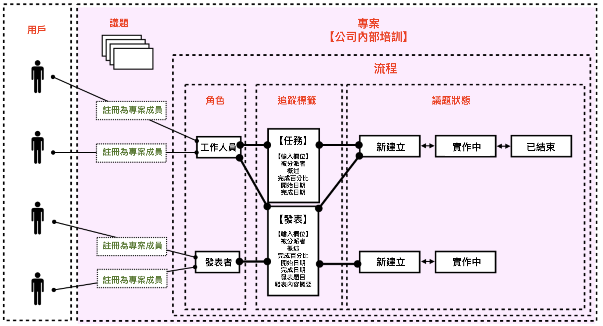
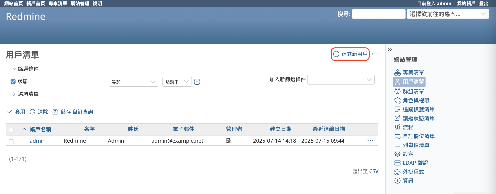
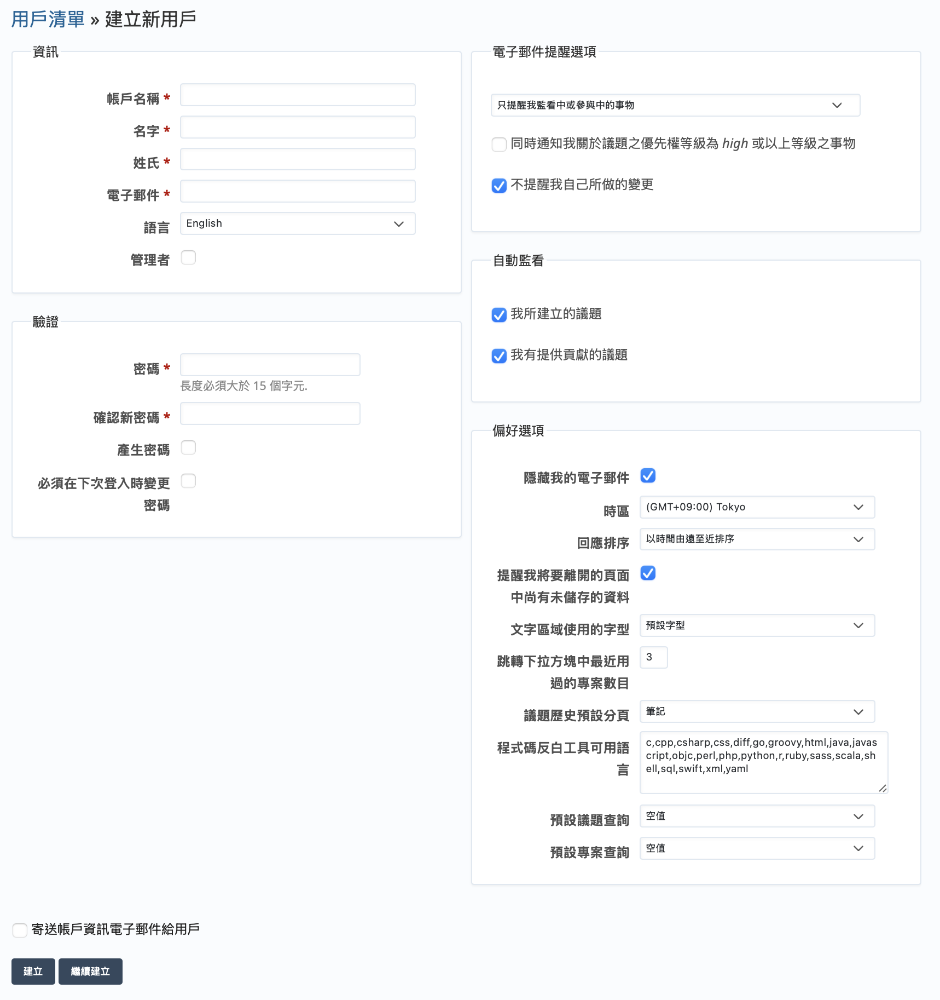
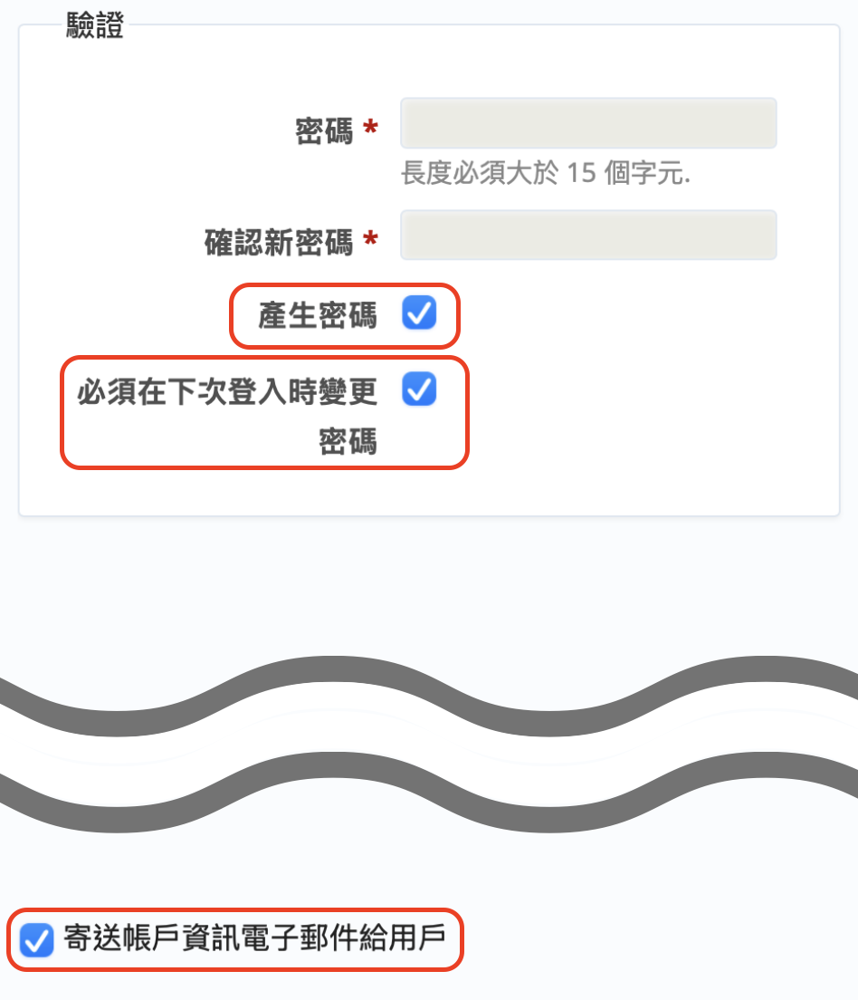
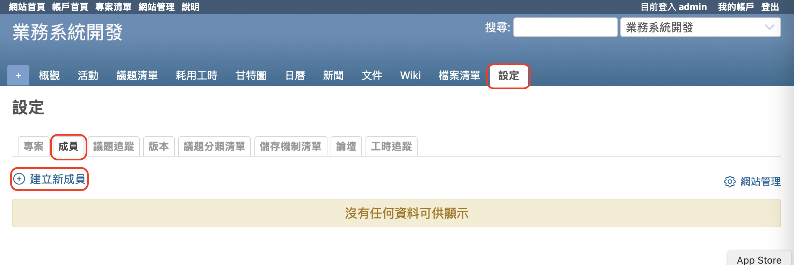
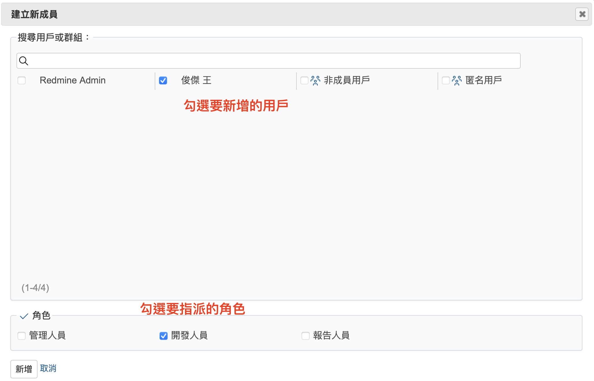
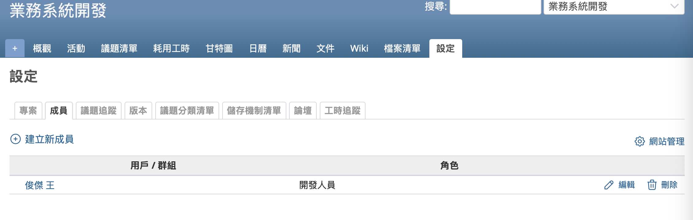
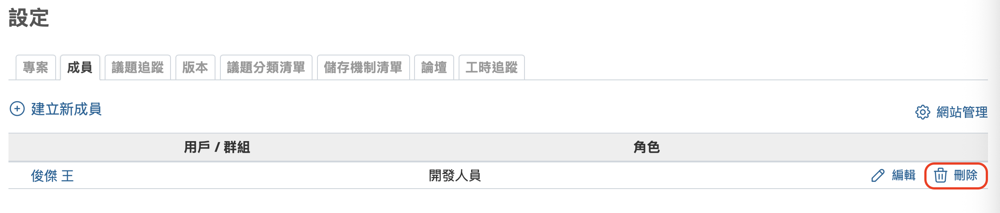
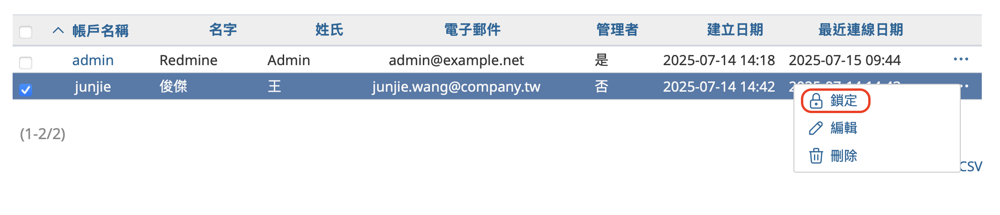
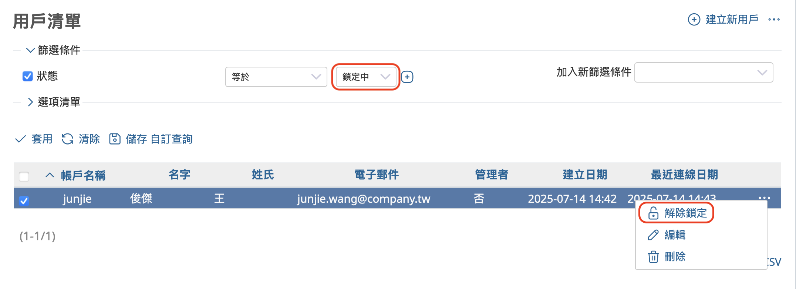

本文將介紹開源課題管理系統 Redmine 的「用戶管理」。

---

## 目錄

- 概要
- 建立新用戶 
- 將成員新增至專案
- 從專案中移除成員
- 鎖定／解除鎖定用戶

---

## 概要

Redmine 是一套可供多位工作人員同時使用的系統。您可以在 Redmine 系統中為每位工作人員建立用戶帳號，透過登入帳號來使用系統功能。

要讓已登入的用戶能夠瀏覽或操作 Redmine 專案的相關資訊，必須先將該用戶新增為該專案的成員。新增成員時，必須同時為該用戶指派一個角色。

當發生人員異動或離職等情況時，可能需要讓某些人無法再存取專案資訊，甚至無法再登入 Redmine。這種情況下，可以將該用戶從專案的成員名單中移除，或是將該用戶帳號鎖定，使其無法登入。

以下將說明與這些用戶管理相關的操作。

---

## 建立新用戶

只有擁有系統管理員權限的用戶才能建立新用戶帳號。剛安裝完 Redmine 時，admin 用戶預設具有系統管理員權限，因此建議以 admin 身分登入並進行操作。

在頂部選單中點選「網站管理」→「用戶清單」，即可開啟用戶列表畫面。

若要新增用戶，請點選畫面右側的「建立新用戶」，將會跳出建立新用戶的畫面。

請依序填入欄位資料，其中「帳戶名稱」、「名字」、「姓氏」、「電子郵件」、「密碼」為必填欄位。

Redmine 提供密碼自動產生的功能。勾選「產生密碼」及「寄送帳戶資訊電子郵件給用戶」，系統將自動為用戶產生密碼並以電子郵件寄送通知。

為提高安全性，建議同時勾選「必須在下次登入時變更密碼」，如此一來，用戶在使用郵件中的密碼首次登入後，會立即被導向變更密碼的畫面，並強制更新密碼。當密碼被成功變更後，郵件中所記載的密碼將失效，無法再使用。

輸入完成後，點選「建立」即可完成新增。

---

## 將成員新增至專案

若要讓已建立的用戶能夠存取某個專案的資訊，必須先將其新增為該專案的成員。

能夠新增專案成員的對象包括：

- 擁有系統管理員權限的用戶
- 已被加入該專案，並被指派具有「管理成員」權限角色的用戶

若您在安裝 Redmine 後執行了「載入預設組態」，系統將會建立名為「管理人員」的角色。此角色預設擁有「管理成員」的權限，因此建議使用這個角色來進行管理操作。

要將用戶加入專案成員，請依序點選頂部選單的「專案清單」→ 點選目標專案 → 點選專案選單中的「設定」→ 點選「成員」分頁，進入成員清單畫面。接著，點選畫面中的「建立新成員」按鈕。

此時將出現「建立新成員」的對話框，請從「搜尋用戶或群組」中勾選欲新增的用戶（可複選），並在「角色」欄位中勾選要指派的角色（也可複選）。  
設定完成後，點選「新增」。

新增成功後，將返回成員列表畫面，剛剛新增的用戶會顯示於其中。

---

## 從專案中移除成員

若要將某位用戶從專案中移除，請開啟該專案的成員列表，點選該用戶所對應列的「刪除」按鈕即可。

---

## 鎖定／解除鎖定用戶

當員工因退職等原因，不希望該用戶再登入 Redmine 時，可採取兩種方式：「刪除用戶」或「鎖定用戶」。

「刪除用戶」是指將該用戶從 Redmine 系統中永久移除。不過，如果刪除了用戶，該用戶曾建立或更新的資料，其建立者或更新者欄位將顯示為「匿名用戶」，導致無法再追溯是誰建立或更新的。因此，除非有特別的理由，不建議刪除用戶，而是建議採用鎖定。

「鎖定用戶」則是在不刪除用戶帳號的情況下，阻止該用戶登入系統。如此一來，該用戶曾建立或更新的資料仍會顯示原本的用戶名稱，資訊不會遺失。一般情況下，建議使用鎖定用戶的方式。

### 鎖定帳號操作步驟：

從上方選單點選「網站管理」→ 點選「用戶清單」，開啟用戶清單畫面。找到欲鎖定的用戶，點選該行右側的「⋯」選單，然後選擇「鎖定」。

被鎖定的帳號可以隨時解除鎖定，恢復使用。

### 解除鎖定操作步驟：

在用戶清單畫面中，套用篩選條件：「狀態」為「鎖定中」，以顯示目前被鎖定的用戶。找到您想解除鎖定的用戶後，點選該行右側的「⋯」選單，接著選擇「解除鎖定」。

如此一來，該用戶就可以再次登入 Redmine 系統。

