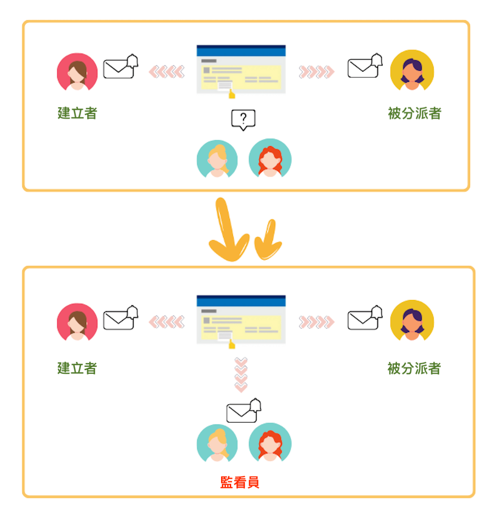
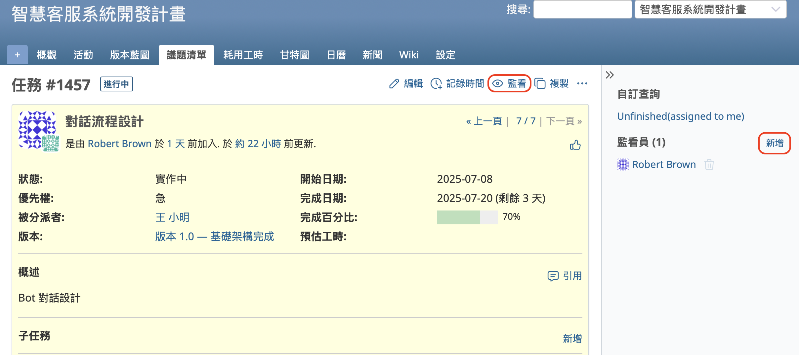
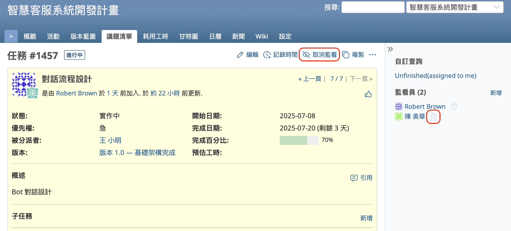
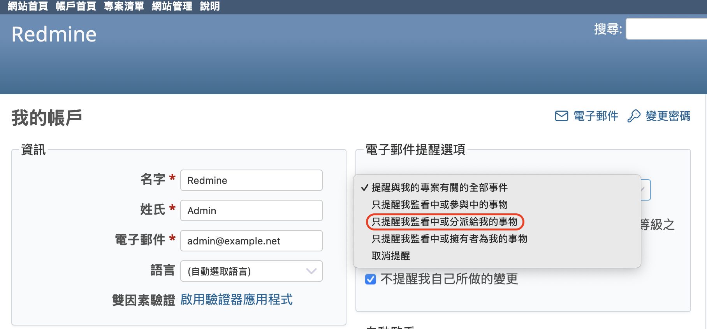
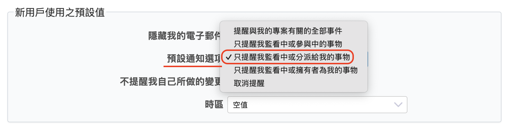
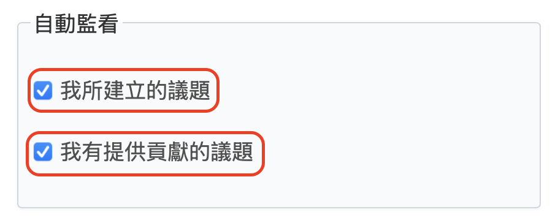

本文將介紹開源課題管理系統 Redmine 的「監看」功能。

## 目錄

- 監看功能概述
- 如何監看 / 停止監看
- 推薦的監看功能設定方式

## 監看功能概述

如同我們在[《5 分鐘快速上手 Redmine：郵件通知設定》](email-notifications.md)中所解釋的，Redmine 可以透過郵件通知讓您得知像是議題更新等變更。以議題為例，預設情況下，當「由自己建立的議題」或「分派給自己的議題」有更新時，您會收到郵件通知。相對地，若是其他用戶建立的議題，或並未分派給您的議題發生變更時，您將不會收到通知郵件。

如果您是專案負責人，希望掌握團隊成員的作業情況，您可能會希望在成員建立並處理的議題更新時，也能收到通知。這時只要「監看」該議題，您就能收到相關的郵件通知。

當任務進展順利，您覺得已無需持續接收通知時，也可以取消監看該議題。如此一來，即使該議題有更新，您也不會再收到通知。

「監看」功能讓您可以根據自己的狀況靈活掌控是否接收郵件通知，非常實用。

## 如何監看 / 停止監看

若要監看某個議題，只需點擊議題詳細頁面上方的「監看」連結即可。若您擁有新增監看員的權限，也可以點擊右側側邊欄中「監看員」欄位的「新增」連結，將自己以外的用戶加入為監看員。

若想取消監看，只要點擊「取消監看」即可。若您具備刪除監看員的權限，則可以點擊右側側邊欄中監看員名稱右側的垃圾桶圖示，將該用戶從監看員名單中移除。

除了議題之外，您也可以監看 Wiki、新聞、討論區等頁面，操作方式相同。

## 推薦的監看功能設定方式

### Redmine 的預設郵件通知處理方式

Redmine 的預設郵件通知處理方式

根據您使用的 Redmine 版本，預設的郵件通知設定可能會有所不同。

在 Redmine 6.0 或更新版本中，這裡推薦的設定已經預設啟用。

若您使用的是 Redmine 5.1 或更早的版本，預設設定為「只提醒我監看中或參與中的事物」，這包括：

- 您正在監看的議題
- 由您建立的議題
- 分派給您的議題

如果您使用的是舊版本，建議您檢查並調整此設定，以減少不必要的郵件通知。

**將郵件通知設定為「只提醒我監看中或分派給我的事物」**

套用這個設定後，您只會收到以下情況的通知郵件：

- 您正在監看的議題
- 分派給您的議題

透過是否監看某個議題，您可以自行決定是否要接收與自己無直接責任的議題更新通知。這樣一來，您就能根據自己的需求細緻地控制通知的數量。

此設定為用戶個別設定。請前往「我的帳戶」→「電子郵件提醒選項」，在下拉選單中選擇「只提醒我監看中或分派給我的事物」。

### 為新用戶變更預設設定（僅限管理員）

管理員也可以變更系統中新用戶的預設郵件通知設定。

請前往：「網站管理」→「設定」→「用戶清單」→「新用戶使用之預設值」，然後選擇「只提醒我監看中或分派給我的事物」。這樣一來，系統中新增的用戶就會自動套用此設定。

### 自動監看功能

Redmine 提供一個稱為「自動監看」的功能，讓你可以自動監看：

- 自己建立的議題
- 自己更新過的議題

設定方式如下：

- 「我的帳戶」→「自動監看」，勾選對應選項即可啟用。

---

Redmine 的監看功能是一項能有效掌握工作動向的通知機制。善加運用此功能，將有助於您即時掌握專案的最新進展，建議您積極活用。