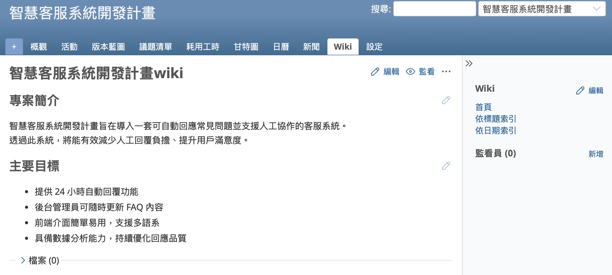
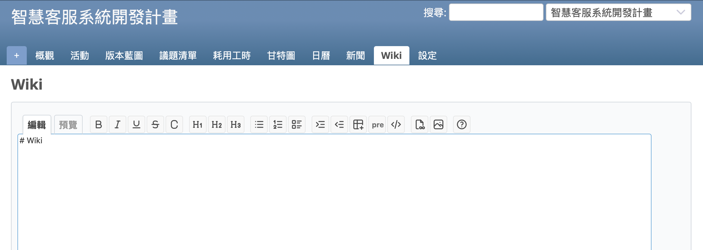
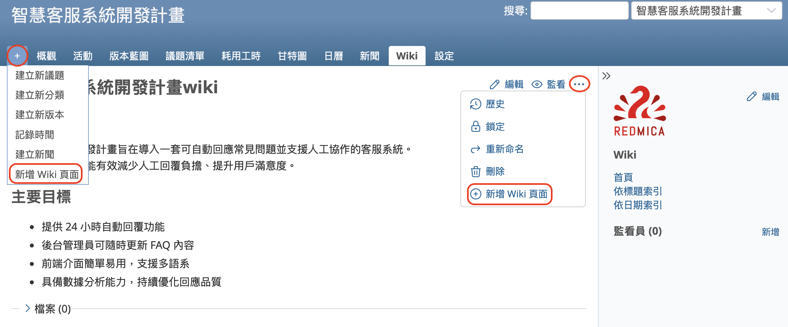
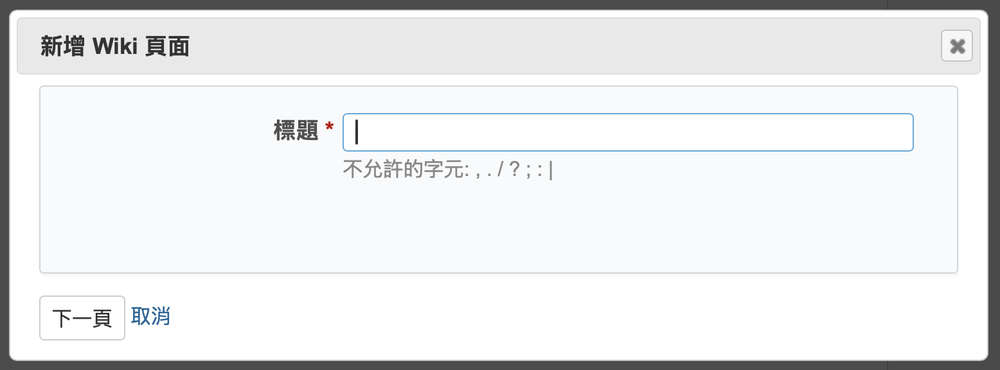
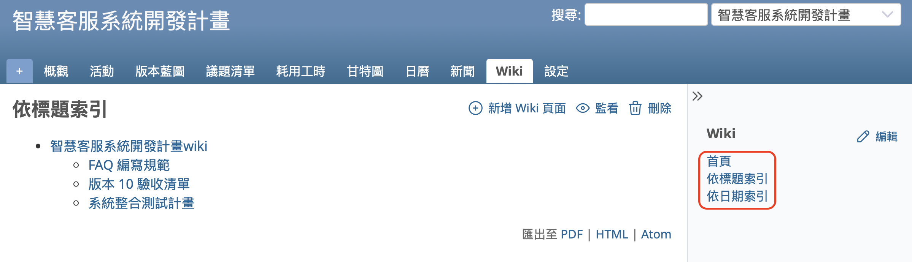
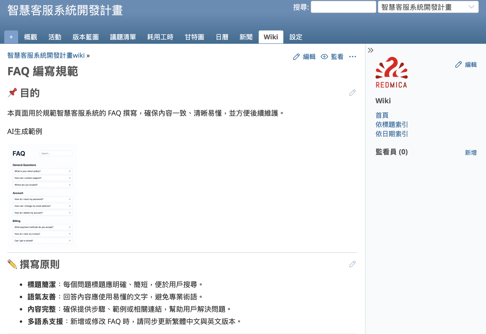

本文將介紹開源課題管理系統 Redmine 的「Wiki」功能。

---

## 目錄

- Wiki 功能簡介
- Wiki 首頁
- 新增 Wiki 頁面
- Wiki 頁面一覽
- Wiki 的撰寫語法

---

## Wiki 功能簡介

在專案管理中，資訊共享是不可或缺的。Redmine的Wiki功能正是為了滿足這樣的需求而設計，是強化團隊協作的強大工具。

Wiki 是一種讓多位使用者能透過網頁瀏覽器共同編輯內容的 Web 應用程式。Wiki 並不是 Redmine 特有的功能，也廣泛存在於其他協作工具中。最具代表性的例子是 Wikipedia，來自世界各地的協作者透過 Wiki 共同撰寫內容，打造出一部龐大的線上百科全書。

Redmine 的 Wiki 功能，讓專案成員可以共同新增與編輯頁面，集中管理與專案相關的資訊。以下是一些典型的使用情境：

- 紀錄開發環境與伺服器環境的建置流程  
- 撰寫各種工具的使用方式、技術資訊與實作經驗  
- 建立匯總各種專案相關連結的入口頁面  
- 建立匯集重要議題（如關鍵性問題）的頁面

---

## Wiki 首頁

在 Redmine 的專案中點選側邊選單的「Wiki」，就能看到 Wiki 首頁。

首次進入時，因為尚未建立頁面，會顯示空白的編輯畫面。輸入內容並點選「儲存」後，就會建立出 Wiki 的首頁。

---

## 新增 Wiki 頁面

要新增 Wiki 頁面，可以將滑鼠游標移到專案選單中的「＋」圖示上，然後從下拉選單中選擇「新增 Wiki 頁面」。
或者，也可以點選畫面右上角的 [...] 選單（位於「編輯」與「監看」按鈕旁邊），然後選擇「新增 Wiki 頁面」，畫面就會切換到可輸入新 Wiki 頁面標題的畫面。

輸入標題後，點選「下一頁」即可進入 Wiki 頁面的編輯畫面。
填寫內容並點擊「儲存」後，就會建立新的 Wiki 頁面。

---

## Wiki 頁面一覽

當您正在檢視某個 Wiki 頁面時，側邊選單會顯示「首頁」、「依標題索引」、「依日期索引」等連結。

- 點選「依標題索引」可以按名稱順序列出已建立的 Wiki 頁面。
- 點選「依日期索引」則會依照建立日期列出 Wiki 頁面。

---

## Wiki 的撰寫語法

在建立 Redmine 的 Wiki 頁面時，可以使用支援套用樣式的標記語法。善用這些語法，能讓頁面資訊更易於閱讀與整理。

Redmine 5.1 的預設設定使用的是 CommonMark Markdown 語法，也可以切換成 Textile 語法。

透過標記語法，您可以為內容加上標題、強調文字，或插入圖片。在編輯畫面的上方提供了套用樣式的按鈕，即使不記得標記語法，也能輕鬆套用所需的格式。

---

Redmine 的 Wiki 功能能夠將容易分散的文件、會議紀錄、技術資訊等重要內容集中於同一處，進而提升整體的專案透明度，促進高效率的決策流程與團隊間的順暢溝通。
這項功能對於專案的成功至關重要，建議積極加以活用。