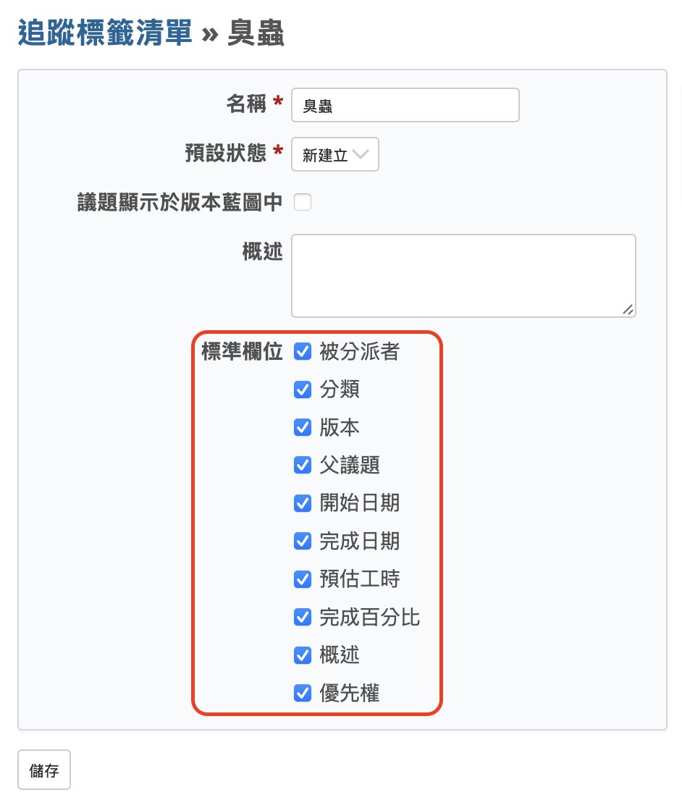

本文將為您簡單說明開源專案管理系統 Redmine 的工作流程設定。

---

## 目錄

- Redmine 的「工作流程」是什麼？
- 角色設定
- 追蹤標籤設定
- 狀態設定
- 工作流程設定

---

## Redmine 的「工作流程」是什麼？

當您要使用 Redmine 的核心功能——議題管理時，就需要進行「工作流程（Workflow）」的設定。「工作流程」這個詞通常是指工作的處理流程，而在 Redmine 中，則是指依據不同的角色（Role）與追蹤標籤（Tracker），來設定議題狀態之間的可轉移關係。可將其想像為如下圖所示的組合方式。

本文將依序說明角色、追蹤標籤、狀態與工作流程的設定方法。

---

## 角色設定

「角色（Role）」這個詞通常是指在某項工作中的「職責」或「身份」，而在 Redmine 中，則是用來表示指派給用戶的一組權限集合。

Redmine 提供許多功能，其中多數功能是否能使用，都可以透過權限進行控制。這些權限不是針對每位用戶個別設定的，而是根據「角色」來設定。例如，您可以建立一個名為「管理人員」的角色，並將某位名叫王先生的用戶加入至 P 專案作為成員。此時，若將王先生指派為「管理人員」角色，他在 P 專案中就會擁有該角色所設定的所有權限。如果「管理人員」角色有被賦予「管理成員」功能的權限，那麼王先生就可以使用這項功能，在專案中新增或移除成員等。

此外，用戶在不同專案中可以被指派不同的角色。例如，若將王先生也加入至 Q 專案，但這次設定為「報告人員」角色，那麼他在 Q 專案中就無法使用「管理成員」等只屬於「管理人員」角色的功能。

要建立角色，請從頂端選單點選「網站管理」→「角色與權限」，即可開啟角色一覽畫面。
若要從頭開始建立新角色，請點選「建立新角色」。
您也可以從現有角色的右側點選「複製」，以複製其權限設定，進而建立新角色。這在想要建立類似權限配置的角色時非常方便。

---

## 追蹤標籤設定

「追蹤標籤（Tracker）」這個詞對部分用戶而言可能比較陌生。在 Redmine 中，追蹤標籤是指組成議題輸入欄位的一組項目。

在 Redmine 裡，您可以相當自由地新增、刪除，甚至自訂議題的輸入項目。這些輸入欄位的定義是以追蹤標籤為單位進行設定的。可以把這個過程理解為設計輸入表單。

建立議題時，您可以選擇要使用哪一個追蹤標籤。因此，如果您針對不同類型的業務預先設計好各自的追蹤標籤（也就是不同的輸入表單），那麼切換追蹤標籤就相當於切換表單欄位，這樣的設計也能讓實際操作更為流暢。

要建立追蹤標籤，請從頂部選單點選「網站管理」→「追蹤標籤清單」，進入追蹤標籤列表畫面。如果要從頭建立，請點選「建立新的追蹤標籤」。若您在 Redmine 安裝初期有執行載入預設設定，系統會自動建立名為「臭蟲（Bug）」、「功能」、「支援」這三個追蹤標籤。您可以直接使用它們、變更名稱後使用，或是複製它們來建立新追蹤標籤。

在追蹤標籤的新增或編輯畫面中，會有一個名為「標準欄位」的區塊，裡面列出了所有可以用於輸入的欄位。請勾選您希望此追蹤標籤使用的欄位後儲存設定。

---

## 狀態設定

Redmine 的「狀態（Status）」是用來表示議題當前處理進度的名稱。請根據您實際的專案管理需求，自行建立適合的狀態名稱。

您可以從上方選單點選「網站管理」→「議題狀態清單」，進入狀態列表畫面。

若要新增狀態名稱，請點選「建立新狀態」。如果您在 Redmine 安裝初期有執行載入預設設定，系統會自動建立以下幾個狀態：「新建立」、「實作中」、「已解決」、「已回應」、「已結束」、「已拒絕」。您可以直接使用這些預設狀態，或視情況修改名稱，也可以作為範本進行擴充。

建立狀態名稱時，請確認是否要將該狀態設定為「議題已結束」。Redmine 中的議題會被歸類為「進行中的狀態」或「已結束的狀態」（區別於「已結束」）兩種狀態之一。如果設定的某個狀態代表議題已經完成，請勾選「議題已結束」選項。

「已結束的狀態」會在多個場景中被使用，例如：

- 在議題清單中以「進行中」條件篩選時，「已結束的狀態」的議題將不會顯示。
- 若要結束某個專案，該專案下的所有議題都必須處於「已結束的狀態」。

值得注意的是，即使狀態名稱不是「已結束」，仍可將其設為「議題已結束」。例如，預設設定中的「已拒絕」即被歸類為「已結束的狀態」。

---

## 工作流程設定

在 Redmine 中，「工作流程（Workflow）」是依照「角色」與「追蹤標籤」的組合，設定議題狀態之間可進行的轉換。

接下來我們將搭配實際的設定畫面，進一步說明工作流程的設定方式。

請從頂部選單點選「网站管理」→「流程」，即可進入「工作流程」畫面。畫面中會出現兩個下拉選單：「角色」與「追蹤標籤」，您可以透過這兩個下拉選單來選擇要設定的角色與追蹤標籤的組合。例如，將角色選擇為「管理人員」，追蹤標籤選擇為「臭蟲（Bug）」，然後點選「編輯」按鈕。這樣就會進入一個畫面，讓您設定「管理人員」這個角色的用戶，在「臭蟲（Bug）」這個追蹤標籤所屬的議題中，能夠使用哪些狀態。此設定畫面會顯示成一個表格，列出「目前狀態」與「可變更至以下狀態」的組合。

這個設定畫面是由「目前狀態」與「可變更至以下狀態」所組成的對照表。意思是，當議題處於「目前狀態」時，只有被勾選的「可變更至以下狀態」才可以作為下一步狀態。例如，在這張設定畫面的螢幕截圖中，若議題目前狀態為「新建立」，那麼它可以被轉換成「實作中」、「已解決」或「已回應」；但無法直接轉為「已結束」或「已拒絕」，這些都是根據對照表上的勾選來決定的。

您可以根據實際業務流程，開啟或關閉這些核取方塊，靈活地定義適合自己團隊的狀態轉移規則。

雖然「工作流程」設定看起來項目繁多、似乎有點複雜，但您不需要一開始就設定完整。Redmine 大部分的設定日後都能再變更，因此建議您在實際運作中逐步調整與優化即可。雖然從零開始設定可能有些費工，但若是先使用透過「載入預設組態」所建立的狀態與追蹤標籤，再根據需要做微調，也是不錯的起點。

---
